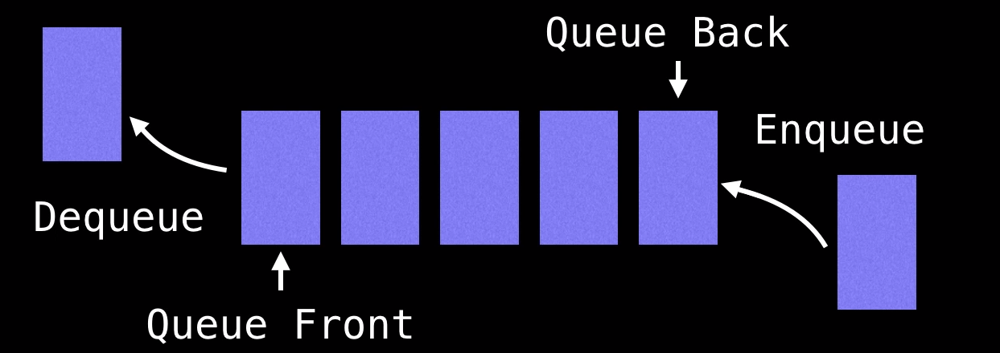

# Breadth First Search Algorithm - BFS

## YouTube Videos:

[https://www.youtube.com/watch?v=oDqjPvD54Ss](https://www.youtube.com/watch?v=oDqjPvD54Ss)

## BFS Overview

- The BFS is another fudamental search algorithm user to explore nodes and edges of a graph. It runs with a time complexity of `O(V+E)` (vertices + edges) and is often used as a building block in other algorithms.
- The BFS algorithm is particularly useful for one thing: **finding the shortest path on unweighted graphs**.
- A BFS starts at some arbitrary node of a graph and explores the neighbour nodes first, before moving to the next level neighbours.

## Using a Queue

- The BFS algorithm uses a queue data structure to track which node to visit next.
- Upon reaching a new node, the algorithm adds it to the queue to visit it later.
- The queue data structure works just like a real world queue such as a waiting line at a restaurant. People can either enter the waiting line (enqueue) or get seated (dequeued).

    

## Javascript implementation

```Rust
```

```Javascript
function bfs(root) {
  let result = [];
  let queue = [root];

  while (queue.length > 0) {
    let node = queue.shift();
    result.push(node.val);

    if (node.left !== null) {
      queue.push(node.left);
    }

    if (node.right !== null) {
      queue.push(node.right);
    }

  }

  return result;
}
```

