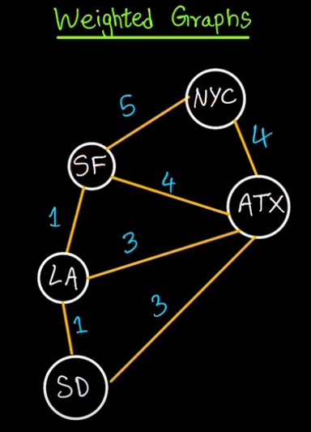
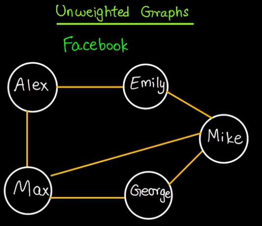
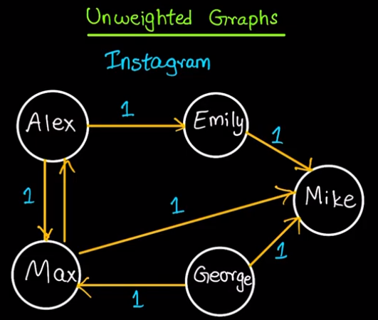

# Graph

## YouTube Videos:

1° [Data structures: Introduction to graphs - mycodeschool](https://www.youtube.com/watch?v=gXgEDyodOJU)

2° [Algorithms: Graph Search, DFS and BFS - HackerHank](https://www.youtube.com/watch?v=zaBhtODEL0w)

3° [Graph Data Structure Intro (inc. adjacency list, adjacency matrix, incidence matrix) - freeCodeCamp.org](https://www.youtube.com/watch?v=DBRW8nwZV-g&list=PLWKjhJtqVAbkso-IbgiiP48n-O-JQA9PJ&index=11)

4° [Graphs: breadth-first search - Beau teaches JavaScript - freeCodeCamp.org](https://www.youtube.com/watch?v=wu0ckYkltus&list=PLWKjhJtqVAbkso-IbgiiP48n-O-JQA9PJ&index=12)

5° [Weighted vs Unweighted Graphs](https://www.youtube.com/watch?v=cMijJ2C1TiI&t)

## Weighted and Unweighted graphs

### Weighted-graphs (flights)


### Unweighted-graphs (facebook and instagram)



## Graph in JS

## Breadth First Search Graph

```JavaScript
// Graphs: Breadth-first search - JS

const bfs = ((graph, root) => {

  let nodesLen = {};

  for (let i = 0; i < graph.length; i++) {
    nodesLen[i] = Infinity;
  };

  nodesLen[root] = 0;

  let queue = [root];
  let current;

  while (queue.length != 0) {
    current = queue.shift();

    let curConnected = graph[current];
    let neighborIdx = [];
    let idx = curConnected.indexOf(1);

    while (idx != -1) {
      neighborIdx.push(idx);
      idx = curConnected.indexOf(1, idx + 1);
    };

    for (let j = 0; j < neighborIdx.length; j++) {
      if (nodesLen[neighborIdx[j]] == Infinity) {
        nodesLen[neighborIdx[j]] = nodesLen[current] + 1;
        queue.push(neighborIdx[j]);
      };
    };
  };

  return nodesLen;

});

const exBFSGraph = [
  [0, 1, 1, 1, 0],
  [0, 0, 1, 0, 0],
  [1, 1, 0, 0, 0],
  [0, 0, 0, 1, 0],
  [0, 1, 0, 0, 0]
];

for (let i = 0; i < exBFSGraph.length; i++) {
  console.log("------------- DISTANCE OF NUMBER " + i + " -------------");
  console.log(bfs(exBFSGraph, i));
};

```

<!-- #### Depth First Search Graph -->
