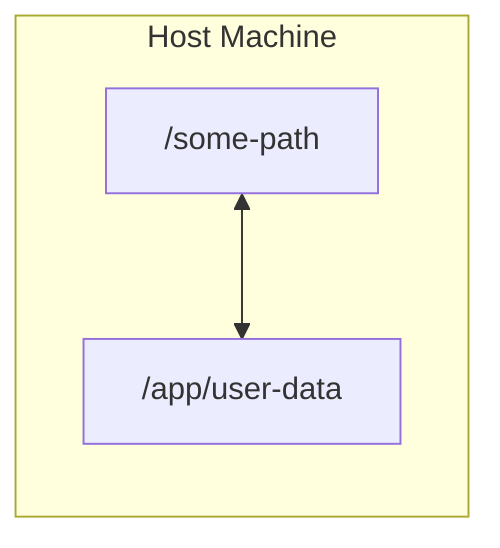
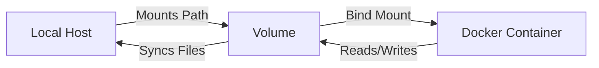

# Docker

## What is docker?

**[Docker]** is a container technology: a tool for creating and managing containers. _[Ripissue]_

**Container** is a standardized unit of software. A package of code and dependencies to run that code.

## Why containers?

1. Different development and production environments. Build and test in exactly the same environment as later run the app.
2. Different development environments within a team / company. Every team member should have the exactly same environment when working on the same project.
3. Clashing tools / versions between different projects. When switching between projects, tools used in project A should not clash with tools used in project B.

## Images & Containers

| <div align="center">**Image**<div>      | <div align="center">**Container**</div>               |
| :-------------------------------------- | :---------------------------------------------------- |
| Templates/blueprints for containers     | The running "unit of software"                        |
| Contains code + required tools/runtimes | Multiple containers can be created based on one image |
| Read-only                               | Read-write                                            |

## Volumes & Bind Mounts

**Volumes** are folders on your host machine hard drive which are mounted ("made avaiable", mapped) into containers.

Volumes are managed by Docker.



Volumes persist if a container shuts down. If a container (re-)starts and mounts a volume, any data inside of that volume is available in the container.

A container can write into a volume and read data from it.

**Bind Mounts** are managed by user.



<table>
    <tr>
        <th style="text-align: center" colspan="2">Volumes</th>
        <th style="text-align: center">Bind Mouts</th>
    </tr>
    <tr>
        <td>Anonymous volumes</td>
        <td>Named volumes</td>
        <td style="text-align: center">-</td>
    </tr>
    <tr>
        <td colspan="2">
            Docker sets up a folder / path on host machine, exact location is unknown. Managed via `docker volume` commands
        </td>
        <td>You define a folder / path on host machine</td>
    </tr>
        <tr>
        <td colspan="3">
            A defined path in the container is mapped to the created volume / mount. E.g: /some-path on your hosting machine is mapped to /app/data.
        </td>
    </tr>
    <tr>
        <td style="text-align: center">-</td>
        <td>Great for data which should be persistent but which you don't need to edit directly</td>
        <td>Great for persistent, editable (by you) data (e.g: source code)</td>
    </tr>

</table>

Anonumous Volume

```sh
sh docker run -v /app/data ...
```

Named Volume

```sh
docker run -v data:/app/data ...
```

Bind Mounts

```sh
docker run -v /path/to/code:/app/code ...
```

### Comparison

| **Anonymous Volume**                                           | **Named Volume**                                             | **Bind Mounts**                                                  |
| -------------------------------------------------------------- | ------------------------------------------------------------ | ---------------------------------------------------------------- |
| Created specifically for a single container                    | Created in general - not tied to any specific container      | Location on host file system, not tied to any specific container |
| Survives container shutdown / restart unless `--rm` is used    | Survives container shutdown / restart removal via Docker CLI | Survives container shutdown / restart removal on host fs         |
| Can not be shared across containers                            | Can be shared across containers                              | Can be shared across containers                                  |
| Since it's anonymous, it can't be re-used (even on same image) | Can be re-used for same caontainer (across restarts)         | Can be re-used for same caontainer (across restarts)             |

[Docker]: https://www.docker.com/ "Docker website"
