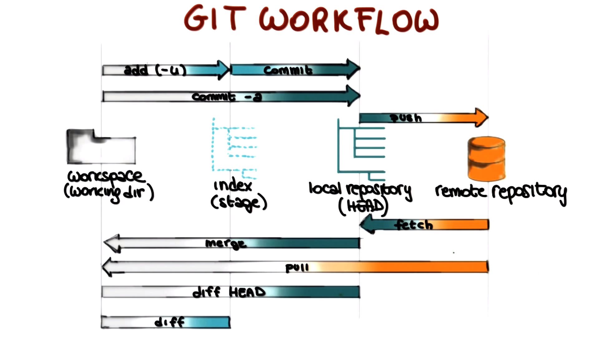

# GIT Notes

**Oficial Documentation:** https://git-scm.com/docs

## GIT Workflow:

youtube: [GIT Workflow - Georgia Tech - Software Development Process](https://www.youtube.com/watch?v=3a2x1iJFJWc&t=51s)
youtube: [Git - Understanding the Basics - Academind](https://www.youtube.com/watch?v=_OZVJpLHUaI)

## Basic commands:

-   `$ git init` Create an empty Git repository or reinitialize an existing one
-   `$ git add .` This command updates the index using the current content found in the working tree, to prepare the content staged for the next commit.
-   `$ git add someFile.js`
-   `$ git commit -m ¨some message¨` Stores the current contents of the index in a new commit along with a log message from the user describing the changes.
-   `$ git commit -a -m ¨some message¨` Add and Commit at the same command - automatic stage files
-   `$ git push -u origin master` Updates remote refs using local refs

---

-   `$ git fetch` Download objects and refs from another repository
-   `$ git merge` Join two or more development histories together
-   `$ git pull` Fetch from and integrate with another repository or a local branch
-   `$ git diff` Show changes between commits, commit and working tree, etc
-   `$ git diff HEAD` Show the difference between the Workspace and the Local Repository (HEAD).
