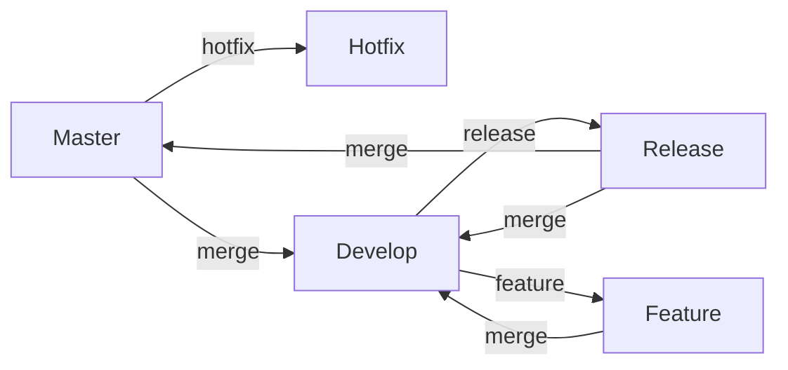
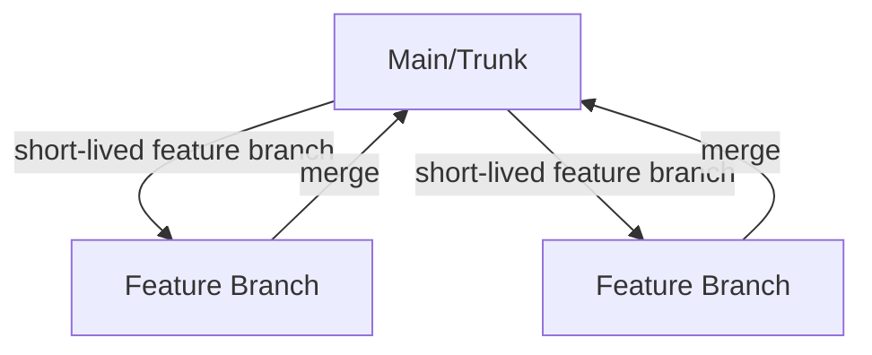

# Understanding Git Flow and Trunk-Based Development Flow

Version control is a crucial aspect of modern software development, allowing multiple developers to collaborate on a project simultaneously. Two popular workflows for managing code in version control systems like Git are **Git Flow** and **Trunk-Based Development**. This article will delve into each of these workflows, compare their pros and cons, and help you decide which one suits your project's needs.

## Git Flow

### What is Git Flow?

Git Flow is a branching model proposed by Vincent Driessen. It defines a strict branching strategy designed to support the release cycle of software projects, with a clear separation between different types of branches.

### Branches in Git Flow

1. **Master**: The main branch where the source code of HEAD always reflects a production-ready state.
2. **Develop**: A parallel branch to `master` where the latest delivered development changes for the next release are integrated.
3. **Feature**: Branches created from `develop` for new features that will be added to the next release.
4. **Release**: Branches created from `develop` when the codebase is ready for release, allowing for final bug fixes and preparations.
5. **Hotfix**: Branches created from `master` to address critical bugs in production.

### Workflow

### Example Companies Using Git Flow

- **SAP**: The enterprise software company uses Git Flow to manage their extensive codebases and ensure that their software products remain stable and production-ready.
- **Drupal**: The popular content management system uses Git Flow to handle contributions from a large number of developers, managing new features, releases, and hotfixes effectively.

### Pros and Cons of Git Flow

**Pros:**

- Well-defined process with clear guidelines.
- Suitable for projects with scheduled releases.
- Isolation of different development stages (features, releases, hotfixes).

**Cons:**

- Can be overly complex for small teams or projects.
- Requires strict adherence to process.
- Can lead to long-lived branches, causing integration issues.

## Trunk-Based Development

### What is Trunk-Based Development?

Trunk-Based Development (TBD) is a branching model where all developers work on a single branch, often referred to as the "trunk" or "main." Changes are committed directly to the trunk or through short-lived feature branches that are merged quickly.

### Workflow

1. **Main/Trunk**: The primary branch where all changes are integrated.
2. **Feature Branches**: Short-lived branches created for specific features or bug fixes, usually existing for only a few hours to a few days before being merged back into the trunk.

### Example Companies Using Trunk-Based Development

- **Google**: Google uses Trunk-Based Development to support their rapid innovation and continuous deployment practices, enabling quick integration and delivery of new features.
- **Facebook**: Facebook employs Trunk-Based Development to facilitate frequent releases and maintain the stability of their platform, allowing them to roll out changes and updates swiftly.

### Pros and Cons of Trunk-Based Development

**Pros:**

- Simplified workflow with less branching complexity.
- Encourages frequent integration, reducing merge conflicts.
- Faster feedback cycles, promoting continuous integration and continuous delivery (CI/CD).

**Cons:**

- Requires a robust suite of automated tests to maintain stability.
- May be challenging for larger teams or complex projects.
- Less isolation between different development stages.

## Comparing Git Flow and Trunk-Based Development

### Suitability for Different Projects

- **Git Flow**: Best suited for projects with well-defined release cycles and a need for clear separation of development stages. Ideal for teams that can follow a strict process.
- **Trunk-Based Development**: Better for projects that require continuous integration and deployment. Ideal for teams that prioritize speed and frequent delivery.

### Complexity and Overhead

- **Git Flow**: More complex due to multiple branches and a defined process, potentially leading to overhead in managing branches.
- **Trunk-Based Development**: Simpler and more straightforward, reducing overhead but requiring robust automated testing.

### Integration and Collaboration

- **Git Flow**: Can lead to integration challenges due to long-lived branches and delayed merging.
- **Trunk-Based Development**: Promotes frequent integration, reducing the risk of merge conflicts and integration issues.

### Example Scenarios

- **Git Flow**: Suitable for a traditional software product with scheduled releases every few months. The team needs to isolate features, releases, and hotfixes to maintain stability and quality.
- **Trunk-Based Development**: Suitable for a SaaS product with continuous deployment. The team wants to deploy changes quickly and frequently, integrating changes as soon as possible.

## Conclusion

Both Git Flow and Trunk-Based Development have their strengths and weaknesses, and the choice between them depends on your project's needs, team size, and development practices. Git Flow offers a structured approach with clear separation of stages, suitable for projects with scheduled releases. Trunk-Based Development promotes continuous integration and delivery, ideal for teams prioritizing speed and frequent updates.

Understanding these workflows and their implications will help you select the best strategy for your project, ensuring efficient collaboration and high-quality software delivery.
