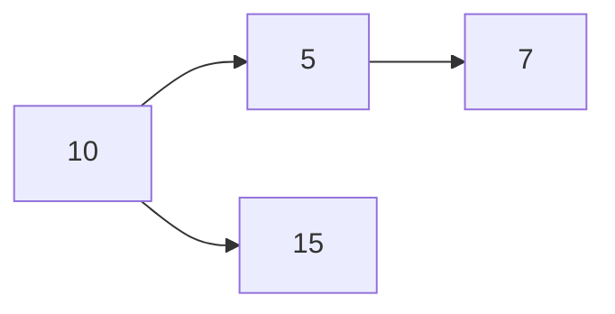
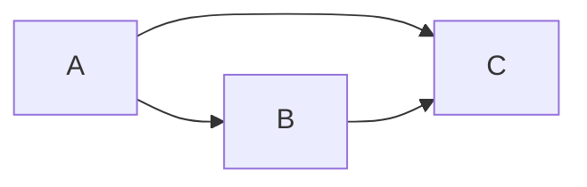

# Trees and Graphs in JavaScript

## Trees

### Introduction

A tree is a hierarchical data structure with a root node and child nodes. Each node can have zero or more children, and there is exactly one path between the root and any other node.

### Types of Trees

- **Binary Tree**: Each node has at most two children.
- **Binary Search Tree (BST)**: A binary tree with the property that left child nodes are less than the parent node, and right child nodes are greater than the parent node.

### Binary Tree Example

#### Node Class

```javascript
class TreeNode {
  constructor(value) {
    this.value = value;
    this.left = null;
    this.right = null;
  }
}
```

#### BinaryTree Class

```javascript
class BinaryTree {
  constructor() {
    this.root = null;
  }

  // Add a node
  add(value) {
    const newNode = new TreeNode(value);

    if (this.root === null) {
      this.root = newNode;
    } else {
      this.insertNode(this.root, newNode);
    }
  }

  insertNode(node, newNode) {
    if (newNode.value < node.value) {
      if (node.left === null) {
        node.left = newNode;
      } else {
        this.insertNode(node.left, newNode);
      }
    } else {
      if (node.right === null) {
        node.right = newNode;
      } else {
        this.insertNode(node.right, newNode);
      }
    }
  }

  // Inorder traversal
  inorder(node = this.root) {
    if (node !== null) {
      this.inorder(node.left);
      console.log(node.value);
      this.inorder(node.right);
    }
  }
}

// Usage
const tree = new BinaryTree();
tree.add(10);
tree.add(5);
tree.add(15);
tree.add(7);
tree.inorder(); // 5 7 10 15
```



### Binary Search Tree (BST)

BST is a binary tree with additional properties:

- The left subtree of a node contains only nodes with keys less than the node’s key.
- The right subtree of a node contains only nodes with keys greater than the node’s key.

## Graphs

### Introduction

A graph is a collection of nodes (vertices) and edges connecting them. Graphs can be directed or undirected.

### Types of Graphs

- **Directed Graph**: Edges have a direction.
- **Undirected Graph**: Edges do not have a direction.

### Graph Example

#### Graph Class

```javascript
class Graph {
  constructor() {
    this.adjacencyList = {};
  }

  // Add a vertex
  addVertex(vertex) {
    if (!this.adjacencyList[vertex]) {
      this.adjacencyList[vertex] = [];
    }
  }

  // Add an edge
  addEdge(vertex1, vertex2) {
    this.adjacencyList[vertex1].push(vertex2);
    this.adjacencyList[vertex2].push(vertex1); // For undirected graph
  }

  // Remove an edge
  removeEdge(vertex1, vertex2) {
    this.adjacencyList[vertex1] = this.adjacencyList[vertex1].filter(
      (vertex) => vertex !== vertex2
    );
    this.adjacencyList[vertex2] = this.adjacencyList[vertex2].filter(
      (vertex) => vertex !== vertex1
    );
  }

  // Remove a vertex
  removeVertex(vertex) {
    while (this.adjacencyList[vertex].length) {
      const adjacentVertex = this.adjacencyList[vertex].pop();
      this.removeEdge(vertex, adjacentVertex);
    }
    delete this.adjacencyList[vertex];
  }

  // Depth First Search
  dfs(start) {
    const result = [];
    const visited = {};
    const adjacencyList = this.adjacencyList;

    (function dfsHelper(vertex) {
      if (!vertex) return null;
      visited[vertex] = true;
      result.push(vertex);
      adjacencyList[vertex].forEach((neighbor) => {
        if (!visited[neighbor]) {
          return dfsHelper(neighbor);
        }
      });
    })(start);

    return result;
  }

  // Breadth First Search
  bfs(start) {
    const queue = [start];
    const result = [];
    const visited = {};
    let currentVertex;

    visited[start] = true;

    while (queue.length) {
      currentVertex = queue.shift();
      result.push(currentVertex);

      this.adjacencyList[currentVertex].forEach((neighbor) => {
        if (!visited[neighbor]) {
          visited[neighbor] = true;
          queue.push(neighbor);
        }
      });
    }

    return result;
  }
}

// Usage
const graph = new Graph();
graph.addVertex("A");
graph.addVertex("B");
graph.addVertex("C");
graph.addEdge("A", "B");
graph.addEdge("A", "C");
graph.addEdge("B", "C");
console.log(graph.dfs("A")); // ['A', 'B', 'C']
console.log(graph.bfs("A")); // ['A', 'B', 'C']
```



### Summary

- **Trees**: Hierarchical data structures with root and child nodes. Examples include binary trees and binary search trees.
- **Graphs**: Collections of nodes (vertices) and edges. Can be directed or undirected. Examples include social networks and web graphs.
