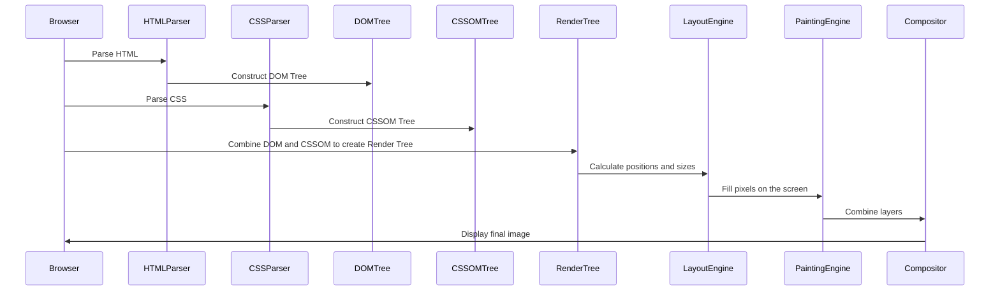

# Browser Rendering Process

## 1. Parsing HTML

The browser starts rendering a web page by parsing the HTML document. Parsing is the process of converting HTML code into a DOM (Document Object Model) tree.

**Steps**:

1. **Tokenization**: The HTML is split into tokens like tags, text, and comments.
2. **Lexical Analysis**: Tokens are categorized into distinct types (e.g., start tags, end tags).
3. **DOM Tree Construction**: The tokens are organized into a tree structure representing the document's hierarchy.

## 2. Parsing CSS

The browser parses the CSS to construct a CSSOM (CSS Object Model) tree. This tree represents the styles associated with each HTML element.

## 3. Combining DOM and CSSOM to Create the Render Tree

The browser combines the DOM and CSSOM trees to create a render tree. The render tree contains only the nodes needed to render the page, excluding non-visual elements like `<head>`.

## 4. Layout (reflow)

In the layout stage, the browser calculates the exact position and size of each element on the page. This stage is also known as reflow.

**Steps**:

1. **Calculate Dimensions**: The browser calculates the width, height, position, and margins of each element.
2. **Generate Box Model**: Each element is represented as a rectangular box.

## 5. Painting

The painting stage involves filling in pixels on the screen. The browser traverses the render tree and paints each node on the screen.

## 6. Compositing

In the compositing stage, the browser combines layers into a single image to display on the screen. This is especially important for elements with CSS properties like `position`, `opacity`, `transform`, and `z-index`.

## Detailed Example of the Rendering Process

### Sample HTML

```html
<!DOCTYPE html>
<html>
  <head>
    <title>Rendering Example</title>
    <style>
      body {
        font-family: Arial, sans-serif;
      }
      h1 {
        color: blue;
      }
      p {
        color: green;
      }
    </style>
  </head>
  <body>
    <h1>Hello, World!</h1>
    <p>This is a rendering example.</p>
  </body>
</html>
```

### Render Tree Construction

The DOM tree:

```
Document
 └── html
      ├── head
      │    └── title
      └── body
           ├── h1
           └── p
```

The CSSOM tree:

```
CSSOM
 └── body { font-family: Arial, sans-serif; }
 └── h1 { color: blue; }
 └── p { color: green; }
```

The render tree:

```
RenderTree
 └── body
      ├── h1 { font-family: Arial, color: blue; }
      └── p { font-family: Arial, color: green; }
```

### Layout and Painting

- The layout engine calculates the positions and sizes of the `h1` and `p` elements.
- The painting engine fills the screen with the text "Hello, World!" in blue and "This is a rendering example." in green.

## Diagram for the Rendering Process



## Summary

- **Parsing HTML**: Converts HTML into the DOM tree.
- **Parsing CSS**: Converts CSS into the CSSOM tree.
- **Render Tree Construction**: Combines the DOM and CSSOM trees to create the render tree.
- **Layout**: Calculates the exact position and size of each element.
- **Painting**: Fills pixels on the screen.
- **Compositing**: Combines layers into a single image for display.
