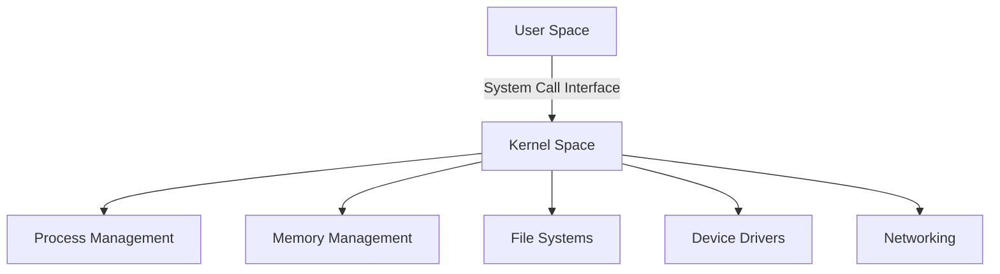

# 1. Linux Kernel Fundamentals

## Introduction

The Linux kernel is the core component of the Linux operating system. It manages the system's hardware, provides an interface for user-level applications, and handles system resources. It is responsible for process management, memory management, device drivers, file systems, and network management.

## Architecture of the Linux Kernel

The Linux kernel follows a monolithic architecture, which means that all the basic services like process management, memory management, file systems, and device drivers run in the kernel space. However, it is modular, allowing the loading and unloading of kernel modules at runtime.

Here's a high-level overview of the Linux kernel architecture:



**System Call Interface (SCI)**

- Provides the interface between user space and kernel space.
- Allows user applications to request services from the kernel.
- Examples: `open()`, `read()`, `write()`, `ioctl()`.

**2. Process Management**

- Handles the creation, scheduling, and termination of processes.
- Uses data structures like the task_struct to maintain process information.
- Implements scheduling algorithms like Completely Fair Scheduler (CFS).

**3. Memory Management**

- Manages physical and virtual memory.
- Handles memory allocation and deallocation.
- Implements paging and swapping to manage memory efficiently.
- Uses data structures like page tables to map virtual addresses to physical addresses.

**4. File Systems**

- Manages files and directories on storage devices.
- Supports various file systems like ext4, XFS, Btrfs, and more.
- Provides a Virtual File System (VFS) layer to abstract file system operations.

**5. Device Drivers**

- Interfaces between the hardware devices and the kernel.
- Manages the communication between the hardware and software.
- Each device type (e.g., block, character, network) has specific drivers.

**6. Networking**

- Manages network communication and protocols.
- Implements various network protocols like TCP/IP.
- Provides networking interfaces for user applications.

## Detailed Breakdown

### System Call Interface

- **System Calls**: Mechanism for user programs to interact with the kernel. Includes calls for file operations, process control, and communication.
- **Example**:
  ```c
  #include <unistd.h>
  int fd = open("file.txt", O_RDONLY);
  ```

### Process Management

- **Processes and Threads**: Processes are instances of running programs. Threads are the smallest unit of execution within a process.
- **Process States**: Running, waiting, stopped, zombie.
- **Scheduling**: Decides which process runs at a given time. Key algorithms include Round Robin, Priority Scheduling, and CFS.

### Memory Management

- **Virtual Memory**: Allows each process to have its own virtual address space.
- **Paging**: Divides memory into fixed-size pages. Uses page tables to manage mappings.
- **Swapping**: Moves inactive pages to disk to free up memory.

### File Systems

- **Inodes**: Data structures representing files.
- **Directories**: Special files that contain references to other files and directories.
- **VFS**: Provides a common interface to different file systems.

### Device Drivers

- **Character Devices**: Handle data streams (e.g., serial ports).
- **Block Devices**: Handle data in fixed-size blocks (e.g., hard drives).
- **Network Devices**: Handle network interfaces (e.g., Ethernet cards).

### Networking

- **Sockets**: Endpoint for network communication.
- **TCP/IP Stack**: Core protocols for network communication.
- **Netfilter**: Framework for packet filtering and manipulation.

## Kernel Modules

- **Loadable Kernel Modules (LKMs)**: Pieces of code that can be loaded and unloaded into the kernel at runtime.
- **Commands**:
  - `insmod`: Insert a module into the kernel.
  - `rmmod`: Remove a module from the kernel.
  - `lsmod`: List currently loaded modules.

## Kernel Development and Contribution

- **Source Code**: Available on [kernel.org](https://www.kernel.org/).
- **Compilation**: Configure and compile the kernel using tools like `make`.
- **Contribution**: Developers can contribute to the Linux kernel by following guidelines and submitting patches.

Here's a simple example of a loadable kernel module written in C:

```c
#include <linux/init.h>
#include <linux/module.h>
#include <linux/kernel.h>

static int __init hello_init(void) {
    printk(KERN_INFO "Hello, Linux Kernel!\n");
    return 0;
}

static void __exit hello_exit(void) {
    printk(KERN_INFO "Goodbye, Linux Kernel!\n");
}

module_init(hello_init);
module_exit(hello_exit);

MODULE_LICENSE("GPL");
MODULE_DESCRIPTION("A simple hello world kernel module");
MODULE_AUTHOR("Your Name");
```

## Summary

Understanding the Linux kernel involves grasping its architecture and the key components that handle various system functionalities. Mastery of these fundamentals will prepare you to tackle more advanced topics and perform well in your interview.
