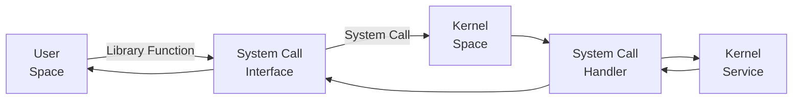

# 2. System Calls and APIs

## Introduction

System calls are the interface between user programs and the operating system kernel. They provide a way for user applications to request services and resources from the kernel, such as file operations, process control, and network communication. APIs (Application Programming Interfaces) are higher-level abstractions that user applications use to interact with the system, often relying on system calls to perform their tasks.

## System Calls

### Definition

System calls are special functions provided by the kernel that allow user-space applications to request services from the operating system. They are the fundamental interface for interacting with the kernel.

### Common System Calls

1. **File Management**: `open()`, `read()`, `write()`, `close()`
2. **Process Management**: `fork()`, `exec()`, `wait()`, `exit()`
3. **Memory Management**: `mmap()`, `munmap()`, `brk()`
4. **Device Management**: `ioctl()`, `read()`, `write()`
5. **Information Maintenance**: `getpid()`, `gettimeofday()`
6. **Communication**: `pipe()`, `socket()`, `send()`, `recv()`

## System Call Workflow

1. **User Space**: A user-space application makes a system call using a library function provided by the C standard library (glibc).
2. **System Call Interface**: The library function invokes the appropriate system call using a special instruction (e.g., `syscall` on x86_64).
3. **Kernel Space**: The system call handler in the kernel processes the request, performs the necessary operations, and returns the result to the user-space application.

## Example: `open()` System Call

1. **User Space**: An application calls `open("file.txt", O_RDONLY)`.
2. **System Call Interface**: The `open()` function in glibc invokes the `syscall` instruction with the appropriate parameters.
3. **Kernel Space**: The kernel's `sys_open` handler processes the request, checks permissions, locates the file, and returns a file descriptor.

```c
#include <fcntl.h>
#include <unistd.h>

int main() {
    int fd = open("file.txt", O_RDONLY);
    if (fd == -1) {
        // Handle error
    }
    // Use the file descriptor
    close(fd);
    return 0;
}
```

## APIs (Application Programming Interfaces)

### Definition

APIs are sets of functions and protocols that allow applications to interact with software or hardware. In the context of operating systems, APIs provide higher-level functions that abstract the complexity of system calls.

### Standard Libraries

1. **C Standard Library (glibc)**: Provides functions like `printf()`, `malloc()`, and `memcpy()`.
2. **POSIX API**: A set of standardized APIs for Unix-like operating systems, including functions for file operations, process control, and inter-process communication.

## System Calls vs. Library Functions

- **System Calls**: Low-level functions provided by the kernel. Directly interact with hardware and system resources.
- **Library Functions**: High-level abstractions provided by libraries. Often use system calls internally to perform tasks.

## Example: `printf()` Function

1. **Library Function**: `printf()` formats a string and outputs it to the standard output.
2. **System Call**: Internally, `printf()` may use the `write()` system call to send the formatted string to the terminal.

```c
#include <stdio.h>

int main() {
    printf("Hello, World!\n");
    return 0;
}
```

## Detailed Breakdown

### Making a System Call



### System Call Handler

- **System Call Table**: A table of function pointers to system call handlers in the kernel.
- **System Call Number**: Each system call has a unique number used to index into the system call table.

### System Call Implementation

```c
#include <linux/kernel.h>
#include <linux/syscalls.h>

SYSCALL_DEFINE2(my_syscall, int, arg1, int, arg2) {
    printk(KERN_INFO "my_syscall called with arguments %d and %d\n", arg1, arg2);
    return arg1 + arg2;
}
```

## Error Handling

- System calls return `-1` on error and set the `errno` variable with the appropriate error code.
- Common errors: `EACCES` (Permission denied), `ENOENT` (No such file or directory), `EBUSY` (Resource busy).

## Performance Considerations

- **Context Switching**: System calls involve context switching between user space and kernel space, which can be expensive.
- **Batching**: Minimizing the number of system calls by batching operations can improve performance.

## Summary

System calls are the bridge between user applications and the kernel, providing essential services like file and process management. APIs, provided by libraries, offer higher-level abstractions for these services, making them easier to use for developers. Understanding the details of system calls and how they work is crucial for effective system programming and performance optimization.
