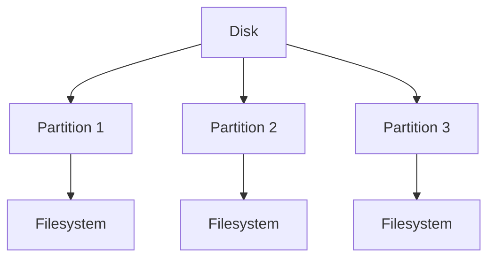

# 3. Filesystem Hierarchy and Management

## Introduction

The filesystem hierarchy is the structure and organization of files and directories in a Linux system. Understanding the filesystem hierarchy is crucial for system administration, as it dictates where files should be located and how the system organizes data. Filesystem management involves tasks like mounting and unmounting file systems, managing disk partitions, and handling files and directories.

## Filesystem Hierarchy

### Filesystem Hierarchy Standard (FHS)

The Filesystem Hierarchy Standard (FHS) defines the directory structure and directory contents in Unix-like operating systems. It helps maintain consistency across different distributions.

### Key Directories in Linux

```bash
.
└── / # top-vel directory
    ├── /bin # essential binary executables
    ├── /boot # bootloader and kernel
    ├── /dev # files that represent hardware
    ├── /etc # system config files
    ├── /home # user home directories
    ├── /lib # shared libs needed by binaries
    ├── /media # removable media suc as USB drives
    ├── /mnt # temp mount points for filesystems
    ├── /opt # optional software packages
    ├── /root # home dir for root user
    ├── /run # runtime data for processes
    ├── /sbin # essential system binaries for admin
    ├── /srv # data for services provided by the system
    ├── /tmp # temporary files
    ├── /usr # user utilities and apps
    │   ├── /bin
    │   ├── /lib
    │   ├── /lib64
    │   └── /local
    └── /var # variable data (logs, spool files, caches)
        ├── /log
        └── /pool
```

### Directory Descriptions

1. **/** (Root)

   - The top-level directory in the filesystem hierarchy.
   - All other directories and files are located under the root directory.

2. **/bin**

   - Contains essential binary executables needed for system operation.
   - Examples: `ls`, `cp`, `mv`, `rm`.

3. **/boot**

   - Contains bootloader files and the kernel.
   - Examples: `vmlinuz`, `initrd`.

4. **/dev**

   - Contains device files that represent hardware components.
   - Examples: `sda`, `tty`, `null`.

5. **/etc**

   - Contains system configuration files.
   - Examples: `passwd`, `fstab`, `hosts`.

6. **/home**

   - Contains user home directories.
   - Example: `/home/username`.

7. **/lib**

   - Contains shared libraries needed by binaries in `/bin` and `/sbin`.
   - Examples: `libc.so`, `libm.so`.

8. **/media**

   - Mount points for removable media such as CD-ROMs and USB drives.
   - Examples: `/media/cdrom`, `/media/usb`.

9. **/mnt**

   - Temporary mount points for filesystems.
   - Examples: `/mnt/disk`, `/mnt/backup`.

10. **/opt**

    - Contains optional software packages.
    - Examples: `/opt/lampp`, `/opt/vmware`.

11. **/root**

    - Home directory for the root user.
    - Example: `/root`.

12. **/run**

    - Contains runtime data for processes started since the last boot.
    - Examples: `/run/lock`, `/run/shm`.

13. **/sbin**

    - Contains essential system binaries for administration.
    - Examples: `ifconfig`, `reboot`, `shutdown`.

14. **/srv**

    - Contains data for services provided by the system.
    - Examples: `/srv/ftp`, `/srv/www`.

15. **/tmp**

    - Contains temporary files.
    - Example: `/tmp`.

16. **/usr**

    - Contains user utilities and applications.
    - Examples: `/usr/bin`, `/usr/lib`.

17. **/var**
    - Contains variable data such as logs, spool files, and caches.
    - Examples: `/var/log`, `/var/spool`.

## Filesystem Management

### Disk Partitioning

- **Partitions**: Logical divisions of a hard disk. Each partition can have its own filesystem.
- **Tools**: `fdisk`, `parted`, `gparted`.



### Filesystem Types

- **Ext4**: Fourth extended filesystem, commonly used in Linux.
- **XFS**: High-performance filesystem.
- **Btrfs**: Modern filesystem with advanced features.
- **FAT32**: Older filesystem, compatible with many operating systems.
- **NTFS**: Filesystem used by Windows.

### Creating and Managing Filesystems

- **mkfs**: Create a filesystem on a partition.
  - Example: `mkfs.ext4 /dev/sda1`
- **mount**: Mount a filesystem to a directory.
  - Example: `mount /dev/sda1 /mnt`
- **umount**: Unmount a filesystem.
  - Example: `umount /mnt`

### Mounting and Unmounting Filesystems

- **Mount Points**: Directories where filesystems are mounted.
- **/etc/fstab**: File containing static information about filesystems.
  - Example entry: `/dev/sda1 /mnt ext4 defaults 0 2`

### Filesystem Checking and Repair

- **fsck**: Filesystem consistency check and repair.
  - Example: `fsck /dev/sda1`

## Directory and File Management

### Commands

- **`ls`**: List directory contents.
- **`cp`**: Copy files and directories.
- **`mv`**: Move or rename files and directories.
- **`rm`**: Remove files and directories.
- **`mkdir`**: Create directories.
- **`rmdir`**: Remove empty directories.
- **`chmod`**: Change file permissions.
- **`chown`**: Change file owner and group.
- **`ln`**: Create hard and symbolic links.

## Summary

Understanding the filesystem hierarchy and management is crucial for effective system administration. It involves knowing the purpose and contents of key directories, managing disk partitions and filesystems, and using commands to handle files and directories. Mastery of these concepts will enable you to efficiently navigate and manage a Linux system, preparing you well for your interview.
