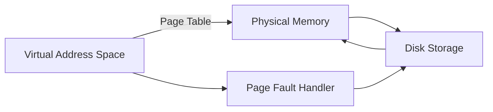

# 5. Memory Management

## Introduction

Memory management is a critical function of the operating system that manages the system's memory resources. It involves the allocation, deallocation, and management of memory for processes, ensuring efficient utilization and protection of memory.

## Key Concepts

### Physical Memory

- **Definition**: The actual hardware RAM installed in the system.
- **Management**: The operating system manages physical memory through various techniques to ensure efficient use.

### Virtual Memory

- **Definition**: An abstraction that provides each process with its own address space, isolating it from others.
- **Paging**: Divides virtual memory into fixed-size pages. Each page maps to a physical memory frame or to disk storage.

### Memory Allocation

- **Dynamic Allocation**: Processes request memory at runtime using functions like `malloc()`.
- **Static Allocation**: Memory allocated at compile time.

## Memory Management Units (MMU)

- **Definition**: Hardware components that handle virtual to physical address translation.
- **Page Tables**: Data structures used by the MMU to map virtual addresses to physical addresses.

## Key Components

### Paging

- **Concept**: Virtual memory is divided into pages, and physical memory is divided into frames.
- **Page Table**: Maps virtual pages to physical frames.
- **Page Fault**: Occurs when a process tries to access a page not currently in physical memory, triggering the OS to fetch the page from disk.



### Swapping

- **Concept**: Moving inactive pages from physical memory to disk to free up RAM.
- **Swap Space**: Disk area reserved for swapping.

### Memory Allocation Techniques

1. **First Fit**: Allocates the first sufficient block of memory.
2. **Best Fit**: Allocates the smallest sufficient block.
3. **Worst Fit**: Allocates the largest available block.

## Memory Protection

- **Definition**: Ensures that one process cannot access the memory of another process.
- **Techniques**: Use of virtual memory, page tables, and access rights.

## Kernel Memory Management

- **Kernel Space**: Memory reserved for the kernel and its modules.
- **User Space**: Memory allocated to user processes.
- **Slab Allocator**: Manages kernel memory allocation efficiently.

## Address Translation

### Virtual to Physical Address Translation

1. **Virtual Address**: Generated by the CPU, unique to each process.
2. **Page Table Lookup**: Translates virtual address to physical address.
3. **Physical Address**: Actual location in RAM.


## Example: Page Table Entry

```c
struct page_table_entry {
    unsigned long present    : 1;  // Page present in memory
    unsigned long rw         : 1;  // Read/write
    unsigned long user       : 1;  // User/supervisor
    unsigned long pwt        : 1;  // Page write-through
    unsigned long pcd        : 1;  // Page cache disable
    unsigned long accessed   : 1;  // Accessed
    unsigned long dirty      : 1;  // Dirty
    unsigned long pte_attr   : 1;  // PTE attribute index
    unsigned long global     : 1;  // Global
    unsigned long avail      : 3;  // Available for system programmer's use
    unsigned long frame      : 40; // Frame address (shifted right 12 bits)
};
```

## Memory Allocation Functions

### `malloc()` and `free()`

- **malloc()**: Allocates a block of memory.
- **free()**: Deallocates a previously allocated block of memory.

### Example in C

```c
#include <stdio.h>
#include <stdlib.h>

int main() {
    int *ptr = (int *)malloc(10 * sizeof(int)); // Allocate memory
    if (ptr == NULL) {
        printf("Memory allocation failed
");
        return 1;
    }
    for (int i = 0; i < 10; i++) {
        ptr[i] = i;
    }
    for (int i = 0; i < 10; i++) {
        printf("%d ", ptr[i]);
    }
    free(ptr); // Deallocate memory
    return 0;
}
```

## Summary

Memory management is crucial for the efficient operation of an operating system. It involves managing physical and virtual memory, handling memory allocation and deallocation, ensuring memory protection, and translating addresses. Understanding these concepts will prepare you well for system administration and performance optimization tasks.
