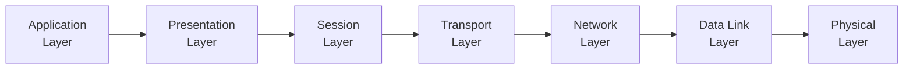

# 6. Networking Concepts and Configuration

## 6.1 Basic Networking Concepts

- **Network**: A collection of computers and devices connected together to share resources and information.
- **IP Address**: A unique identifier for a device on a network.
- **Subnet Mask**: Defines the network and host portions of an IP address.
- **Gateway**: A node that routes traffic from a local network to other networks.
- **DNS (Domain Name System)**: Translates domain names to IP addresses.

## 6.2 Network Models

### OSI Model

The OSI (Open Systems Interconnection) model has seven layers:

1. **Physical**: Hardware connections, signaling.
2. **Data Link**: MAC addresses, switches.
3. **Network**: IP addresses, routers.
4. **Transport**: TCP/UDP, data delivery.
5. **Session**: Manages sessions/connections.
6. **Presentation**: Data translation, encryption.
7. **Application**: End-user applications.



### TCP/IP Model

The TCP/IP model has four layers:

1. **Application**: Application protocols (HTTP, FTP, etc.).
2. **Transport**: TCP/UDP, data transfer.
3. **Internet**: IP addressing, routing.
4. **Link**: Network access, hardware protocols.

## 6.3 Network Configuration in Linux

### Viewing Network Configuration

- **ifconfig**: Displays network interfaces and their configurations.
- **ip addr show**: Displays IP addresses assigned to network interfaces.

```sh
ifconfig
ip addr show
```

### Configuring Network Interfaces

- **Static IP Configuration**:
  - Edit `/etc/network/interfaces` (Debian-based) or `/etc/sysconfig/network-scripts/ifcfg-eth0` (Red Hat-based).

```sh
# Debian-based example
auto eth0
iface eth0 inet static
    address 192.168.1.10
    netmask 255.255.255.0
    gateway 192.168.1.1
```

```sh
# Red Hat-based example
DEVICE=eth0
BOOTPROTO=static
IPADDR=192.168.1.10
NETMASK=255.255.255.0
GATEWAY=192.168.1.1
ONBOOT=yes
```

- **Dynamic IP Configuration**:
  - Use `dhclient` to obtain an IP address from a DHCP server.

```sh
dhclient eth0
```

### DNS Configuration

- Configure DNS servers in `/etc/resolv.conf`.

```sh
nameserver 8.8.8.8
nameserver 8.8.4.4
```

## 6.4 Networking Tools

- **ping**: Tests connectivity between hosts.
- **traceroute**: Traces the route packets take to a destination.
- **netstat**: Displays network connections, routing tables, and interface statistics.
- **ss**: Analyzes sockets.
- **tcpdump**: Captures and analyzes network traffic.
- **nmap**: Network scanning and discovery.

```sh
ping google.com
traceroute google.com
netstat -tuln
ss -tuln
tcpdump -i eth0
nmap -sP 192.168.1.0/24
```

## 6.5 Advanced Networking Concepts

### VLANs (Virtual Local Area Networks)

- **VLAN**: Segments a physical network into multiple logical networks.
- **Configuring VLANs**:
  - Use the `vconfig` command to create VLANs on an interface.

```sh
vconfig add eth0 10
ifconfig eth0.10 192.168.10.1 netmask 255.255.255.0 up
```

### Bridging

- **Bridge**: Connects two or more network segments, operating at the data link layer.
- **Configuring a Bridge**:
  - Use `brctl` to create and manage bridges.

```sh
brctl addbr br0
brctl addif br0 eth0
ifconfig br0 192.168.1.10 netmask 255.255.255.0 up
```

## 6.6 Network Services Configuration

### DHCP Server

- **DHCP (Dynamic Host Configuration Protocol)**: Automatically assigns IP addresses to devices on a network.
- **Configuring DHCP Server**:
  - Install and configure `isc-dhcp-server` on Debian-based systems.

```sh
# /etc/dhcp/dhcpd.conf
subnet 192.168.1.0 netmask 255.255.255.0 {
    range 192.168.1.10 192.168.1.100;
    option routers 192.168.1.1;
    option domain-name-servers 8.8.8.8, 8.8.4.4;
}
```

### HTTP Server

- **HTTP (HyperText Transfer Protocol)**: Serves web content.
- **Configuring HTTP Server**:
  - Install and configure `apache2` or `nginx`.

```sh
# Apache2 example
apt install apache2
# Default document root: /var/www/html
```

```sh
# Nginx example
apt install nginx
# Default document root: /usr/share/nginx/html
```

## 6.7 Firewall Configuration

- **Firewall**: Controls incoming and outgoing network traffic based on predetermined security rules.
- **Configuring Firewall**:
  - Use `iptables` or `ufw` (Uncomplicated Firewall).

```sh
# iptables example
iptables -A INPUT -p tcp --dport 22 -j ACCEPT
iptables -A INPUT -j DROP

# ufw example
ufw allow ssh
ufw enable
```

## 6.8 Network File Sharing

### NFS (Network File System)

- **NFS**: Allows file access over a network.
- **Configuring NFS**:
  - Install `nfs-kernel-server` and configure exports.

```sh
# /etc/exports
/home 192.168.1.0/24(rw,sync,no_root_squash)
```

```sh
exportfs -a
systemctl restart nfs-kernel-server
```

### Samba

- **Samba**: Provides SMB/CIFS services for file sharing with Windows systems.
- **Configuring Samba**:
  - Install `samba` and configure shares.

```sh
# /etc/samba/smb.conf
[shared]
   path = /srv/samba/shared
   read only = no
   browsable = yes
```

```sh
systemctl restart smbd
```

## 6.9 Troubleshooting Network Issues

- **Check physical connections**: Ensure cables and hardware are connected properly.
- **Check IP configuration**: Use `ifconfig` or `ip addr show`.
- **Check routes**: Use `route` or `ip route`.
- **Check DNS resolution**: Use `nslookup` or `dig`.
- **Check connectivity**: Use `ping` and `traceroute`.
- **Check firewall rules**: Use `iptables -L` or `ufw status`.

```sh
ping google.com
nslookup google.com
traceroute google.com
iptables -L
```

## Conclusion

Mastering these networking concepts and configuration techniques will ensure you have a solid understanding of how to manage and troubleshoot network issues in a Linux environment, which will be critical for your interview.
