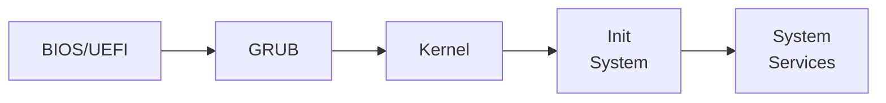
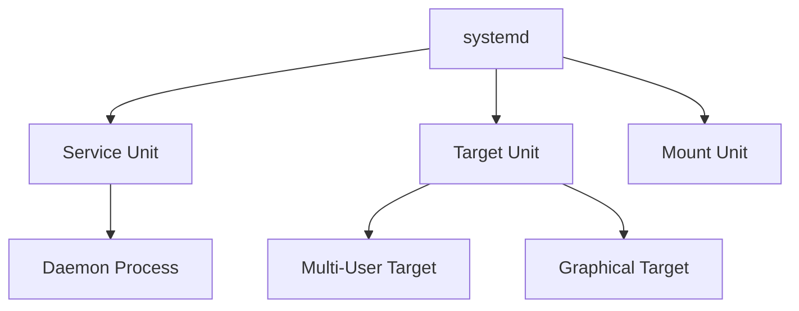

# 11. Boot Process and System Initialization

## 11.1 Introduction to Boot Process

- **Boot Process**: The sequence of events that occurs from the time a computer is powered on until the operating system is loaded and the system is ready for use.
- **System Initialization**: The process of starting and managing system services and processes after the kernel has been loaded.

## 11.2 Stages of the Boot Process

### 1. BIOS/UEFI Initialization

- **BIOS (Basic Input/Output System)**: The firmware interface that initializes hardware during the booting process and provides runtime services for operating systems and programs.
- **UEFI (Unified Extensible Firmware Interface)**: The modern replacement for BIOS, providing enhanced features and a more flexible pre-boot environment.

### 2. Boot Loader

- **Boot Loader**: A small program that loads the operating system into memory.
- Common boot loaders: GRUB (Grand Unified Bootloader), LILO (Linux Loader).

#### GRUB Example



### 3. Kernel Initialization

- **Kernel**: The core of the operating system that manages system resources and hardware.
- The kernel initializes devices, mounts the root filesystem, and starts the initial process.

### 4. Init System

- **Init System**: The first process started by the kernel (PID 1) that manages system initialization and service management.
- Common init systems: System V (SysVinit), Upstart, systemd.

### 5. System Services

- **System Services**: Background processes (daemons) that provide various functionalities (e.g., networking, logging, etc.).

## 11.3 BIOS/UEFI Initialization

- **Power-On Self Test (POST)**: Hardware initialization and diagnostics performed by BIOS/UEFI.
- **Boot Device Selection**: BIOS/UEFI selects the boot device based on configuration (e.g., hard drive, CD/DVD, USB).
- **Boot Loader Execution**: BIOS/UEFI loads and executes the boot loader from the selected boot device.

## 11.4 Boot Loader

### GRUB (Grand Unified Bootloader)

- **Configuration File**: `/boot/grub/grub.cfg`
- **Stages**:
  - **Stage 1**: Located in the Master Boot Record (MBR) or UEFI partition.
  - **Stage 1.5**: Located in the first 30 KB of the boot partition.
  - **Stage 2**: Located in the `/boot` directory, loads the kernel and initramfs.

### Configuring GRUB

- **Updating GRUB Configuration**:

```sh
sudo update-grub
```

- **Customizing GRUB**:

```sh
sudo nano /etc/default/grub
sudo update-grub
```

## 11.5 Kernel Initialization

- **Loading the Kernel**: The boot loader loads the kernel into memory and passes control to it.
- **Kernel Decompression**: The kernel is decompressed and initialized.
- **Device Initialization**: The kernel initializes hardware devices and drivers.
- **Mounting Root Filesystem**: The kernel mounts the root filesystem specified by the boot loader.
- **Starting Init Process**: The kernel starts the init process (PID 1).

## 11.6 Init System

### System V (SysVinit)

- **Initialization Scripts**: Located in `/etc/init.d/` and `/etc/rc.d/`.
- **Runlevels**: Defines the state of the machine (e.g., single-user mode, multi-user mode). Runlevel configuration files are located in `/etc/inittab`.

### Upstart

- **Event-Based Init System**: Uses events to start and stop services.
- **Configuration Files**: Located in `/etc/init/`.

### systemd

- **Unit Files**: Configuration files that define system services, targets, and other system resources.
- **Default Target**: The default systemd target (similar to SysVinit runlevels). Configuration files are located in `/etc/systemd/system/`.



### Managing Services with systemd

- **Starting/Stopping Services**:

```sh
sudo systemctl start service_name
sudo systemctl stop service_name
```

- **Enabling/Disabling Services**:

```sh
sudo systemctl enable service_name
sudo systemctl disable service_name
```

- **Checking Service Status**:

```sh
sudo systemctl status service_name
```

- **Listing All Services**:

```sh
sudo systemctl list-units --type=service
```

## 11.7 System Services

- **Service Management**: Managing background processes (daemons) that provide various system functionalities.
- **Common System Services**:
  - `network.service`: Manages network connections.
  - `sshd.service`: Manages SSH server.
  - `cron.service`: Manages scheduled tasks.

### Example: Managing SSH Service

- **Start SSH Service**:

```sh
sudo systemctl start sshd
```

- **Enable SSH Service on Boot**:

```sh
sudo systemctl enable sshd
```

## 11.8 Boot Logs

- **Viewing Boot Logs**: Use `journalctl` to view system logs, including boot logs.

```sh
# View the boot log
sudo journalctl -b

# View logs for previous boots
sudo journalctl --list-boots
sudo journalctl -b -1
```

## Conclusion

Understanding the boot process and system initialization is crucial for system administrators. This knowledge helps in diagnosing boot issues, configuring the boot process, and managing system services. Mastery of these concepts will significantly improve your ability to manage and troubleshoot Linux systems.
