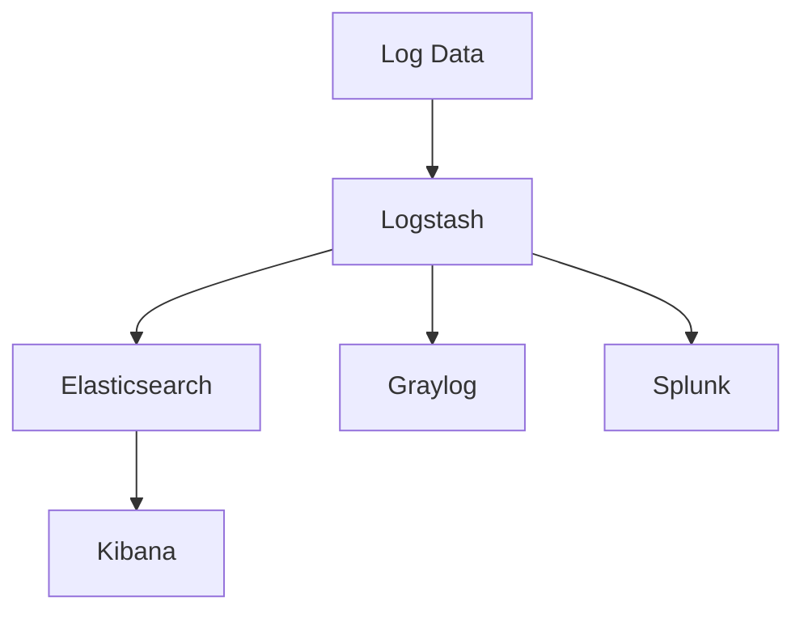

# 13. Logging and Log Management

## 13.1 Introduction to Logging

- **Logging**: The process of recording events, messages, and other information about the operation of a computer system.
- **Log Management**: The practice of collecting, analyzing, and storing logs to monitor, troubleshoot, and ensure the security of systems.

### Key Concepts

- **Log Files**: Files that store log entries.
- **Log Entries**: Individual records in a log file that document a specific event or message.

## 13.2 Types of Logs

### 1. System Logs

- **System Logs**: Logs generated by the operating system to record events related to system operations.
- **Examples**: Boot logs, kernel logs, authentication logs.

### 2. Application Logs

- **Application Logs**: Logs generated by applications to record events specific to the application's operation.
- **Examples**: Web server logs, database logs, application error logs.

### 3. Security Logs

- **Security Logs**: Logs that record security-related events.
- **Examples**: Access logs, audit logs, firewall logs.

## 13.3 Log Files and Locations

### Common Log Files and Their Locations

- **/var/log/syslog**: General system log file.
- **/var/log/auth.log**: Authentication log file.
- **/var/log/kern.log**: Kernel log file.
- **/var/log/dmesg**: Boot and hardware log file.
- **/var/log/secure**: Security-related messages and authentication log file (Red Hat-based systems).
- **/var/log/messages**: General log file for system messages (Red Hat-based systems).

## 13.4 Log Management Tools

### rsyslog

- **rsyslog**: A powerful and versatile syslog server for forwarding log messages in an IP network.
- **Configuration File**: `/etc/rsyslog.conf`.

```sh
# Example: Forward all logs to a remote server
*.* @remote-server:514
```

### journald

- **journald**: A component of systemd that collects and stores log data.
- **Configuration File**: `/etc/systemd/journald.conf`.

```sh
# Example: Configure journald to store persistent logs
[Journal]
Storage=persistent
```

### syslog-ng

- **syslog-ng**: An enhanced logging daemon that extends the syslog protocol with additional features.
- **Configuration File**: `/etc/syslog-ng/syslog-ng.conf`.

```sh
# Example: Forward logs to a remote server
destination d_remote {
    tcp("remote-server" port(514));
};
log {
    source(s_sys);
    destination(d_remote);
};
```

### logrotate

- **logrotate**: A utility for rotating, compressing, and managing log files.
- **Configuration Files**: `/etc/logrotate.conf`, `/etc/logrotate.d/`.

```sh
# Example: Rotate logs weekly and keep 4 weeks of logs
/var/log/syslog {
    weekly
    rotate 4
    compress
    missingok
    notifempty
    create 640 syslog adm
    sharedscripts
    postrotate
        /etc/init.d/rsyslog reload > /dev/null
    endscript
}
```

## 13.5 Log Analysis and Monitoring

### Analyzing Logs

- **Manual Analysis**: Using tools like `grep`, `awk`, and `sed` to search and filter log files.
- **Automated Analysis**: Using log analysis tools to automatically parse and analyze log data.

### Log Analysis Tools

- **ELK Stack**: Elasticsearch, Logstash, and Kibana for collecting, storing, and visualizing log data.
- **Graylog**: A centralized logging solution for log management and analysis.
- **Splunk**: A platform for searching, monitoring, and analyzing machine-generated data.



## 13.6 Best Practices for Log Management

### Centralized Logging

- **Centralized Logging**: Collecting logs from multiple systems and storing them in a central location for easy management and analysis.

### Log Retention Policies

- **Log Retention**: Establishing policies for how long logs should be kept before being archived or deleted.

### Security and Privacy

- **Secure Logging**: Ensuring that log data is protected from unauthorized access and tampering.
- **Anonymization**: Removing or obfuscating sensitive information in log files to protect privacy.

### Monitoring and Alerts

- **Proactive Monitoring**: Setting up monitoring and alerting to detect and respond to issues in real-time.

## 13.7 Practical Examples

### Example 1: Using grep to Search Logs

```sh
# Search for failed login attempts in the authentication log
grep "Failed password" /var/log/auth.log
```

### Example 2: Using logrotate to Manage Log Files

```sh
# Rotate logs for a custom application
/var/log/myapp/*.log {
    daily
    rotate 7
    compress
    missingok
    notifempty
    create 640 myapp myapp
    postrotate
        systemctl reload myapp
    endscript
}
```

### Example 3: Configuring rsyslog to Forward Logs to a Remote Server

```sh
# /etc/rsyslog.conf
*.* @remote-server:514
```

## Conclusion

Effective logging and log management are critical for monitoring system performance, troubleshooting issues, and ensuring security. By understanding the various types of logs, tools, and best practices, you can develop a comprehensive log management strategy that meets the needs of your organization.
