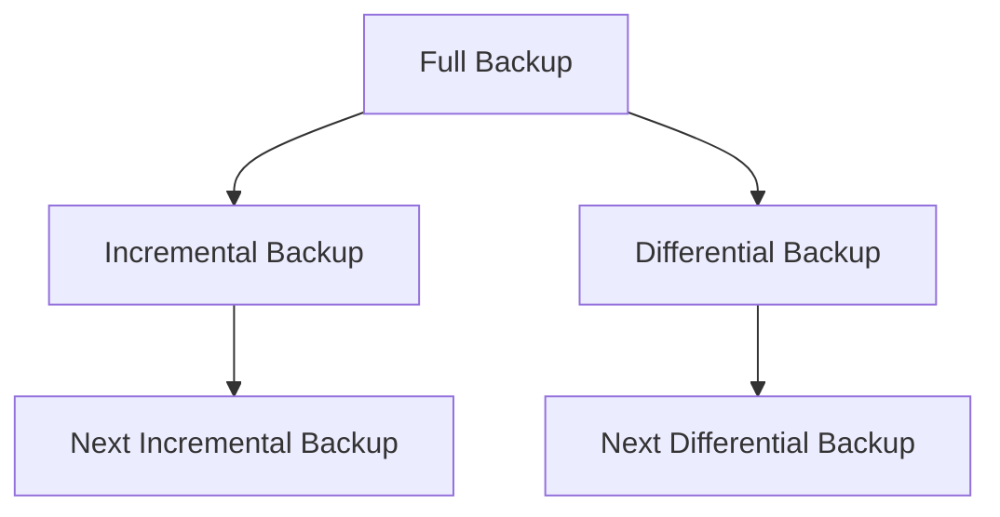

# 14. Backup and Recovery

## 14.1 Introduction to Backup and Recovery

- **Backup**: The process of creating copies of data to protect against data loss.
- **Recovery**: The process of restoring data from backups in case of data loss or corruption.

### Key Concepts

- **Full Backup**: A complete copy of all data.
- **Differential Backup**: Copies only the data that has changed since the last full backup.
- **Incremental Backup**: Copies only the data that has changed since the last backup.
- **Snapshot**: A point-in-time copy of data, often used in conjunction with backup strategies.

## 14.2 Types of Backups

### 1. Full Backup

- **Full Backup**: A complete copy of all files and data at a specific point in time.
- **Advantages**: Simple to restore from, as all data is in one place.
- **Disadvantages**: Time-consuming and requires a lot of storage space.

### 2. Differential Backup

- **Differential Backup**: Backs up only the data that has changed since the last full backup.
- **Advantages**: Faster than full backups and easier to restore than incremental backups.
- **Disadvantages**: Requires more storage space than incremental backups.

### 3. Incremental Backup

- **Incremental Backup**: Backs up only the data that has changed since the last backup of any type.
- **Advantages**: Faster and requires less storage space than full backups.
- **Disadvantages**: Slower to restore, as multiple backups may need to be combined.

### Backup Strategies



## 14.3 Backup Tools

### rsync

- **rsync**: A fast and versatile file copying tool, often used for backups.

```sh
# Example: Syncing directories
rsync -av --delete /source/directory /backup/directory
```

### tar

- **tar**: A utility to create archive files, commonly used for backups.

```sh
# Example: Creating a tar archive
tar -cvzf backup.tar.gz /path/to/directory
```

### dd

- **dd**: A low-level copying tool, often used for creating disk images.

```sh
# Example: Creating a disk image
sudo dd if=/dev/sda of=/path/to/backup.img bs=4M
```

### duplicity

- **duplicity**: An encrypted bandwidth-efficient backup tool.

```sh
# Example: Creating an encrypted backup
duplicity /source/directory file:///path/to/backup
```

### rsnapshot

- **rsnapshot**: A filesystem snapshot utility based on `rsync`.

```sh
# Example: Running rsnapshot backup
rsnapshot daily
```

## 14.4 Backup Storage Options

### Local Storage

- **Local Storage**: Backups stored on local devices such as external hard drives or network-attached storage (NAS).
- **Advantages**: Fast access and control over data.
- **Disadvantages**: Vulnerable to physical damage and theft.

### Remote Storage

- **Remote Storage**: Backups stored on remote servers or cloud storage services.
- **Advantages**: Protection against local disasters and easy access from different locations.
- **Disadvantages**: Dependent on network speed and potentially higher costs.

### Cloud Storage

- **Cloud Storage**: Backups stored on cloud platforms such as AWS, Google Cloud, or Azure.
- **Advantages**: Scalability, reliability, and offsite storage.
- **Disadvantages**: Recurring costs and reliance on third-party providers.

## 14.5 Recovery Techniques

### Restoring from Full Backup

- **Full Backup Restore**: Simple process of copying data from the full backup to the original location.

```sh
# Example: Restoring from tar archive
tar -xvzf backup.tar.gz -C /restore/location
```

### Restoring from Incremental Backup

- **Incremental Restore**: Restoring the last full backup followed by each incremental backup in order.

```sh
# Example: Restoring with rsync
rsync -av /backup/full/ /restore/location/
rsync -av /backup/incremental1/ /restore/location/
rsync -av /backup/incremental2/ /restore/location/
```

### Restoring from Differential Backup

- **Differential Restore**: Restoring the last full backup followed by the latest differential backup.

```sh
# Example: Restoring with rsync
rsync -av /backup/full/ /restore/location/
rsync -av /backup/differential/ /restore/location/
```

## 14.6 Backup and Recovery Best Practices

### Regular Backups

- **Regular Backups**: Schedule regular backups to ensure data is consistently protected.

### Testing Restores

- **Testing Restores**: Regularly test backup restores to ensure data integrity and recovery process effectiveness.

### Secure Storage

- **Secure Storage**: Protect backup data with encryption and secure storage locations.

### Documentation

- **Documentation**: Maintain clear documentation of backup procedures, schedules, and recovery steps.

### Automation

- **Automation**: Automate backup processes to reduce human error and ensure consistency.

## Conclusion

Effective backup and recovery strategies are essential for protecting data and ensuring business continuity. Understanding the different types of backups, tools, and best practices will help you develop a robust backup and recovery plan that meets your organization's needs.
