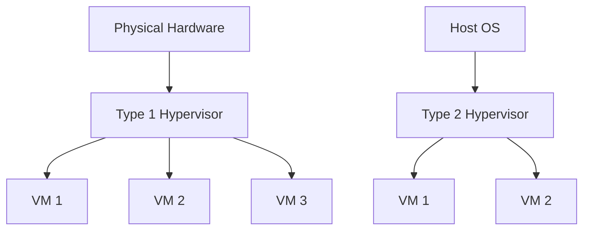
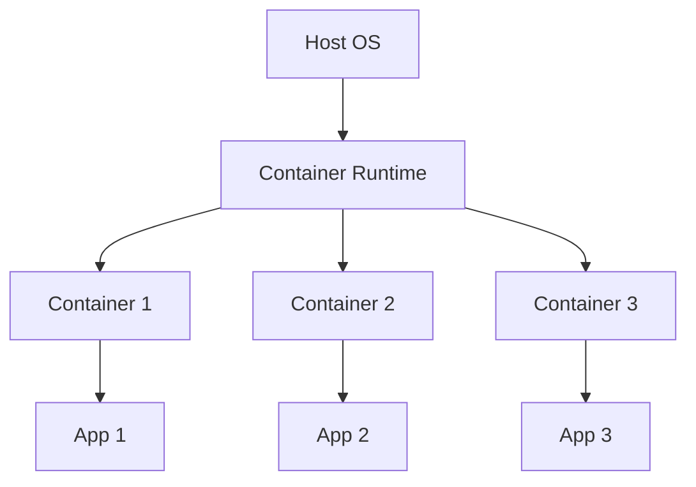

# 15. Virtualization and Containerization (e.g., Docker, LXC)

## 15.1 Introduction to Virtualization and Containerization

- **Virtualization**: The creation of virtual instances of physical resources such as servers, storage devices, and networks.
- **Containerization**: A lightweight form of virtualization that involves encapsulating an application and its dependencies into a container that can run on any computing environment.

### Key Concepts

- **Hypervisor**: Software that creates and manages virtual machines (VMs).
- **Containers**: Lightweight, portable units of software that package code and dependencies together.

## 15.2 Virtualization

### Types of Virtualization

1. **Full Virtualization**: Uses a hypervisor to emulate hardware, allowing multiple VMs to run unmodified operating systems.
2. **Paravirtualization**: The guest OS is aware of the hypervisor and can communicate with it for better performance.
3. **Hardware-Assisted Virtualization**: Uses hardware features to improve the performance and efficiency of virtualization.

### Hypervisors

- **Type 1 Hypervisor (Bare-Metal)**: Runs directly on the host's hardware (e.g., VMware ESXi, Microsoft Hyper-V).
- **Type 2 Hypervisor (Hosted)**: Runs on a host operating system (e.g., VirtualBox, VMware Workstation).

### Benefits of Virtualization

- **Resource Optimization**: Better utilization of hardware resources.
- **Isolation**: VMs are isolated from each other, providing security and stability.
- **Scalability**: Easy to scale up by adding more VMs.
- **Flexibility**: Supports running different operating systems on the same hardware.

### Virtualization Diagram



## 15.3 Containerization

### Containers vs. Virtual Machines

- **Containers**: Share the host OS kernel, lightweight, and start quickly.
- **Virtual Machines**: Run separate OS instances, more resource-intensive, and slower to start.

### Docker

- **Docker**: A platform for developing, shipping, and running applications in containers.

#### Key Components

- **Docker Engine**: The runtime that builds and runs containers.
- **Dockerfile**: A script containing instructions to build a Docker image.
- **Docker Image**: A snapshot of a container.
- **Docker Container**: A runnable instance of a Docker image.

#### Docker Commands

- **Building an Image**:

```sh
docker build -t my_image:latest .
```

- **Running a Container**:

```sh
docker run -d --name my_container my_image:latest
```

- **Listing Containers**:

```sh
docker ps
```

### LXC (Linux Containers)

- **LXC**: An OS-level virtualization method for running multiple isolated Linux systems on a single host.

#### Key Concepts

- **LXC Containers**: Lightweight virtual machines sharing the host kernel.
- **LXC Tools**: `lxc-create`, `lxc-start`, `lxc-stop`, `lxc-destroy`.

#### LXC Example

- **Creating a Container**:

```sh
lxc-create -t download -n my_container -- -d ubuntu -r focal -a amd64
```

- **Starting a Container**:

```sh
lxc-start -n my_container -d
```

- **Stopping a Container**:

```sh
lxc-stop -n my_container
```

### Containerization Diagram



## 15.4 Orchestration and Management

### Kubernetes

- **Kubernetes**: An open-source platform for automating deployment, scaling, and operations of containerized applications.

#### Key Components

- **Cluster**: A set of nodes running containerized applications.
- **Node**: A worker machine in Kubernetes.
- **Pod**: The smallest deployable unit in Kubernetes, which can contain one or more containers.

#### Kubernetes Commands

- **Creating a Deployment**:

```sh
kubectl create deployment my_app --image=my_image:latest
```

- **Scaling a Deployment**:

```sh
kubectl scale deployment my_app --replicas=3
```

- **Listing Pods**:

```sh
kubectl get pods
```

### Docker Swarm

- **Docker Swarm**: A native clustering and orchestration tool for Docker.

#### Key Components

- **Swarm**: A cluster of Docker nodes.
- **Service**: A task definition for running containers.
- **Task**: An individual container running as part of a service.

#### Docker Swarm Commands

- **Initializing a Swarm**:

```sh
docker swarm init
```

- **Creating a Service**:

```sh
docker service create --name my_service --replicas 3 my_image:latest
```

- **Listing Services**:

```sh
docker service ls
```

## 15.5 Best Practices

### For Virtualization

- **Resource Allocation**: Properly allocate resources to avoid overcommitting.
- **Isolation**: Ensure strong isolation between VMs for security.
- **Backup and Recovery**: Implement robust backup and recovery strategies for VMs.

### For Containerization

- **Image Optimization**: Keep Docker images small and efficient.
- **Security**: Regularly update images and use trusted base images.
- **Orchestration**: Use orchestration tools like Kubernetes for managing containerized applications.

## Conclusion

Understanding virtualization and containerization is crucial for modern IT infrastructure. These technologies provide flexibility, scalability, and efficiency in managing applications and resources. Mastery of these concepts will significantly enhance your ability to design, deploy, and manage complex systems.
