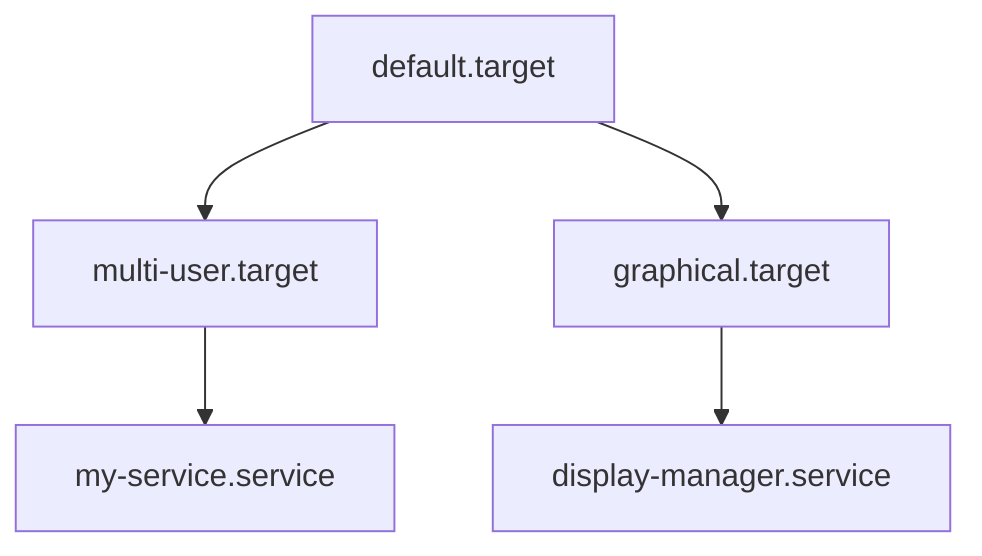

# 16. Systemd and Service Management

## 16.1 Introduction to Systemd

- **Systemd**: A system and service manager for Linux operating systems, responsible for initializing the system and managing system services.
- **Init System**: The first process (PID 1) started by the Linux kernel, responsible for starting and managing system services.

### Key Concepts

- **Unit Files**: Configuration files that describe the services, sockets, devices, and other entities managed by systemd.
- **Targets**: Groupings of units that allow for starting and stopping multiple services at once, similar to runlevels in traditional init systems.

## 16.2 Systemd Components

### 1. Unit Files

- **Types of Unit Files**:
  - **Service Units**: Define how to manage system services (.service).
  - **Socket Units**: Define network sockets and IPC mechanisms (.socket).
  - **Device Units**: Define and manage device nodes in the /dev directory (.device).
  - **Mount Units**: Define mount points for filesystems (.mount).
  - **Automount Units**: Automate the mounting of filesystems (.automount).
  - **Target Units**: Group multiple units for managing services (.target).

### 2. Targets

- **Targets**: Group units to manage their state collectively.
- **Common Targets**:
  - `default.target`: The default target reached after boot.
  - `multi-user.target`: Multi-user mode without graphical interface.
  - `graphical.target`: Multi-user mode with graphical interface.

## 16.3 Unit File Structure

- **Unit File Sections**:
  - `[Unit]`: General unit description and dependencies.
  - `[Service]`: Service-specific configuration.
  - `[Install]`: Installation information.

### Example: Simple Service Unit File

```ini
[Unit]
Description=My Sample Service
After=network.target

[Service]
ExecStart=/usr/bin/my-service
Restart=always

[Install]
WantedBy=multi-user.target
```

## 16.4 Managing Services with Systemd

### Starting and Stopping Services

- **Start a Service**:

```sh
sudo systemctl start service_name
```

- **Stop a Service**:

```sh
sudo systemctl stop service_name
```

### Enabling and Disabling Services

- **Enable a Service**:

```sh
sudo systemctl enable service_name
```

- **Disable a Service**:

```sh
sudo systemctl disable service_name
```

### Checking Service Status

- **Check the Status of a Service**:

```sh
sudo systemctl status service_name
```

### Restarting and Reloading Services

- **Restart a Service**:

```sh
sudo systemctl restart service_name
```

- **Reload a Service**:

```sh
sudo systemctl reload service_name
```

## 16.5 Viewing and Analyzing Logs

- **journalctl**: Utility to query and display logs from journald, the logging component of systemd.

### Viewing Logs

- **View All Logs**:

```sh
journalctl
```

- **View Logs for a Specific Service**:

```sh
journalctl -u service_name
```

- **View Logs Since Last Boot**:

```sh
journalctl -b
```

### Filtering Logs

- **Filter by Time**:

```sh
journalctl --since "2023-01-01 00:00:00" --until "2023-01-01 23:59:59"
```

- **Follow Logs in Real-Time**:

```sh
journalctl -f
```

## 16.6 Systemd Targets

### Default Target

- **Set the Default Target**:

```sh
sudo systemctl set-default target_name
```

- **Change to a Different Target**:

```sh
sudo systemctl isolate target_name
```

### Common Targets

- **multi-user.target**: Equivalent to runlevel 3, multi-user mode without graphical interface.
- **graphical.target**: Equivalent to runlevel 5, multi-user mode with graphical interface.

## 16.7 Creating and Managing Unit Files

### Creating a Custom Service

1. **Create a Unit File**: Create a file in `/etc/systemd/system/my-service.service`.

```ini
[Unit]
Description=My Custom Service
After=network.target

[Service]
ExecStart=/usr/bin/my-custom-service
Restart=on-failure

[Install]
WantedBy=multi-user.target
```

2. **Reload Systemd Configuration**:

```sh
sudo systemctl daemon-reload
```

3. **Enable and Start the Service**:

```sh
sudo systemctl enable my-service
sudo systemctl start my-service
```

## 16.8 Advanced Features

### Dependency Management

- **Requires**: Specifies units that must be started for this unit.
- **Wants**: Specifies units that should be started if possible.
- **Before/After**: Specifies ordering of units.

### Timer Units

- **Timer Units**: Used to schedule tasks similar to cron jobs.

### Example: Timer Unit

1. **Create a Timer Unit File**: Create `/etc/systemd/system/my-timer.timer`.

```ini
[Unit]
Description=Run My Service Every Hour

[Timer]
OnCalendar=hourly
Persistent=true

[Install]
WantedBy=timers.target
```

2. **Create a Matching Service Unit**: Create `/etc/systemd/system/my-timer.service`.

```ini
[Unit]
Description=My Timer Service

[Service]
ExecStart=/usr/bin/my-timer-task
```

3. **Enable and Start the Timer**:

```sh
sudo systemctl enable my-timer.timer
sudo systemctl start my-timer.timer
```

### Example Diagram of Systemd Unit and Target Relationships



## Conclusion

Systemd is a powerful and flexible system and service manager that provides extensive capabilities for managing system services and boot processes. Understanding systemd's components, commands, and configuration options is essential for effectively managing Linux systems.
