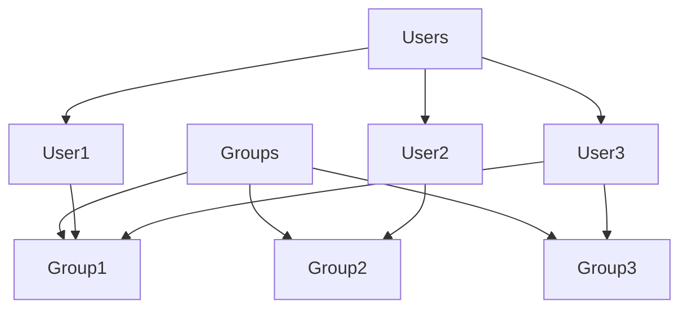

# 17. User and Group Management

## 17.1 Introduction to User and Group Management

- **User Management**: The process of creating, managing, and deleting user accounts on a Linux system.
- **Group Management**: The process of creating, managing, and deleting groups to organize and control user permissions and access.

### Key Concepts

- **User Accounts**: Represent individual users with unique usernames and UIDs (User IDs).
- **Groups**: Collections of user accounts that share the same permissions and access rights.

## 17.2 User Management

### Adding a User

- **adduser**: Adds a new user to the system with a home directory and default settings.

```sh
sudo adduser username
```

- **useradd**: Adds a new user to the system (more basic than `adduser`).

```sh
sudo useradd -m username
```

### Modifying a User

- **usermod**: Modifies an existing user account.

```sh
sudo usermod -aG groupname username
```

### Deleting a User

- **deluser**: Deletes a user from the system.

```sh
sudo deluser username
```

- **userdel**: Deletes a user from the system.

```sh
sudo userdel username
```

### Viewing User Information

- **id**: Displays user and group information.

```sh
id username
```

- **getent**: Retrieves entries from administrative databases.

```sh
getent passwd username
```

### Password Management

- **passwd**: Changes a user's password.

```sh
sudo passwd username
```

## 17.3 Group Management

### Adding a Group

- **addgroup**: Adds a new group to the system.

```sh
sudo addgroup groupname
```

- **groupadd**: Adds a new group to the system.

```sh
sudo groupadd groupname
```

### Modifying a Group

- **groupmod**: Modifies an existing group.

```sh
sudo groupmod -n newgroupname oldgroupname
```

### Deleting a Group

- **delgroup**: Deletes a group from the system.

```sh
sudo delgroup groupname
```

- **groupdel**: Deletes a group from the system.

```sh
sudo groupdel groupname
```

### Viewing Group Information

- **getent**: Retrieves entries from administrative databases.

```sh
getent group groupname
```

## 17.4 User and Group Configuration Files

### /etc/passwd

- **/etc/passwd**: Contains user account information.

```plaintext
username:x:UID:GID:comment:home_directory:shell
```

### /etc/shadow

- **/etc/shadow**: Contains encrypted user passwords and account expiration information.

```plaintext
username:encrypted_password:last_changed:min:max:warn:inactive:expire:reserved
```

### /etc/group

- **/etc/group**: Contains group information.

```plaintext
groupname:x:GID:user1,user2,...
```

### /etc/gshadow

- **/etc/gshadow**: Contains secure group account information.

```plaintext
groupname:encrypted_password:group_admins:group_members
```

## 17.5 Managing User and Group Permissions

### File and Directory Ownership

- **chown**: Changes the ownership of files and directories.

```sh
sudo chown owner:group filename
```

### File and Directory Permissions

- **chmod**: Changes the permissions of files and directories.

```sh
chmod mode filename
```

### Viewing Permissions

- **ls -l**: Lists files and directories with detailed information, including permissions.

```sh
ls -l filename
```

### Permission Types

- **r**: Read permission
- **w**: Write permission
- **x**: Execute permission

### Special Permissions

- **Setuid**: Allows a file to be executed with the permissions of its owner.

```sh
chmod u+s filename
```

- **Setgid**: Allows a file to be executed with the permissions of its group.

```sh
chmod g+s filename
```

- **Sticky Bit**: Ensures that only the owner of a file can delete or modify it within a directory.

```sh
chmod +t directory
```

## 17.6 Practical Examples

### Example 1: Adding a New User

1. **Add a New User**:

```sh
sudo adduser newuser
```

2. **Set Password for the User**:

```sh
sudo passwd newuser
```

### Example 2: Creating and Managing Groups

1. **Create a New Group**:

```sh
sudo addgroup newgroup
```

2. **Add User to Group**:

```sh
sudo usermod -aG newgroup newuser
```

3. **Verify Group Membership**:

```sh
id newuser
```

### Example 3: Changing File Ownership and Permissions

1. **Change Ownership of a File**:

```sh
sudo chown newuser:newgroup filename
```

2. **Change Permissions of a File**:

```sh
chmod 750 filename
```

### Example Diagram of User and Group Relationships



## Conclusion

Effective user and group management is essential for maintaining system security and organizing user access. Understanding the tools and commands for managing users and groups, as well as configuring permissions, is crucial for any system administrator.
