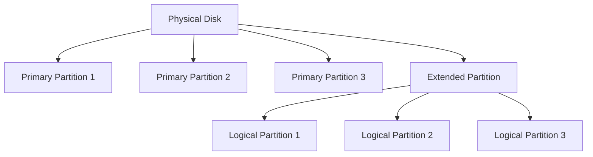
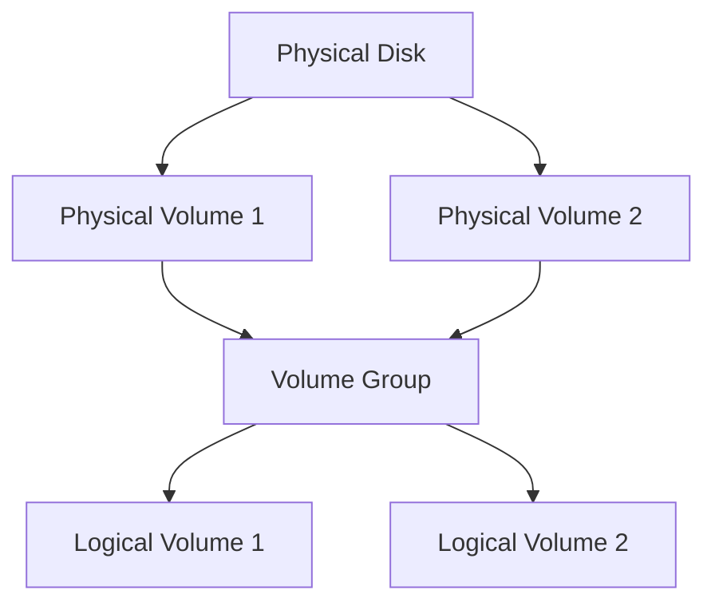

# 18. Disk Management and Partitioning

## 18.1 Introduction to Disk Management and Partitioning

- **Disk Management**: The process of managing disk space and organizing data storage on a computer system.
- **Partitioning**: The division of a physical disk into smaller, logical sections called partitions.

### Key Concepts

- **Partitions**: Logical divisions of a physical disk that can be formatted with a filesystem.
- **Filesystems**: Structures that allow data to be stored, organized, and managed on a partition.
- **Logical Volume Manager (LVM)**: A tool for managing disk space more flexibly than traditional partitioning.

## 18.2 Disk Partitions

### Types of Partitions

1. **Primary Partition**: A primary division of the disk that can contain a filesystem or an operating system.
2. **Extended Partition**: A special type of partition that can contain multiple logical partitions.
3. **Logical Partition**: A partition within an extended partition.

### Partition Table

- **MBR (Master Boot Record)**: An older partitioning scheme that supports up to 4 primary partitions or 3 primary partitions and 1 extended partition.
- **GPT (GUID Partition Table)**: A modern partitioning scheme that supports a large number of partitions and larger disk sizes.

### Partitioning Diagram



## 18.3 Disk Management Tools

### fdisk

- **fdisk**: A command-line utility for managing MBR partition tables.

```sh
# Example: Open fdisk for a specific disk
sudo fdisk /dev/sda
```

### gdisk

- **gdisk**: A command-line utility for managing GPT partition tables.

```sh
# Example: Open gdisk for a specific disk
sudo gdisk /dev/sda
```

### parted

- **parted**: A command-line utility for managing both MBR and GPT partition tables.

```sh
# Example: Open parted for a specific disk
sudo parted /dev/sda
```

### lsblk

- **lsblk**: Lists information about all available or specified block devices.

```sh
lsblk
```

### blkid

- **blkid**: Lists information about block devices and their attributes.

```sh
sudo blkid
```

## 18.4 Filesystem Management

### Creating Filesystems

- **mkfs**: Creates a filesystem on a partition.

```sh
# Example: Create an ext4 filesystem on /dev/sda1
sudo mkfs.ext4 /dev/sda1
```

### Checking and Repairing Filesystems

- **fsck**: Checks and repairs filesystems.

```sh
# Example: Check and repair an ext4 filesystem on /dev/sda1
sudo fsck /dev/sda1
```

### Mounting and Unmounting Filesystems

- **mount**: Mounts a filesystem.

```sh
# Example: Mount /dev/sda1 to /mnt
sudo mount /dev/sda1 /mnt
```

- **umount**: Unmounts a filesystem.

```sh
# Example: Unmount /mnt
sudo umount /mnt
```

### Viewing Mounted Filesystems

- **df**: Displays disk space usage.

```sh
df -h
```

- **mount**: Displays all mounted filesystems.

```sh
mount
```

## 18.5 Logical Volume Manager (LVM)

### LVM Concepts

- **Physical Volume (PV)**: A disk or partition used by LVM.
- **Volume Group (VG)**: A collection of physical volumes.
- **Logical Volume (LV)**: A resizable volume within a volume group.

### LVM Diagram



### Managing LVM

- **Creating Physical Volumes**:

```sh
sudo pvcreate /dev/sda1
```

- **Creating Volume Groups**:

```sh
sudo vgcreate myvg /dev/sda1
```

- **Creating Logical Volumes**:

```sh
sudo lvcreate -L 10G -n mylv myvg
```

- **Resizing Logical Volumes**:

```sh
sudo lvresize -L +5G /dev/myvg/mylv
```

- **Removing Logical Volumes**:

```sh
sudo lvremove /dev/myvg/mylv
```

### Example: Creating and Using LVM

1. **Create a Physical Volume**:

```sh
sudo pvcreate /dev/sda1
```

2. **Create a Volume Group**:

```sh
sudo vgcreate myvg /dev/sda1
```

3. **Create a Logical Volume**:

```sh
sudo lvcreate -L 10G -n mylv myvg
```

4. **Create a Filesystem on the Logical Volume**:

```sh
sudo mkfs.ext4 /dev/myvg/mylv
```

5. **Mount the Logical Volume**:

```sh
sudo mount /dev/myvg/mylv /mnt
```

## 18.6 RAID (Redundant Array of Independent Disks)

### RAID Levels

1. **RAID 0 (Striping)**: Distributes data across multiple disks for improved performance but offers no redundancy.
2. **RAID 1 (Mirroring)**: Duplicates data across multiple disks for redundancy.
3. **RAID 5 (Striping with Parity)**: Distributes data and parity information across multiple disks for a balance of performance and redundancy.
4. **RAID 6 (Striping with Double Parity)**: Similar to RAID 5 but with additional parity for increased fault tolerance.
5. **RAID 10 (Combination of RAID 1 and RAID 0)**: Combines mirroring and striping for both performance and redundancy.

### Managing RAID with mdadm

- **mdadm**: A command-line utility for managing RAID arrays.

```sh
# Example: Create a RAID 1 array
sudo mdadm --create /dev/md0 --level=1 --raid-devices=2 /dev/sda1 /dev/sdb1
```

### Viewing RAID Status

- **cat /proc/mdstat**: Displays the status of RAID arrays.

```sh
cat /proc/mdstat
```

## Conclusion

Disk management and partitioning are essential skills for managing storage in Linux systems. Understanding the tools and techniques for managing partitions, filesystems, and logical volumes, as well as RAID configurations, will enable you to efficiently manage disk space and ensure data integrity.
