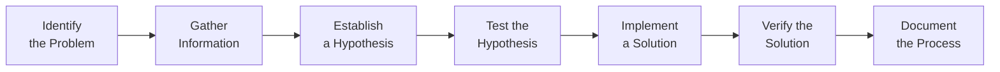

# 19. Troubleshooting and Debugging Techniques

## 19.1 Introduction to Troubleshooting and Debugging

- **Troubleshooting**: The process of diagnosing the source of a problem and finding a solution.
- **Debugging**: The process of identifying, analyzing, and removing errors in software.

### Key Concepts

- **Symptom**: An observable behavior or error that indicates a problem.
- **Root Cause**: The underlying issue that is causing the symptom.
- **Resolution**: The solution that addresses the root cause of the problem.

## 19.2 Systematic Troubleshooting Approach

### Steps for Effective Troubleshooting

1. **Identify the Problem**: Clearly define the symptom and understand the issue.
2. **Gather Information**: Collect relevant data, logs, and error messages.
3. **Establish a Hypothesis**: Develop possible explanations for the problem.
4. **Test the Hypothesis**: Perform tests to confirm or refute the hypothesis.
5. **Implement a Solution**: Apply the solution that addresses the root cause.
6. **Verify the Solution**: Ensure the problem is resolved and the system is functioning correctly.
7. **Document the Process**: Record the issue, solution, and steps taken for future reference.

## 19.3 Common Troubleshooting Tools

### Log Files

- **/var/log/**: Directory containing system logs.
- **dmesg**: Kernel ring buffer logs.

```sh
dmesg | grep error
```

### Monitoring Tools

- **top**: Displays real-time system resource usage.

```sh
top
```

- **htop**: Interactive process viewer.

```sh
htop
```

- **vmstat**: Reports virtual memory statistics.

```sh
vmstat
```

- **iostat**: Reports CPU and I/O statistics.

```sh
iostat
```

### Network Troubleshooting Tools

- **ping**: Tests connectivity to a network host.

```sh
ping google.com
```

- **traceroute**: Traces the route packets take to a network host.

```sh
traceroute google.com
```

- **netstat**: Displays network connections and statistics.

```sh
netstat -tuln
```

- **tcpdump**: Captures and analyzes network packets.

```sh
sudo tcpdump -i eth0
```

### Debugging Tools

- **gdb**: GNU Debugger for debugging programs.

```sh
gdb ./myprogram
```

- **strace**: Traces system calls and signals.

```sh
strace -o output.txt ./myprogram
```

- **lsof**: Lists open files.

```sh
lsof | grep filename
```

### Filesystem Tools

- **df**: Reports disk space usage.

```sh
df -h
```

- **du**: Estimates file and directory space usage.

```sh
du -sh /path/to/directory
```

- **fsck**: Checks and repairs filesystems.

```sh
sudo fsck /dev/sda1
```

## 19.4 Debugging Techniques

### Reproducing the Problem

- **Consistency**: Ensure the problem can be consistently reproduced.
- **Isolation**: Isolate the problem to a minimal test case.

### Analyzing Error Messages

- **Logs**: Examine logs for error messages and clues.
- **Error Codes**: Look up error codes and messages for more information.

### Using Debuggers

- **Breakpoints**: Set breakpoints to pause execution at specific points.
- **Step Through Code**: Step through code to observe the program's behavior.
- **Inspect Variables**: Check the values of variables at different points.

### Debugging Network Issues

- **Check Connectivity**: Use ping and traceroute to verify network connectivity.
- **Analyze Traffic**: Use tcpdump or Wireshark to capture and analyze network traffic.
- **Check Services**: Ensure network services are running and properly configured.

### Debugging Performance Issues

- **Resource Usage**: Use top, htop, or vmstat to monitor CPU, memory, and disk usage.
- **Bottlenecks**: Identify and address performance bottlenecks.
- **Optimize Code**: Profile and optimize code for better performance.

## 19.5 Advanced Troubleshooting Techniques

### Kernel Debugging

- **dmesg**: Check kernel messages for errors.

```sh
dmesg | less
```

- **sysctl**: Modify kernel parameters at runtime.

```sh
sudo sysctl -w net.ipv4.ip_forward=1
```

### System Recovery

- **Boot into Recovery Mode**: Access recovery options to troubleshoot boot issues.
- **Chroot Environment**: Use chroot to repair a broken system from a live environment.

```sh
sudo chroot /mnt /bin/bash
```

### Remote Troubleshooting

- **SSH Access**: Securely connect to remote systems for troubleshooting.

```sh
ssh user@remote_host
```

- **Remote Debugging**: Use gdb for remote debugging sessions.

```sh
gdbserver host:port ./myprogram
```

## 19.6 Documentation and Reporting

### Documentation

- **Record Steps**: Document each step taken during troubleshooting.
- **Capture Output**: Save command outputs, logs, and error messages.
- **Summarize Findings**: Provide a summary of the issue and the resolution.

### Reporting

- **Bug Reports**: File detailed bug reports with steps to reproduce, logs, and screenshots.
- **Communicate with Teams**: Share findings and collaborate with team members.

### Example Diagram of Troubleshooting Process



## Conclusion

Effective troubleshooting and debugging require a systematic approach, the right tools, and strong analytical skills. By mastering these techniques, you can quickly identify and resolve issues, ensuring the smooth operation of your systems and applications.
