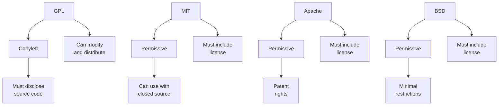

# 20. Open Source

## 20.1 Introduction to Open Source

- **Open Source**: Software with source code that anyone can inspect, modify, and enhance.
- **Open Source Software (OSS)**: Software distributed with a license that allows anyone to view, modify, and distribute the code.

### Key Concepts

- **Source Code**: The human-readable instructions that a programmer writes.
- **License**: A legal document that outlines the terms under which software can be used, modified, and shared.
- **Community**: The group of developers and users who contribute to and use open-source software.

## 20.2 History of Open Source

### Early Beginnings

- **1960s and 1970s**: Software was often shared freely among researchers and developers.
- **GNU Project**: Initiated by Richard Stallman in 1983 to develop a free Unix-like operating system.
- **Free Software Foundation (FSF)**: Founded in 1985 to support the free software movement.

### Rise of Open Source

- **1990s**: Open source gained popularity with the release of the Linux kernel by Linus Torvalds in 1991.
- **Open Source Initiative (OSI)**: Founded in 1998 to promote and protect open-source software by providing a certification for open-source licenses.

## 20.3 Open Source Licenses

### Common Open Source Licenses

- **GNU General Public License (GPL)**: Requires that any modified versions of the software be open source.
- **MIT License**: A permissive license that allows virtually unrestricted use, modification, and distribution.
- **Apache License**: Permissive license with a focus on patent rights and contributions.
- **BSD License**: A family of permissive licenses with minimal restrictions on the use and distribution of the software.

### License Comparison



## 20.4 Benefits of Open Source

### For Developers

- **Collaboration**: Enables developers to work together on projects from anywhere in the world.
- **Learning and Skill Development**: Provides opportunities to learn from real-world code and improve skills.
- **Reputation Building**: Allows developers to build a portfolio of contributions.

### For Organizations

- **Cost Savings**: Reduces costs associated with licensing fees.
- **Security**: Benefits from peer review and transparency, which can lead to more secure software.
- **Flexibility**: Provides the ability to modify software to meet specific needs.

### For Users

- **Transparency**: Users can see exactly what the software does.
- **Control**: Users have more control over their software environment.
- **Community Support**: Access to a community of users and developers for support.

## 20.5 Challenges of Open Source

### For Developers

- **Sustainability**: Maintaining and supporting open-source projects can be challenging without funding.
- **Coordination**: Managing contributions and coordinating work can be complex.

### For Organizations

- **Compatibility**: Ensuring compatibility with existing systems and software can be challenging.
- **Support**: Open-source projects may not have official support or service-level agreements (SLAs).

### For Users

- **Usability**: Some open-source software may not be as user-friendly as commercial alternatives.
- **Documentation**: Documentation may be lacking or inconsistent.

## 20.6 Open Source Development Workflow

### Key Practices

- **Version Control**: Using systems like Git to track changes and collaborate.
- **Issue Tracking**: Using platforms like GitHub Issues or JIRA to track bugs and feature requests.
- **Code Review**: Reviewing code changes to maintain quality and consistency.
- **Continuous Integration**: Using tools like Jenkins or GitHub Actions to automate testing and deployment.

### Example Workflow


## 20.7 Popular Open Source Projects

- **Linux**: An open-source operating system kernel created by Linus Torvalds.

- **Apache**: A widely-used open-source web server.

- **Firefox**: An open-source web browser developed by the Mozilla Foundation.

- **LibreOffice**: An open-source office suite that includes word processing, spreadsheets, and presentations.

- **Kubernetes**: An open-source container orchestration platform developed by Google.

## 20.8 Contributing to Open Source

### Finding Projects

- **GitHub**: Explore repositories and find projects to contribute to.
- **Open Source Guides**: Resources for learning how to contribute to open source.

### Making Contributions

- **Fork the Repository**: Create a personal copy of the project.
- **Clone the Repository**: Download the repository to your local machine.
- **Create a Branch**: Make a new branch for your changes.
- **Make Changes**: Implement your changes and commit them.
- **Push Changes**: Push your changes to your forked repository.
- **Create a Pull Request**: Propose your changes to the original project.

### Example of Contributing

```sh
# Fork the repository on GitHub
# Clone the repository
git clone https://github.com/your-username/project-name.git
# Create a new branch
git checkout -b feature-branch
# Make changes and commit them
git commit -m "Description of changes"
# Push changes to your forked repository
git push origin feature-branch
# Create a pull request on GitHub
```

## Conclusion

Open source software has revolutionized the way software is developed and shared. Understanding the principles, benefits, and challenges of open source, as well as the workflow for contributing to projects, is essential for modern software development.
