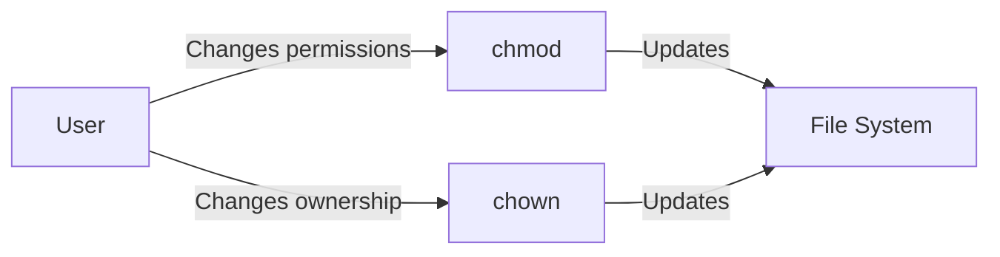

# `chmod` and `chown` Commands in Linux

`chmod` and `chown` are essential commands in Linux for managing file permissions and ownership. Understanding these commands is crucial for maintaining the security and proper functioning of the system.

## `chmod` Command

The `chmod` (change mode) command is used to change the permissions of a file or directory.

### File Permissions

In Linux, each file and directory has a set of permissions for the owner, group, and others. These permissions determine who can read, write, or execute the file.

- **r**: Read permission (4)
- **w**: Write permission (2)
- **x**: Execute permission (1)

Permissions are represented in three groups:

1. **Owner**
2. **Group**
3. **Others**

Each group has three permissions (r, w, x). For example, `rwxr-xr--` means:

- Owner: read, write, execute
- Group: read, execute
- Others: read

### Using `chmod`

#### Symbolic Mode

The symbolic mode uses characters to represent changes:

- `u`: User (owner)
- `g`: Group
- `o`: Others
- `a`: All (user, group, others)

Operations:

- `+`: Add permission
- `-`: Remove permission
- `=`: Set exact permission

**Examples**:

1. Add execute permission for the owner:

   ```bash
   chmod u+x file.txt
   ```

2. Remove write permission for the group:

   ```bash
   chmod g-w file.txt
   ```

3. Set read and write permissions for all:
   ```bash
   chmod a=rw file.txt
   ```

#### Numeric Mode

The numeric mode uses octal numbers to represent permissions:

- Read (r) = 4
- Write (w) = 2
- Execute (x) = 1

Combine these to set permissions. For example, `755` means:

- Owner: 7 (read, write, execute: 4+2+1)
- Group: 5 (read, execute: 4+1)
- Others: 5 (read, execute: 4+1)

**Example**:

Set permissions to `755`:

```bash
chmod 755 file.txt
```

## `chown` Command

The `chown` (change owner) command changes the ownership of a file or directory.

### Syntax

```bash
chown [OPTIONS] USER[:GROUP] FILE
```

- **USER**: New owner
- **GROUP**: New group (optional)

**Examples**:

1. Change the owner of a file to `alice`:

   ```bash
   sudo chown alice file.txt
   ```

2. Change the owner to `alice` and group to `developers`:

   ```bash
   sudo chown alice:developers file.txt
   ```

3. Change the group of a file:
   ```bash
   sudo chown :developers file.txt
   ```

### Recursive Option

To change ownership recursively (all files and directories within a directory), use the `-R` option:

**Example**:

Change the owner and group of a directory and its contents:

```bash
sudo chown -R alice:developers /path/to/directory
```

## Example Workflow



## Conclusion

Understanding and using `chmod` and `chown` commands are fundamental for managing file permissions and ownership in Linux. These commands help in securing files and ensuring that only authorized users can access or modify them.
