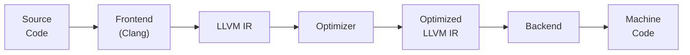

# LLVM: A Comprehensive Overview

## Introduction

LLVM (Low Level Virtual Machine) is a collection of modular and reusable compiler and toolchain technologies. Initially designed as a set of reusable libraries for compiler development, LLVM has grown into an umbrella project that encompasses a variety of tools and projects used to develop modern programming languages and execute them efficiently.

## Key Components of LLVM

1. **LLVM Core Libraries**: These provide a modern source- and target-independent optimizer, along with code generation support for various CPUs.

2. **Clang**: A compiler front end for the C, C++, and Objective-C programming languages. It is designed to work seamlessly with LLVM to provide fast and user-friendly compiler tools.

3. **LLVM Intermediate Representation (IR)**: A language-independent intermediate representation that serves as a platform-independent assembly language.

4. **LLDB**: A next-generation, high-performance debugger.

5. **LLVM Test Suite**: A collection of benchmarks and regression tests to ensure the reliability of LLVM components.

6. **LLVM Tools**: Various tools like `opt` (optimizer), `llc` (LLVM static compiler), `lli` (LLVM interpreter), and `llvm-ar` (archiver), which are used for optimization, code generation, and execution.

## How LLVM Works

### Compilation Process

1. **Frontend**: The compiler front end (like Clang) parses source code and transforms it into LLVM Intermediate Representation (IR).
2. **Optimizer**: The LLVM optimizer transforms the IR to improve performance and efficiency, performing tasks like dead code elimination, loop unrolling, and inlining.
3. **Backend**: The LLVM backend takes the optimized IR and generates machine code for the target architecture.



## LLVM Intermediate Representation (IR)

LLVM IR is a low-level programming language similar to assembly, but it is designed to be used with a wide variety of front ends and back ends.

### Features

- **SSA Form**: LLVM IR uses Static Single Assignment (SSA) form, which simplifies optimization.
- **Platform Independence**: IR can be compiled to run on any hardware.
- **Rich Type System**: Supports primitive types, complex structures, and vectors.

### Example

Here's a simple example of LLVM IR for adding two integers:

```llvm
define i32 @add(i32 %a, i32 %b) {
  %1 = add i32 %a, %b
  ret i32 %1
}
```

## Clang: LLVM's C Language Family Frontend

Clang is a compiler for C, C++, and Objective-C languages, designed to offer a fast, modular compiler with useful diagnostics and a friendly interface.

### Features

- **Fast Compilation**: Designed for fast compile times and low memory usage.
- **Modular Library-based Architecture**: Useful for tools like static analyzers and code generators.
- **Detailed Diagnostics**: Provides clear and precise error and warning messages.

### Example

To compile a C program using Clang:

```bash
clang -O2 -emit-llvm -c hello.c -o hello.bc
```

This command compiles `hello.c` to LLVM bitcode (`hello.bc`).

## LLDB: LLVM's Debugger

LLDB is the debugger component of the LLVM project, designed to be highly extensible and to provide fast debugging of C, C++, and Objective-C programs.

### Features

- **Fast Performance**: Designed for quick start-up and efficient operation.
- **Scriptable**: Supports scripting with Python for custom commands and automation.
- **Multi-language Support**: Debugs programs written in multiple languages, not just those compiled with Clang.

### Example

To debug a program with LLDB:

```bash
lldb a.out
```

This command starts LLDB and loads the executable `a.out`.

## LLVM Ecosystem

### LLVM Test Suite

The LLVM test suite includes a variety of tests and benchmarks to ensure that the LLVM tools and libraries perform correctly and efficiently.

### LLVM Tools

- **`opt`**: A tool for applying LLVM-to-LLVM transformations and analyses.
- **`llc`**: The LLVM static compiler, compiles LLVM IR to assembly language.
- **`lli`**: The LLVM interpreter, executes LLVM bitcode.
- **`llvm-ar`**: An archiver to create, modify, and extract from archives of LLVM IR files.

## Conclusion

LLVM provides a powerful, flexible framework for building compilers and other toolchains. Its modular design allows for reuse across different languages and platforms, making it a cornerstone of modern compiler technology.
