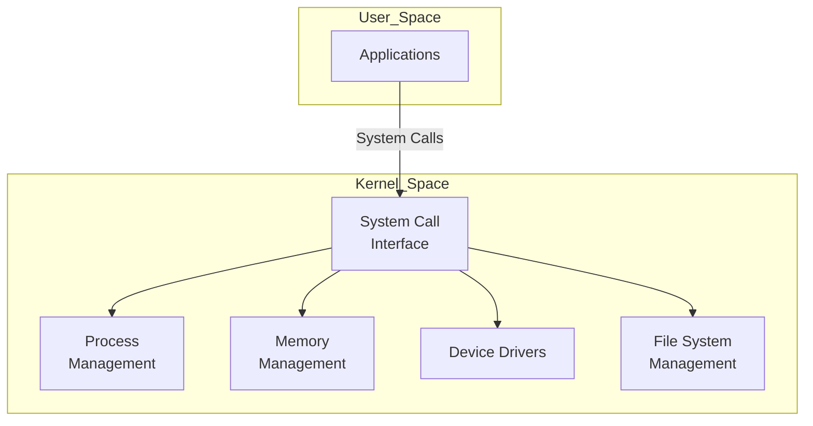
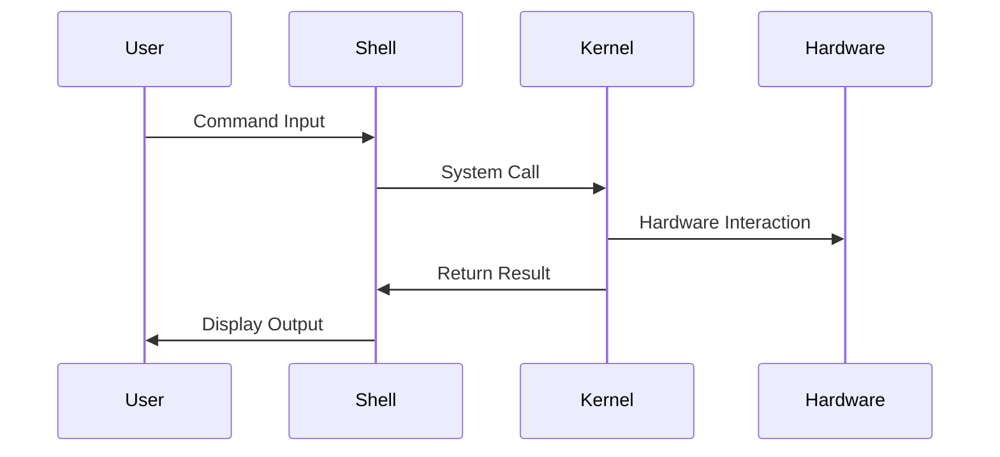

## Linux Kernel vs Linux Shell

### Introduction

The Linux operating system is composed of several layers, with the two most critical components being the Linux Kernel and the Linux Shell. Understanding the distinction between these two is fundamental for anyone delving into Linux, whether for development, system administration, or advanced usage.

### Linux Kernel

#### Definition

The Linux Kernel is the core part of the Linux operating system. It manages the system's hardware, resources, and allows software applications to interact with hardware components seamlessly.

#### Functions

1. **Process Management:** Handles the creation, scheduling, and termination of processes.
2. **Memory Management:** Manages the system's memory, including the allocation and deallocation of memory spaces as needed by different programs.
3. **Device Drivers:** Facilitates communication between the hardware and the software by managing device drivers.
4. **System Calls and Security:** Provides system call interfaces for user applications to interact with the hardware and ensures system security and stability.
5. **File System Management:** Manages files on the system, handling the reading, writing, and organization of files on storage devices.

#### Architecture

The Linux Kernel architecture can be visualized as follows:

### Linux Shell

#### Definition

The Linux Shell is a command-line interface that allows users to interact with the operating system by executing commands. It acts as an intermediary between the user and the Kernel.

#### Types of Shells

1. **Bourne Shell (sh)**: The original Unix shell, developed by Stephen Bourne. It provides basic scripting capabilities and command execution.

2. **Bourne Again Shell (bash)**: An enhanced version of the Bourne Shell with additional features such as command-line editing, history, and job control, widely used in Linux.

3. **C Shell (csh)**: A Unix shell with C-like syntax, developed by Bill Joy, providing scripting capabilities and features like aliases and history substitution.

4. **Korn Shell (ksh)**: Developed by David Korn, it combines features of the Bourne Shell and C Shell, offering enhanced scripting capabilities and improved performance.

5. **Z Shell (zsh)**: An advanced shell that incorporates features from bash, ksh, and tcsh, known for its powerful scripting, customization, and user-friendly features.

#### Functions

1. **Command Execution:** Allows users to run commands to perform various tasks, such as file manipulation, program execution, and system monitoring.
2. **Scripting:** Users can write scripts (batch files) to automate repetitive tasks.
3. **Environment Control:** Enables users to set up and manipulate the environment in which programs run, including variables, aliases, and functions.
4. **Command History and Editing:** Provides a history of commands executed and allows editing of commands for efficiency.

#### Interaction with the Kernel

The Shell interacts with the Kernel through system calls. When a user types a command, the Shell interprets it and sends the appropriate system call to the Kernel, which then performs the requested operation.

### Key Differences

| Feature           | Linux Kernel                                          | Linux Shell                                                     |
| ----------------- | ----------------------------------------------------- | --------------------------------------------------------------- |
| Role              | Core component managing system resources              | Command-line interface for user interaction                     |
| Function          | Handles hardware, processes, memory, and system calls | Executes user commands and scripts                              |
| Interaction Level | Operates at the system level                          | Operates at the user level                                      |
| Examples          | Kernel versions (e.g., 5.x, 6.x)                      | Bash, Zsh, Csh                                                  |
| Dependency        | Essential for the OS to run                           | Not essential for OS operation but crucial for user interaction |

### Conclusion

Understanding the differences between the Linux Kernel and the Linux Shell is crucial for efficient system management and development. The Kernel acts as the backbone of the system, managing resources and hardware interactions, while the Shell provides a user-friendly interface for executing commands and scripts. Mastery of both components is essential for advanced Linux usage.
