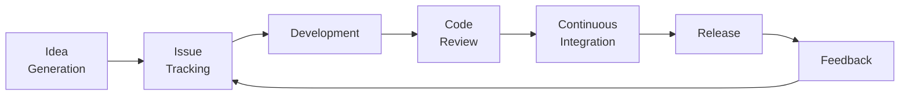

# Open Source Software

## Introduction

Open source software (OSS) is software that is released with a license that allows anyone to view, use, modify, and distribute the source code. The open-source model promotes collaboration, transparency, and community-driven development, leading to rapid innovation and widespread adoption.

## Code of Conduct

A code of conduct is a set of guidelines that contributors and maintainers of an open source project agree to follow. It ensures a welcoming and inclusive environment for all participants.

### Key Elements

- **Respect and Inclusion**: Encourage respectful and inclusive behavior, regardless of background or experience level.
- **Collaboration**: Promote collaboration and constructive feedback.
- **Conflict Resolution**: Provide mechanisms for addressing conflicts and unacceptable behavior.

## Principles

Open source development is guided by several core principles:

1. **Transparency**: All aspects of the project, including discussions, decisions, and code changes, are open to the public.
2. **Collaboration**: Encourages collaboration from diverse contributors to improve the software.
3. **Meritocracy**: Contributions are evaluated based on merit rather than the contributor's status.
4. **Community-Driven**: Development is driven by the needs and feedback of the community.

## Values

Open source communities share common values that guide their actions and interactions:

1. **Freedom**: The freedom to use, modify, and distribute software.
2. **Innovation**: Encouraging creativity and innovation through collaboration.
3. **Quality**: Striving for high-quality, reliable software.
4. **Accessibility**: Making software accessible to everyone.

## Why Open Source?

Open source software is created and maintained for several reasons:

1. **Transparency and Trust**: Users can inspect the code to ensure it does not contain malicious elements.
2. **Collaboration**: Leveraging the collective expertise of a global community to improve software.
3. **Cost**: Reducing costs by avoiding proprietary software licenses.
4. **Customization**: Allowing users to modify software to meet their specific needs.
5. **Innovation**: Fostering innovation through shared knowledge and ideas.

## Advantages

Open source software offers numerous benefits:

1. **Cost Savings**: Eliminates the need for expensive software licenses.
2. **Security**: Code transparency allows for thorough inspection and rapid identification of vulnerabilities.
3. **Flexibility**: Users can modify and adapt software to their needs.
4. **Community Support**: Access to a vast community of users and developers for support and contributions.
5. **Rapid Development**: Faster development cycles due to community contributions and feedback.

## Development Flows

Open source projects typically follow a collaborative development flow:

1. **Idea Generation**: Ideas for features or improvements are proposed by the community.
2. **Issue Tracking**: Bugs, feature requests, and tasks are tracked using issue trackers like GitHub Issues or JIRA.
3. **Development**: Contributors fork the repository, make changes, and submit pull requests.
4. **Code Review**: Maintainers review pull requests, provide feedback, and merge approved changes.
5. **Continuous Integration**: Automated testing and integration ensure code quality.
6. **Release**: New versions of the software are packaged and released to the public.
7. **Feedback**: Users provide feedback, report bugs, and suggest improvements.

## Roles in Open Source

1. **Maintainer**: Oversees the project, reviews contributions, merges pull requests, and manages releases.
2. **Contributor**: Submits code, documentation, or other improvements to the project.
3. **User**: Uses the software and provides feedback or bug reports.
4. **Reviewer**: Reviews code changes, provides feedback, and ensures code quality.
5. **Community Manager**: Facilitates community engagement, moderates discussions, and helps onboard new contributors.

## Example Projects

1. **Linux Kernel**: An open source operating system kernel used by millions of devices worldwide.
2. **Apache HTTP Server**: A widely used web server that is part of the Apache Software Foundation.
3. **Mozilla Firefox**: An open source web browser developed by the Mozilla Foundation.
4. **WordPress**: A content management system (CMS) used by millions of websites, developed by a global community.

## Licensing

Open source software is distributed under licenses that define the terms of use, modification, and distribution. Common licenses include:

1. **GNU General Public License (GPL)**: Requires derived works to be open source and distributed under the same license.
2. **MIT License**: A permissive license that allows for free use, modification, and distribution.
3. **Apache License**: Similar to the MIT License, with additional protections for contributors.
4. **BSD License**: A permissive license with fewer restrictions, allowing proprietary use of the code.

## Conclusion

Open source software is a powerful model that promotes collaboration, transparency, and innovation. By adhering to principles and values such as freedom, community-driven development, and quality, open source projects have created some of the most widely used and trusted software in the world. Understanding the dynamics of open source, from codes of conduct to development flows, is crucial for anyone looking to contribute to or utilize open source software.
