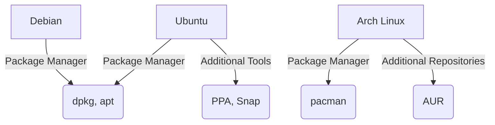

# Packaging in Linux: Debian, Ubuntu, and Arch

Packaging systems are a crucial part of Linux distributions, allowing for the easy installation, upgrade, and removal of software. Each distribution often has its own packaging format and tools.

## 1. Debian Packaging

Debian uses the `.deb` package format along with tools like `dpkg`, `apt`, and `apt-get`.

### 1.1 `.deb` Package Format

- **Description**: A `.deb` file is an archive containing the files for an application, along with metadata.
- **Components**:
  - `control`: Metadata about the package (e.g., version, dependencies).
  - `data`: The actual files to be installed.

### 1.2 Tools

- **dpkg**: The low-level package manager for Debian.
  - **Commands**:
    - `dpkg -i package.deb`: Install a package.
    - `dpkg -r package`: Remove a package.
    - `dpkg -l`: List installed packages.
- **apt** and **apt-get**: Higher-level tools that handle package installation, removal, and upgrades, including dependency resolution.
  - **Commands**:
    - `apt-get update`: Update the package index.
    - `apt-get install package`: Install a package.
    - `apt-get remove package`: Remove a package.
    - `apt-get upgrade`: Upgrade all installed packages.

### 1.3 Creating a `.deb` Package

1. **Directory Structure**:

   ```
   mypackage/
   ├── DEBIAN
   │   └── control
   └── usr
       └── local
           └── bin
               └── myscript
   ```

2. **control File**:

   ```plaintext
   Package: mypackage
   Version: 1.0
   Section: base
   Priority: optional
   Architecture: all
   Depends: bash
   Maintainer: Your Name <you@example.com>
   Description: My custom script
   ```

3. **Building the Package**:
   ```bash
   dpkg-deb --build mypackage
   ```

## 2. Ubuntu Packaging

Ubuntu is based on Debian and uses the same `.deb` package format and tools like `dpkg`, `apt`, and `apt-get`. However, Ubuntu also introduces some additional tools and formats.

### 2.1 PPA (Personal Package Archives)

- **Description**: PPAs allow users to distribute software packages that are not available in the official repositories.
- **Usage**:
  - Add a PPA:
    ```bash
    sudo add-apt-repository ppa:myppa/ppa
    sudo apt-get update
    ```
  - Install packages from a PPA:
    ```bash
    sudo apt-get install package
    ```

### 2.2 Snap Packages

- **Description**: Snap is a newer package format that works across various Linux distributions.
- **Commands**:
  - `snap install package`: Install a snap package.
  - `snap remove package`: Remove a snap package.
  - `snap refresh package`: Update a snap package.

## 3. Arch Linux Packaging

Arch Linux uses the `pacman` package manager and the `.pkg.tar.zst` package format.

### 3.1 `pacman` Package Manager

- **Commands**:
  - `pacman -S package`: Install a package.
  - `pacman -R package`: Remove a package.
  - `pacman -Syu`: Update the system (synchronize and upgrade).

### 3.2 AUR (Arch User Repository)

- **Description**: The AUR is a community-driven repository for Arch users. It contains user-submitted packages.
- **Usage**:
  - Install an AUR helper (e.g., `yay`):
    ```bash
    sudo pacman -S yay
    ```
  - Install an AUR package:
    ```bash
    yay -S package
    ```

### 3.3 Creating a Package for Arch Linux

1. **PKGBUILD File**:

   ```bash
   pkgname=mypackage
   pkgver=1.0
   pkgrel=1
   arch=('x86_64')
   url="http://example.com/"
   license=('GPL')
   depends=('bash')
   source=($pkgname-$pkgver.tar.gz)
   sha256sums=('SKIP')

   package() {
       install -Dm755 "$srcdir/$pkgname-$pkgver/myscript" "$pkgdir/usr/local/bin/myscript"
   }
   ```

2. **Building the Package**:
   ```bash
   makepkg -si
   ```

## 4. Differences and Use Cases

- **Debian**: Stable and reliable, with a vast number of packages. Suitable for servers and workstations where stability is crucial.
- **Ubuntu**: User-friendly, based on Debian, with additional tools like PPAs and Snap packages. Ideal for desktops and beginners.
- **Arch Linux**: Rolling release model, providing the latest software. Highly customizable and suitable for advanced users who want control over their system.

## 5. Mermaid Diagram


