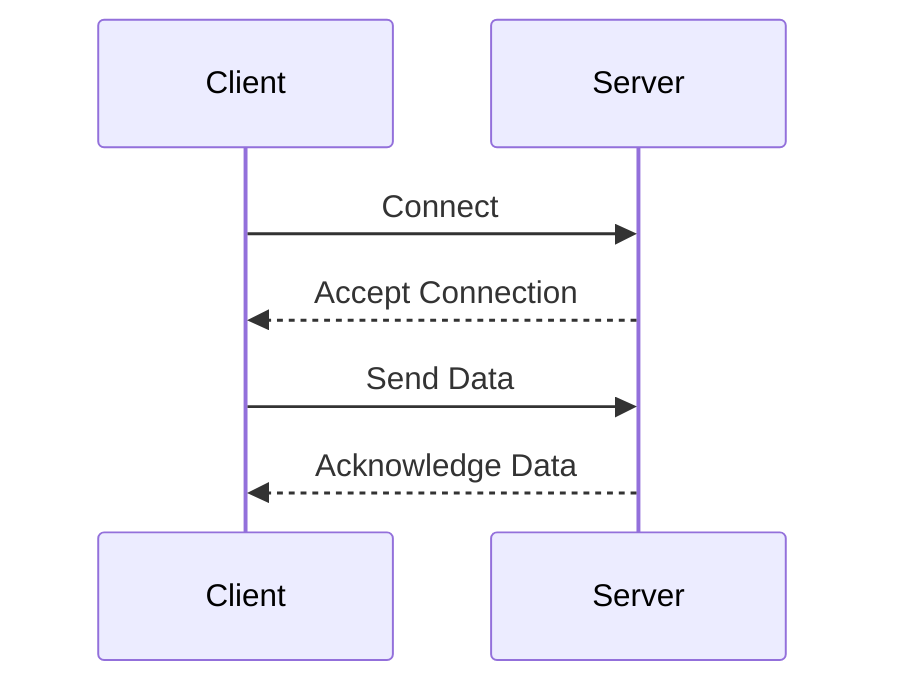

# Sockets and Pipes in Linux

Sockets and pipes are essential for inter-process communication (IPC) in Linux. They allow processes to communicate with each other, either on the same machine or across different machines on a network. Understanding how sockets and pipes work is crucial for building robust and efficient applications.

## 1. Pipes
Pipes are a simple way for processes to communicate. There are two types of pipes: unnamed pipes and named pipes (also known as FIFOs).

### 1.1 Unnamed Pipes
- **Description**: Unnamed pipes are used for communication between a parent process and its child process.
- **Usage**: 
  - Created using the `pipe()` system call.
  - Data written to the pipe by one process can be read by the other.
  - Unidirectional: Data flows in one direction (from the write end to the read end).

**Example Code**:
```c
#include <unistd.h>
#include <stdio.h>
#include <string.h>

int main() {
    int pipefd[2];
    pid_t pid;
    char buffer[30];
    
    if (pipe(pipefd) == -1) {
        perror("pipe");
        return 1;
    }
    
    pid = fork();
    if (pid == -1) {
        perror("fork");
        return 1;
    }
    
    if (pid == 0) { // Child process
        close(pipefd[1]); // Close write end
        read(pipefd[0], buffer, 30);
        printf("Child read: %s\n", buffer);
        close(pipefd[0]);
    } else { // Parent process
        close(pipefd[0]); // Close read end
        write(pipefd[1], "Hello, child!", 13);
        close(pipefd[1]);
    }
    
    return 0;
}
```

### 1.2 Named Pipes (FIFOs)
- **Description**: Named pipes have a name within the file system and can be used for communication between unrelated processes.
- **Usage**: 
  - Created using the `mkfifo()` system call or the `mknod` command.
  - Bidirectional communication is possible, but not simultaneously in both directions.

**Example Code**:
```c
#include <stdio.h>
#include <stdlib.h>
#include <string.h>
#include <unistd.h>
#include <fcntl.h>
#include <sys/types.h>
#include <sys/stat.h>

int main() {
    char *fifo = "/tmp/myfifo";
    mkfifo(fifo, 0666);
    
    if (fork() == 0) { // Child process
        int fd = open(fifo, O_RDONLY);
        char buffer[30];
        read(fd, buffer, 30);
        printf("Child read: %s\n", buffer);
        close(fd);
    } else { // Parent process
        int fd = open(fifo, O_WRONLY);
        write(fd, "Hello, FIFO!", 12);
        close(fd);
        wait(NULL); // Wait for child process
        unlink(fifo); // Remove the FIFO
    }
    
    return 0;
}
```

## 2. Sockets
Sockets provide a more complex and versatile form of IPC. They support communication over the network and are the foundation of internet communication.

### 2.1 Types of Sockets
- **Stream Sockets (SOCK_STREAM)**: Provide reliable, two-way, connection-based byte streams. They use the Transmission Control Protocol (TCP).
- **Datagram Sockets (SOCK_DGRAM)**: Provide connectionless, unreliable messages of a fixed maximum length. They use the User Datagram Protocol (UDP).
- **Raw Sockets (SOCK_RAW)**: Provide access to lower-level network protocols. They are used for custom implementations of protocols at the transport layer or below.

### 2.2 Creating a Socket
- **System Calls**:
  - `socket()`: Creates a socket.
  - `bind()`: Binds a socket to an address.
  - `listen()`: Listens for incoming connections (only for stream sockets).
  - `accept()`: Accepts a connection (only for stream sockets).
  - `connect()`: Initiates a connection on a socket (used by the client).
  - `send()` and `recv()`: Send and receive data.
  - `close()`: Closes the socket.

**Example Code for TCP Server**:
```c
#include <stdio.h>
#include <stdlib.h>
#include <string.h>
#include <unistd.h>
#include <arpa/inet.h>

int main() {
    int server_fd, new_socket;
    struct sockaddr_in address;
    int addrlen = sizeof(address);
    char buffer[1024] = {0};
    char *hello = "Hello from server";
    
    if ((server_fd = socket(AF_INET, SOCK_STREAM, 0)) == 0) {
        perror("socket failed");
        exit(EXIT_FAILURE);
    }
    
    address.sin_family = AF_INET;
    address.sin_addr.s_addr = INADDR_ANY;
    address.sin_port = htons(8080);
    
    if (bind(server_fd, (struct sockaddr *)&address, sizeof(address)) < 0) {
        perror("bind failed");
        close(server_fd);
        exit(EXIT_FAILURE);
    }
    
    if (listen(server_fd, 3) < 0) {
        perror("listen");
        close(server_fd);
        exit(EXIT_FAILURE);
    }
    
    if ((new_socket = accept(server_fd, (struct sockaddr *)&address, (socklen_t*)&addrlen)) < 0) {
        perror("accept");
        close(server_fd);
        exit(EXIT_FAILURE);
    }
    
    read(new_socket, buffer, 1024);
    printf("Message from client: %s\n", buffer);
    send(new_socket, hello, strlen(hello), 0);
    printf("Hello message sent\n");
    
    close(new_socket);
    close(server_fd);
    
    return 0;
}
```

**Example Code for TCP Client**:
```c
#include <stdio.h>
#include <stdlib.h>
#include <string.h>
#include <unistd.h>
#include <arpa/inet.h>

int main() {
    int sock = 0;
    struct sockaddr_in serv_addr;
    char *hello = "Hello from client";
    char buffer[1024] = {0};
    
    if ((sock = socket(AF_INET, SOCK_STREAM, 0)) < 0) {
        printf("\n Socket creation error \n");
        return -1;
    }
    
    serv_addr.sin_family = AF_INET;
    serv_addr.sin_port = htons(8080);
    
    if (inet_pton(AF_INET, "127.0.0.1", &serv_addr.sin_addr) <= 0) {
        printf("\nInvalid address/ Address not supported \n");
        return -1;
    }
    
    if (connect(sock, (struct sockaddr *)&serv_addr, sizeof(serv_addr)) < 0) {
        printf("\nConnection Failed \n");
        return -1;
    }
    
    send(sock, hello, strlen(hello), 0);
    printf("Hello message sent\n");
    read(sock, buffer, 1024);
    printf("Message from server: %s\n", buffer);
    
    close(sock);
    
    return 0;
}
```

## 3. Differences Between Pipes and Sockets
- **Scope**:
  - Pipes are generally used for communication between processes on the same machine.
  - Sockets can be used for communication between processes on the same machine or across different machines.
- **Communication**:
  - Pipes are unidirectional (one-way) unless you use two pipes for bidirectional communication.
  - Sockets can be bidirectional.
- **Data Transfer**:
  - Pipes are typically used for simple, linear data transfer.
  - Sockets are more versatile and can handle complex communication patterns, including request/response and peer-to-peer communication.

## 4. Summary and Use Cases
- **Unnamed Pipes**: Useful for parent-child process communication. Example: `ls | grep`.
- **Named Pipes (FIFOs)**: Useful for unrelated process communication on the same machine. Example: Logging system where different applications write logs to the same FIFO.
- **Sockets**: Useful for network communication. Example: Web servers, chat applications, and other client-server models.

## 5. Mermaid Diagrams

### 5.1 Pipe Communication


### 5.2 Socket Communication

