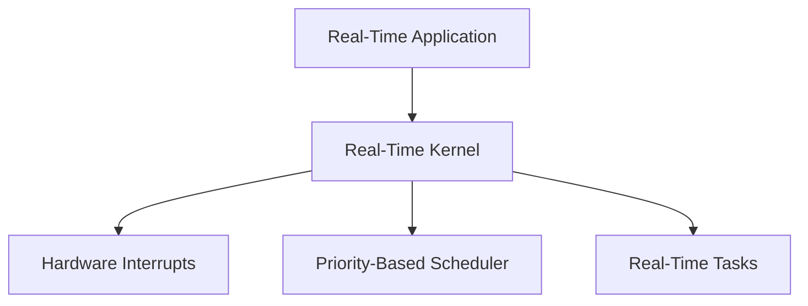

# Real-Time Kernel

## Introduction

Let’s think of a real-time kernel like a super-efficient traffic manager for a busy city. In this city, there are lots of cars (which represent tasks or jobs that the computer needs to do), and they all need to get to their destinations on time.

1.  **Guaranteed Timing**: Just like a traffic manager who makes sure that emergency vehicles get through quickly, a real-time kernel ensures that important tasks get done within a set amount of time. If a task needs to be completed in 5 minutes, the real-time kernel makes sure it happens in exactly 5 minutes, no matter what.
2.  **No Delays**: In a regular city, sometimes cars might get stuck in traffic, causing delays. In a real-time kernel, there are special rules to prevent these delays, so everything runs smoothly and on time. This is super important for things that need to work perfectly, like controlling a robot arm in a factory or making sure your car’s brakes respond quickly.
3.  **Precise and Reliable**: Imagine if a traffic light changed at exactly the right moment to keep everything moving safely. A real-time kernel does something similar by making sure that tasks are handled exactly when they’re supposed to be, so everything runs safely and reliably.

It is like a super-smart traffic manager that makes sure everything in the computer world happens on time, no delays, and without any hiccups!

A real-time kernel is an operating system kernel that guarantees a certain level of execution for tasks within a specified time constraint. This is crucial for applications that require precise timing and reliability, such as industrial control systems, telecommunications, and automotive systems.

## Characteristics of Real-Time Kernels

1. **Deterministic Behavior**: The ability to guarantee that certain operations are performed within a specified time frame.
2. **Low Latency**: Minimizing the delay between an event and the corresponding task execution.
3. **Priority-Based Scheduling**: Using priorities to ensure that high-priority tasks are executed before lower-priority ones.
4. **Preemption**: Allowing higher-priority tasks to interrupt lower-priority tasks to meet timing constraints.
5. **Interrupt Handling**: Efficient and predictable handling of hardware interrupts.

## Types of Real-Time Systems

1. **Hard Real-Time Systems**: Systems where missing a deadline is unacceptable and may lead to catastrophic consequences (e.g., airbag deployment systems).
2. **Soft Real-Time Systems**: Systems where deadlines are important but not critical, and missing a deadline only results in degraded performance (e.g., video streaming).

## Real-Time Linux Kernel

The standard Linux kernel is not designed for real-time applications due to its focus on throughput rather than predictability. However, with modifications and patches, Linux can be adapted for real-time performance.

### PREEMPT_RT Patch

The `PREEMPT_RT` patch is a popular set of modifications for the Linux kernel that aims to transform it into a fully preemptible kernel, suitable for real-time applications.

- **Fully Preemptible Kernel**: The kernel can be preempted almost anywhere, reducing latency and improving determinism.
- **Threaded Interrupts**: Converting interrupt handlers into kernel threads to make them preemptible.
- **Priority Inheritance**: Mechanism to avoid priority inversion by temporarily boosting the priority of lower-priority tasks holding resources needed by higher-priority tasks.

### Enabling Real-Time Features

To enable real-time features, you need to apply the `PREEMPT_RT` patch to the kernel and configure it appropriately.

**Steps to Apply PREEMPT_RT Patch:**

1. **Download the Kernel Source and Patch:**

   ```bash
   wget https://cdn.kernel.org/pub/linux/kernel/v5.x/linux-5.10.tar.xz
   wget https://cdn.kernel.org/pub/linux/kernel/projects/rt/5.10/patch-5.10-rt.patch.xz
   ```

2. **Extract the Kernel Source:**

   ```bash
   tar -xf linux-5.10.tar.xz
   ```

3. **Apply the RT Patch:**

   ```bash
   cd linux-5.10
   xzcat ../patch-5.10-rt.patch.xz | patch -p1
   ```

4. **Configure the Kernel:**

   ```bash
   make menuconfig
   ```

   - Go to `Processor type and features` -> `Preemption Model` and select `Fully Preemptible Kernel (RT)`.

5. **Compile and Install the Kernel:**

   ```bash
   make -j$(nproc)
   sudo make modules_install
   sudo make install
   ```

6. **Update Bootloader and Reboot:**
   ```bash
   sudo update-grub
   sudo reboot
   ```

## Real-Time Scheduling Policies

Linux provides several scheduling policies that are particularly useful for real-time tasks:

1. **SCHED_FIFO**: First-In-First-Out scheduling for real-time tasks, where tasks are executed in the order they become ready.
2. **SCHED_RR**: Round-Robin scheduling for real-time tasks, similar to SCHED_FIFO but with time slices.
3. **SCHED_DEADLINE**: A scheduling policy for tasks with explicit deadlines, allowing tasks to specify their runtime, deadline, and period.

### Setting Real-Time Scheduling Policies

You can set real-time scheduling policies using the `chrt` command or programmatically using system calls.

**Example Using `chrt`:**

1. **Run a Task with SCHED_FIFO:**

   ```bash
   sudo chrt -f 99 ./my_realtime_task
   ```

2. **Run a Task with SCHED_RR:**
   ```bash
   sudo chrt -r 50 ./my_realtime_task
   ```

## Example Workflow



## Conclusion

A real-time kernel is essential for applications that require deterministic behavior and low-latency response. The `PREEMPT_RT` patch extends the Linux kernel's capabilities to meet real-time requirements, providing a versatile and robust platform for developing real-time systems. Understanding how to configure and use real-time features in Linux is crucial for ensuring that time-sensitive tasks are executed reliably.
