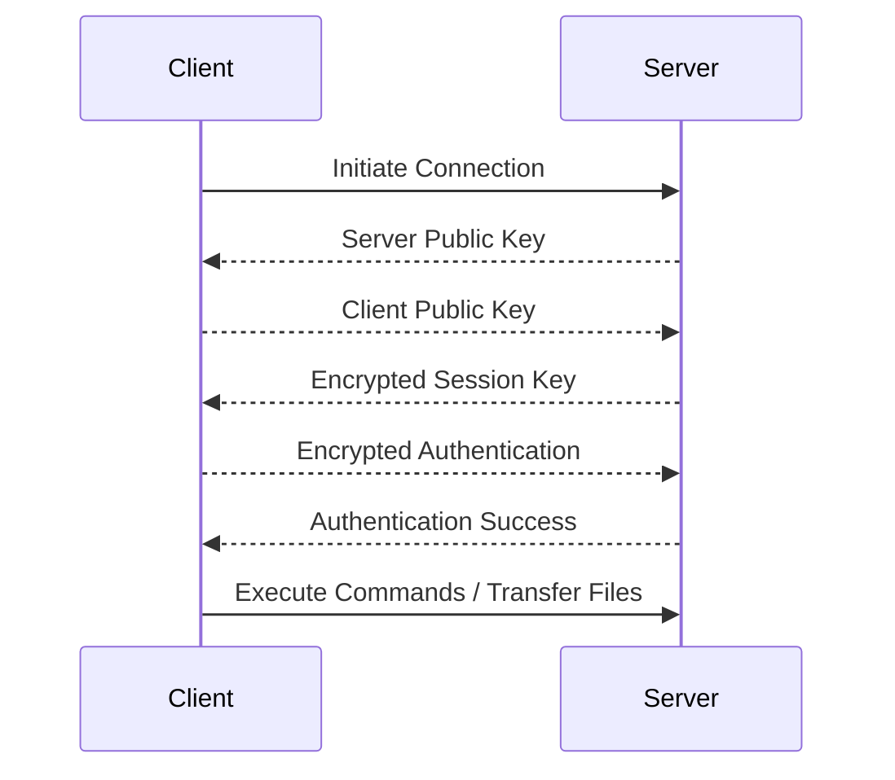

# Secure Shell (SSH)

## Introduction

Secure Shell (SSH) is a cryptographic network protocol used for secure communication between two networked devices. It provides a secure channel over an unsecured network, allowing users to access, manage, and transfer files between remote systems securely. SSH is widely used for remote login, command execution, and secure file transfer.

## Key Features of SSH

1. **Encryption**: SSH encrypts all data transmitted between the client and the server, ensuring confidentiality and integrity.
2. **Authentication**: SSH supports multiple authentication methods, including password-based and key-based authentication.
3. **Data Integrity**: SSH uses message authentication codes (MACs) to ensure data integrity.
4. **Port Forwarding**: SSH can tunnel other protocols through its secure connection, providing encrypted channels for other network services.
5. **Compression**: SSH can compress data before transmitting it, improving performance over slow networks.

## SSH Components

1. **SSH Client**: The program used to initiate a connection to an SSH server. Examples include `ssh` (OpenSSH), PuTTY, and WinSCP.
2. **SSH Server**: The program running on the remote machine that accepts SSH connections. Examples include `sshd` (OpenSSH), Dropbear, and Tectia SSH.
3. **SSH Keys**: Public-private key pairs used for key-based authentication.

## How SSH Works

1. **Connection Establishment**: The client initiates a connection to the SSH server.
2. **Key Exchange**: The client and server exchange cryptographic keys to establish a secure channel.
3. **Authentication**: The server authenticates the client using methods such as password, public key, or other supported mechanisms.
4. **Session Establishment**: Once authenticated, the client can execute commands, transfer files, or tunnel other services through the SSH connection.



## Common SSH Commands

1. **Connecting to a Remote Server**:

   ```bash
   ssh user@hostname
   ```

   Example:

   ```bash
   ssh alice@example.com
   ```

2. **Copying Files to a Remote Server**:

   ```bash
   scp localfile user@hostname:/path/to/remote/file
   ```

   Example:

   ```bash
   scp myfile.txt alice@example.com:/home/alice/
   ```

3. **Copying Files from a Remote Server**:

   ```bash
   scp user@hostname:/path/to/remote/file localfile
   ```

   Example:

   ```bash
   scp alice@example.com:/home/alice/myfile.txt .
   ```

4. **Generating SSH Key Pair**:

   ```bash
   ssh-keygen -t rsa -b 4096 -C "your_email@example.com"
   ```

   This command generates a new RSA key pair.

5. **Adding SSH Key to SSH Agent**:

   ```bash
   ssh-add ~/.ssh/id_rsa
   ```

   This command adds the private key to the SSH authentication agent.

6. **Forwarding a Local Port to a Remote Server**:
   ```bash
   ssh -L local_port:remote_host:remote_port user@hostname
   ```
   Example:
   ```bash
   ssh -L 8080:localhost:80 alice@example.com
   ```

## SSH Configuration

### SSH Client Configuration

SSH client settings can be configured in the `~/.ssh/config` file for user-specific configurations or `/etc/ssh/ssh_config` for system-wide configurations.

Example `~/.ssh/config`:

```bash
Host example
    HostName example.com
    User alice
    Port 22
    IdentityFile ~/.ssh/id_rsa
    ForwardAgent yes
```

### SSH Server Configuration

SSH server settings can be configured in the `/etc/ssh/sshd_config` file.

Example `/etc/ssh/sshd_config`:

```bash
Port 22
PermitRootLogin no
PasswordAuthentication yes
ChallengeResponseAuthentication no
UsePAM yes
X11Forwarding yes
PrintMotd no
AcceptEnv LANG LC_*
Subsystem sftp /usr/lib/openssh/sftp-server
```

## SSH Key-Based Authentication

To set up key-based authentication:

1. **Generate a Key Pair**:

   ```bash
   ssh-keygen -t rsa -b 4096 -C "your_email@example.com"
   ```

2. **Copy the Public Key to the Remote Server**:

   ```bash
   ssh-copy-id user@hostname
   ```

   Example:

   ```bash
   ssh-copy-id alice@example.com
   ```

3. **Verify Key-Based Authentication**:
   ```bash
   ssh user@hostname
   ```
   Example:
   ```bash
   ssh alice@example.com
   ```

## Conclusion

SSH is a powerful and secure tool for remote communication, file transfer, and secure tunneling. Understanding its features, commands, and configuration options is essential for system administrators and developers who need to manage and interact with remote systems securely.
