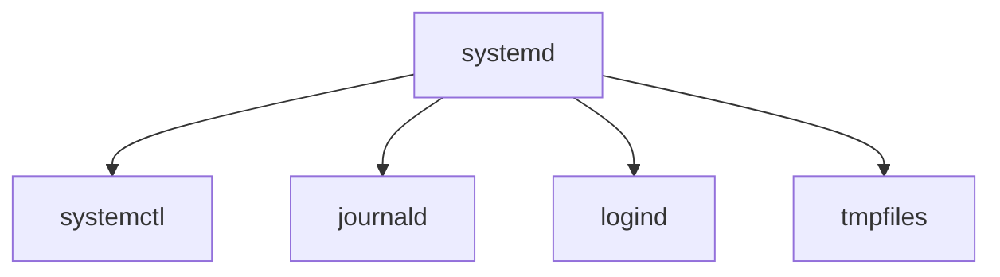
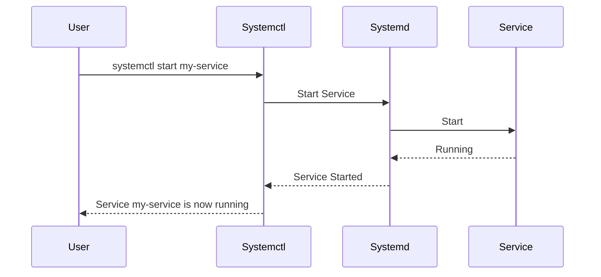

## Systemd

### Introduction

Systemd is a suite of software components that provides a system and service manager for Linux operating systems. It has become the default initialization system for many Linux distributions, replacing the older System V init system. Systemd is designed to provide better performance, simplicity, and modern features for managing system services and boot processes.

### Key Features of Systemd

1. **Parallel Service Startup**: Systemd can start services in parallel, significantly speeding up the boot process.
2. **On-Demand Activation**: Services can be started on demand when they are first accessed.
3. **Dependency Management**: Systemd understands the dependencies between services, ensuring they are started and stopped in the correct order.
4. **Snapshot and Restore**: Systemd allows taking snapshots of the system state and restoring them later.
5. **Logging**: Integrated logging with `journald` to collect and manage logs (`journalctl -u bolt`).

### Architecture

Systemd architecture includes several key components:

- **Systemd**: The system and service manager.
- **systemctl**: A command-line utility to interact with the systemd manager.
- **journald**: A system service that collects and manages log data.
- **logind**: A service to manage user logins.
- **tmpfiles**: Utility to manage temporary files.



### How Systemd Works

Systemd uses unit files to manage system services and other system resources. Each unit file describes a service, socket, device, mount point, swap file, etc.

#### Types of Unit Files

1. **Service Units** (`.service`): Defines a system service.
2. **Socket Units** (`.socket`): Defines an IPC or network socket.
3. **Device Units** (`.device`): Describes a device that is recognized by the kernel.
4. **Mount Units** (`.mount`): Defines a mount point on the file system.
5. **Automount Units** (`.automount`): Defines an automount point.
6. **Timer Units** (`.timer`): Defines a timer.

#### Unit File Example

Here's an example of a simple service unit file:

```
[Unit]
Description=My Sample Service
After=network.target

[Service]
ExecStart=/usr/bin/my-service
Restart=always

[Install]
WantedBy=multi-user.target
```

### Managing Systemd with `systemctl`

`systemctl` is the command-line tool used to control the systemd system and service manager.

#### Common Commands

1. **Start a Service**: `sudo systemctl start <service-name>`
2. **Stop a Service**: `sudo systemctl stop <service-name>`
3. **Restart a Service**: `sudo systemctl restart <service-name>`
4. **Enable a Service at Boot**: `sudo systemctl enable <service-name>`
5. **Disable a Service at Boot**: `sudo systemctl disable <service-name>`
6. **Check Status of a Service**: `sudo systemctl status <service-name>`
7. **View Logs**: `sudo journalctl -u <service-name>`

#### Example Workflow



### Systemd Logging with `journald`

Systemd includes the `journald` service for logging, which stores log data in a binary format for efficient retrieval and management.

#### Viewing Logs

1. **View All Logs**: `journalctl`
2. **View Logs for a Specific Service**: `journalctl -u <service-name>`
3. **View Logs for the Current Boot**: `journalctl -b`
4. **Filter Logs by Time**: `journalctl --since "2024-06-01" --until "2024-06-10"`

### Advantages of Systemd

1. **Speed**: Faster boot times due to parallel service startup.
2. **Flexibility**: Powerful dependency management and on-demand activation.
3. **Unified Management**: Consistent management of services, sockets, devices, and mounts.
4. **Integrated Logging**: Efficient and centralized logging with `journald`.

### Conclusion

Systemd provides a modern and efficient system and service manager for Linux. Its advanced features, such as parallel service startup, on-demand activation, and comprehensive logging, make it a powerful tool for managing Linux systems. Mastery of systemd commands and understanding its architecture are essential skills for any Linux administrator or power user.
