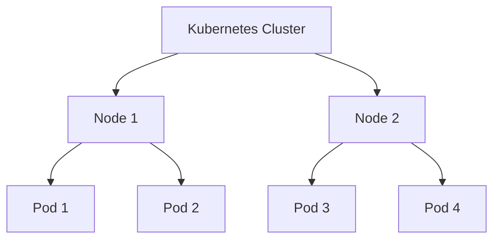

# Virtual Machines, Containers, and Related Topics

Virtual Machines (VMs) and containers are technologies used to create isolated environments for running applications. They provide different levels of isolation, performance, and flexibility, making them suitable for various use cases in modern computing.

## Virtual Machines (VMs)

### Definition

A Virtual Machine is an emulation of a computer system that runs on top of a physical host machine. VMs use hypervisors to abstract the hardware and create multiple virtual instances of the physical resources.

### Key Components

1. **Hypervisor**: Software that creates and manages VMs by abstracting the underlying hardware.

   - **Type 1 (Bare-metal)**: Runs directly on the host hardware (e.g., VMware ESXi, Microsoft Hyper-V).
   - **Type 2 (Hosted)**: Runs on a host operating system (e.g., VMware Workstation, Oracle VirtualBox).

2. **Guest OS**: The operating system running inside the VM.

### Advantages

- **Isolation**: Each VM is completely isolated from others, providing strong security boundaries.
- **Compatibility**: Can run different operating systems on the same hardware.
- **Resource Management**: Can allocate and limit resources (CPU, memory, storage) for each VM.

### Disadvantages

- **Overhead**: VMs have higher resource overhead due to full OS emulation.
- **Slower Startup**: Takes longer to start compared to containers.

## Containers

### Definition

Containers are lightweight, portable units that package an application and its dependencies, running in isolated user spaces on a shared operating system kernel.

### Key Components

1. **Container Runtime**: Software that runs and manages containers (e.g., Docker, containerd).
2. **Images**: Read-only templates used to create containers.
3. **Containers**: Instances of images that run applications.

### Advantages

- **Lightweight**: Less overhead compared to VMs, sharing the host OS kernel.
- **Fast Startup**: Containers start quickly.
- **Portability**: Consistent environments across development, testing, and production.

### Disadvantages

- **Isolation**: Weaker isolation compared to VMs, as containers share the host OS kernel.
- **Compatibility**: Can only run Linux containers on Linux hosts (Windows containers on Windows hosts).

## Virtual Machines vs. Containers

| Feature              | Virtual Machines                             | Containers                             |
| -------------------- | -------------------------------------------- | -------------------------------------- |
| Isolation            | Strong isolation with separate OS            | Lightweight isolation using namespaces |
| Performance Overhead | Higher due to full OS emulation              | Lower due to shared OS kernel          |
| Startup Time         | Slower                                       | Faster                                 |
| Resource Efficiency  | Less efficient                               | More efficient                         |
| Use Cases            | Multi-OS environments, strong security needs | Microservices, DevOps, CI/CD           |

## Related Technologies

### Kubernetes

Kubernetes is an open-source platform for automating the deployment, scaling, and management of containerized applications. It abstracts the underlying infrastructure, allowing developers to focus on application logic.

#### Key Concepts

1. **Cluster**: A set of nodes (machines) running containerized applications managed by Kubernetes.
2. **Pods**: The smallest deployable units in Kubernetes, which can contain one or more containers.
3. **Services**: Abstractions that define a logical set of Pods and a policy for accessing them.
4. **Deployments**: Blueprints for Pods and ReplicaSets, used for managing application deployments.



### Docker

Docker is a platform for developing, shipping, and running applications inside containers. It provides tools and features for building container images, managing container lifecycles, and orchestrating multi-container applications.

#### Key Commands

1. **Build an Image**:

   ```bash
   docker build -t my-app .
   ```

2. **Run a Container**:

   ```bash
   docker run -d --name my-container my-app
   ```

3. **List Containers**:

   ```bash
   docker ps
   ```

4. **Stop a Container**:

   ```bash
   docker stop my-container
   ```

5. **Remove a Container**:
   ```bash
   docker rm my-container
   ```

## Conclusion

Virtual Machines and containers are both essential technologies in modern computing, each with its strengths and weaknesses. VMs provide strong isolation and compatibility at the cost of higher overhead, while containers offer lightweight, fast, and portable environments with some trade-offs in isolation. Understanding these technologies, along with related tools like Docker and Kubernetes, is crucial for efficient and effective application deployment and management.
