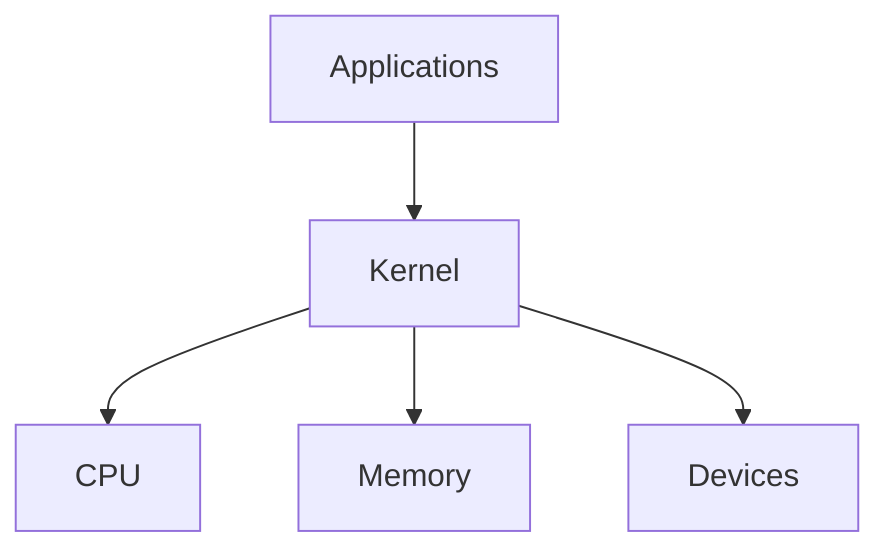
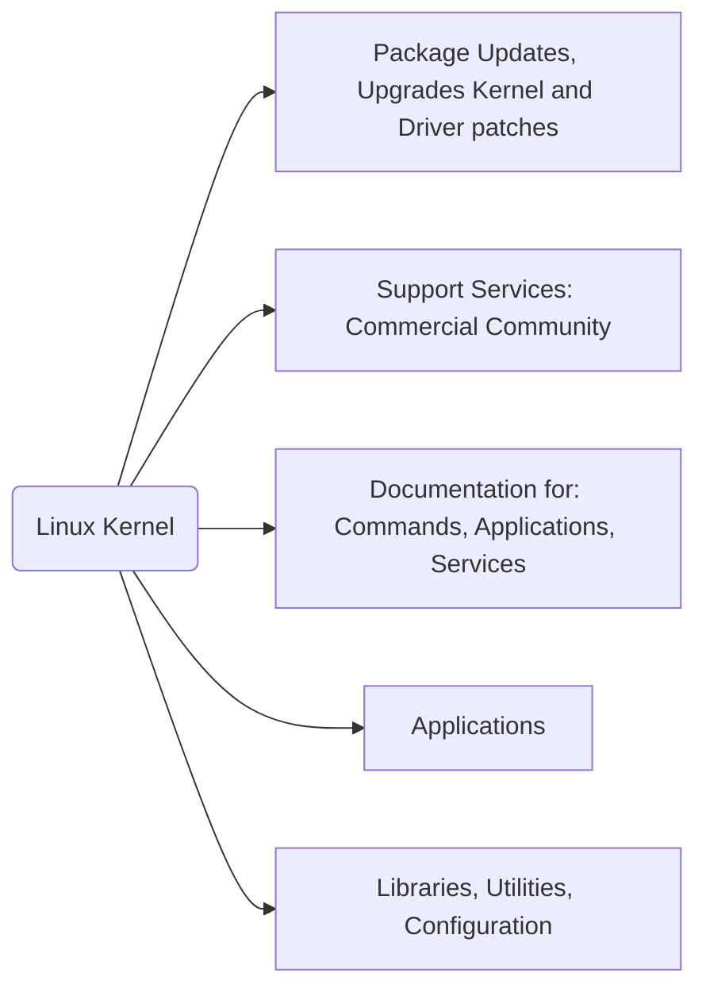
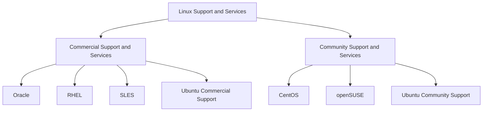

# Introduction to Linux

[https://www.youtube.com/watch?v=sWbUDq4S6Y8](https://www.youtube.com/watch?v=sWbUDq4S6Y8)

```
.
└── Linux Kernel/
    ├── Debian family/
    │   └── Ubuntu/
    │       └── Linux Mint
    ├── Red Hat Enterpise Linux familiy/
    │   └── Fedora/
    │       ├── CentOS
    │       └── Oracle Linux
    ├── SUSE family/
    │   └── SLES/
    │       └── openSUSE
    └── Other Distros families
```

## Red Hat Enterprise Linux (RHEL)

### Key Facts About the Red Hat Family

- Fedora an upstream testing platform
- CentOS is a close clone of RHEL
- Intel x86, Arm, Itanium, PowerPC
- yum package manager

## SUSE

### Key Facts About the SUSE Family

- SLES is upstream for openSUSE
- RPM-based zypper package manager
- YaST for system admin purposes
- Widely used in retail

## Debian

### Key Facts About the Debian Family

- Debian family is upstream for Ubuntu
- DPKG-based APT package manager
- Widely used for cloud deployments
- GNOME-based but differs visually

## Linux Terminology and Examples

- **Kernel**: Glue between hardware and applications
  ```mermaid
  graph LR;
    Application --> Kernel --> Hardware;
  ```
- **distribution**: Collection of software making up a Linux-based OS
- **boot loader**: Program tha boots the operating system (e.g: GRUB and ISOLINUX)
- **service**: Program that runs as a background process (httpd, nfsd, ftdp and named)
- **filesystem**: Method for storing and organizing files (e.g: ext3, ext4, FAT, CFS, NTFS and Btrfs)
- **X Window system**:
  - Graphical subsystem oni nearly all Linux systems
  - provides the standard toolkit and protocol to build graphical user interfaces
- **desktop environment**: Graphical user interface on top of the operating system (GNOME, KDE, Xfce and Fluxbox)
- **command line**: Interface for typing commands on top of the operating system
- **Shell**: Command line interpreter that interprets the command line input and instructs the operating system to perform any necessary tasks and commands.

## Linux Distros







## File System Hierarchy

# Filesystem Hierarchy Standard (FHS)

```
/
├── bin/        Essential user command binaries
├── boot/       Static files of the boot loader
├── dev/        Device files
├── etc/        Host-specific system configuration
├── home/       User home directories
│   ├── student/
│   │   └── dir
│   └── linuxgym
├── lib/        Essential shared libraries and kernel modules
├── media/      Mount point for removable media
├── mnt/        Mount point for temporarily mounted filesystems
├── opt/        Add-on application software packages
├── sbin/       System binaries
├── srv/        Data for services provided by this system
├── tmp/        Temporary files
├── usr/        Multi-user utilities and applications
│   └── local/
│       ├── bin
│       └── games
├── var/        Variable files
├── root/       Home directory for the root user
└── proc/       Virtual filesystem documenting kernel and process status as text files

```
