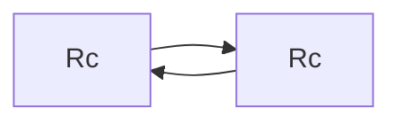
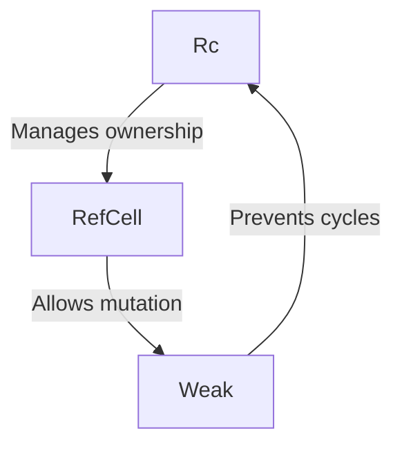

# Smart Pointers in Rust

## Overview

Smart pointers are advanced data structures in Rust that behave like pointers but offer additional features and metadata. They are used extensively for memory safety and to manage resource allocation.

## Types of Smart Pointers

### `Box<T>`

A `Box<T>` allocates data on the heap. It provides a simple way to allocate space for data outside the stack's limited space.

**Usage Example:**
```rust
let b = Box::new(5);
assert_eq!(*b, 5);
```

### `Rc<T>`

The `Rc<T>` (Reference Counted) smart pointer enables multiple ownership by counting the number of references to a value which ensures that the value is dropped only when there are no references.

**Example with Reference Counting:**
```rust
use std::rc::Rc;

let a = Rc::new(5);
let b = Rc::clone(&a);

assert_eq!(Rc::strong_count(&a), 2);
```

### `RefCell<T>`

`RefCell<T>` provides interior mutability: a way to enforce borrowing rules at runtime instead of compile time. This is useful when one cannot determine if code adheres to borrowing rules until runtime.

**Example of Borrowing at Runtime:**
```rust
use std::cell::RefCell;

let c = RefCell::new(5);
let mut d = c.borrow_mut();
*d += 1;

assert_eq!(*c.borrow(), 6);
```

## Combining `Rc<T>` and `Ref ArrayOf<_T> Interiors`

You can combine `Rc<T>` and `RefCell<T>` to get a type that can have multiple owners and be mutable.

```rust
use std::rc::Rc;
use std::cell::RefCell;

let value = Rc::new(RefCell::new(5));

let a = value.clone();
let b = value.clone();

*a.borrow_mut() += 1;
assert_eq!(*b.borrow(), 6);
```

## Reference Cycles and Memory Leaks

Reference cycles occur when two or more `Rc<T>`s create references to each other, preventing their memory from being freed. Rust cannot prevent this, thus it's a potential memory leak.

**Graphical Representation of a Reference Cycle:**


## Preventing Memory Leaks with `Weak<T>`

Using `Weak<T>`, a variant of `Rc<T>`, helps prevent cycles since `Weak<T>` references do not count towards the ownership tally of an object.

```rust
use std::rc::{Rc, Weak};
use std::cell::RefCell;

let leaf = Rc::new(Node {
    value: 3,
    parent: RefCell::new(Weak::new()),
    children: RefCell::new(vec![]),
});

let branch = Rc::new(Node {
    value: 5,
    parent: RefCell::new(Weak::new()),
    children: RefcELL::new(vec![Rc::clone(&leaf)]),
});

*leaf.parent.borrow_mut() = Rc::downgrade(&branch);
```

**Summary Diagram:**

This diagram summarizes the relationship between `Rc<T>`, `RefCell<T>`, and `Weak<T>` in managing memory and preventing cycles.



**Conclusion**

Smart pointers in Rust, such as `Box<T>`, `Rc<T>`, and `RefCell<T>`, are crucial for memory safety and flexible memory management, enabling patterns that are not possible with regular pointers alone.

