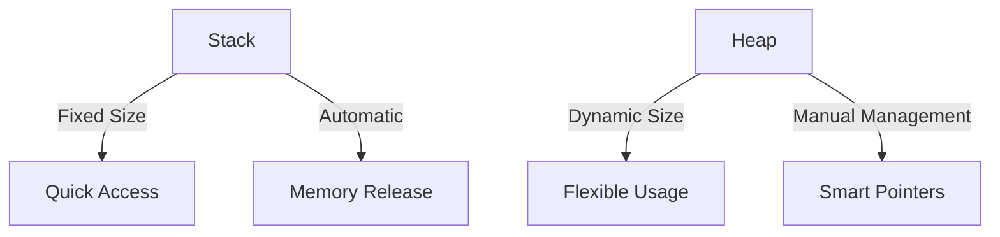

# Stack and Heap Allocation in Rust

Rust manages data in two main ways: stack allocation and heap allocation. Understanding these is crucial for effective Rust programming, particularly for managing performance and ensuring safety.

## Stack Allocation

- **Fast and Efficient**: Allocation happens at compile time, and accessing the memory is fast.
- **Limited in Size**: Typically used for small data or fixed size data.
- **Last In, First Out**: Data is removed in the opposite order to which it was added.

**Example Code**:
```rust
fn main() {
    let x = 5;
    let y = 42;
    // x and y are stored in the stack
}
```

## Heap Allocation

- **Dynamic**: Allows for dynamic memory size during runtime.
- **Flexible Size**: Can allocate a large block of memory.
- **Manual Management**: In Rust, managed through smart pointers like Box, Rc, etc.

**Example Code**:
```rust
fn main() {
    let x = Box::new(5);
    // x is a pointer to a heap allocated integer
}
```

## Graphical Representation


