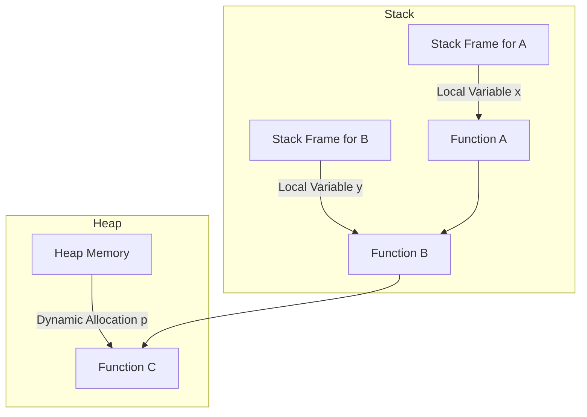

# Understanding Heap and Stack in Computer Science

In computer science, heap and stack are two types of memory used for different purposes in a program's execution.

## Stack

The stack is a region of memory that stores temporary variables created by functions. It operates in a last-in, first-out (LIFO) manner. The stack is responsible for:

- **Function calls**: Each function call creates a stack frame that holds its local variables and return address.
- **Local variables**: Variables that are declared within a function and are not global or static.
- **Function parameters**: Arguments passed to functions.

### Key Characteristics:

- **Fast access**: The stack is very fast to allocate and deallocate because it follows a strict LIFO order.
- **Size limitations**: The stack has limited size, which can lead to stack overflow if too much memory is used.
- **Automatic deallocation**: When a function exits, its stack frame is automatically removed.

### Stack Example in Rust:

```rust
fn A() {
    let x = 10; // x is stored on the stack

    fn B() {
        let y = 20; // y is stored on the stack
        println!("y: {}", y); // Example usage of y
    }

    B(); // Call function B
    println!("x: {}", x); // Example usage of x
}

fn main() {
    A(); // Call function A
}

```

In this example:

- \`x\` is stored on the stack when \`A\` is called.
- \`y\` is stored on the stack when \`B\` is called.
- When \`B\` finishes, \`y\` is removed from the stack.
- When \`A\` finishes, \`x\` is removed from the stack.

## Heap

The heap is a region of memory used for dynamic memory allocation. It does not follow a specific order and allows for more flexible storage of data that needs to persist beyond the scope of a single function.

### Key Characteristics:

- **Flexible size**: The heap can grow and shrink as needed, allowing for more complex data structures like linked lists, trees, and graphs.
- **Automatic deallocation**: In Rust, memory allocated on the heap is automatically managed. The memory is deallocated when it is no longer needed, which prevents memory leaks.
- **Slower access**: Accessing heap memory is generally slower than stack memory due to the lack of a strict order.

### Heap Example in Rust:

```rust
fn C() {
    // Allocate memory on the heap for an integer
    let p: Box<i32> = Box::new(30);

    // `p` automatically deallocates when it goes out of scope
}

fn main() {
    C();
}

```

In this example:

- Memory is allocated on the heap using `Box::new`.
- The value `30` is stored in the allocated heap memory.
- The memory is automatically freed when `p` goes out of scope, thanks to Rust's ownership system.

## Mermaid Diagram



## Summary

- **Stack**: Used for static memory allocation with fast access, automatic management, but limited size.
- **Heap**: Used for dynamic memory allocation with flexible size, manual management, and generally slower access.

Understanding the differences between stack and heap is crucial for efficient memory management in programming.
