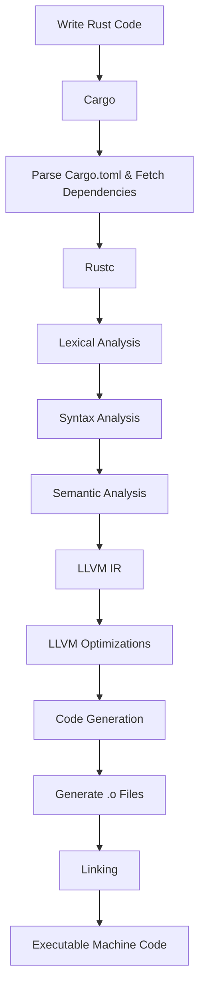

# Compilation Flow in Rust

## High-Level Overview

1. **Writing Code**: You write your Rust code in `.rs` files.
2. **Cargo**: The build system and package manager for Rust.
3. **Rustc**: The Rust compiler.
4. **LLVM IR**: Intermediate representation used by LLVM.
5. **LLVM Optimizations**: Various optimization passes to improve the code.
6. **Code Generation**: LLVM converts IR to machine code.
7. **Linking**: Combining machine code with libraries to produce the final executable.

## Detailed Flow

### 1. Writing Code

You start by writing your Rust code in `.rs` files. For example:

```rust
// main.rs
fn main() {
    println!("Hello, world!");
}
```

### 2. Cargo

Cargo is the Rust package manager and build system. When you run `cargo build`, Cargo does several things:

- **Parse `Cargo.toml`**: Cargo reads the `Cargo.toml` file to understand the project structure, dependencies, and build instructions.
- **Fetch Dependencies**: If there are dependencies specified, Cargo fetches them from the registry (like crates.io) and compiles them.

### 3. Rustc (Rust Compiler)

Cargo invokes `rustc`, the Rust compiler, to compile your Rust code. `rustc` performs several steps:

- **Lexical Analysis**: Tokenizes the source code into meaningful symbols.
- **Syntax Analysis**: Parses the tokens into an Abstract Syntax Tree (AST), representing the structure of the code.
- **Semantic Analysis**: Checks for type correctness, variable declarations, and other semantic rules.

### 4. LLVM IR

After analyzing the Rust code, `rustc` converts it into LLVM Intermediate Representation (IR). LLVM IR is a low-level, platform-independent representation of the code that is easier to optimize and transform.

**Example LLVM IR**:

```llvm
; ModuleID = 'main'
source_filename = "main.rs"

define i32 @main() {
entry:
  call void @llvm.global_ctors()
  call void @main_inner()
  ret i32 0
}

declare void @llvm.global_ctors()
declare void @main_inner()
```

### 5. LLVM Optimizations

LLVM applies various optimization passes to the IR to improve the performance and efficiency of the code. These optimizations can include:

- **Dead Code Elimination**: Removing code that is never executed.
- **Constant Folding**: Pre-computing constant expressions at compile time.
- **Inlining**: Replacing function calls with the function's body to reduce overhead.

### 6. Code Generation

After optimizations, LLVM converts the optimized IR into machine code specific to your target architecture (e.g., x86, ARM).

### 7. Linking

Finally, the machine code is linked with any required libraries to produce the final executable. The linker performs several tasks:

- **Combine Object Files**: Merges compiled object files into a single executable.
- **Resolve Symbols**: Ensures that function and variable references point to the correct locations.
- **Add Libraries**: Links against standard and external libraries.

## The Complete Flow



## Summary

1. **Write Code**: You write Rust code in `.rs` files.
2. **Cargo**: Manages the build process, dependencies, and invokes `rustc`.
3. **Rustc**: Compiles Rust code into LLVM IR after performing lexical, syntax, and semantic analysis.
4. **LLVM IR**: An intermediate representation of the code.
5. **LLVM Optimizations**: Various passes to optimize the IR.
6. **Code Generation**: LLVM converts IR to machine code.
7. **Linking**: Combines machine code with libraries to produce the final executable.

By understanding this flow, you can better appreciate the steps involved in compiling Rust code and the role LLVM plays in optimizing and generating the final machine code.
