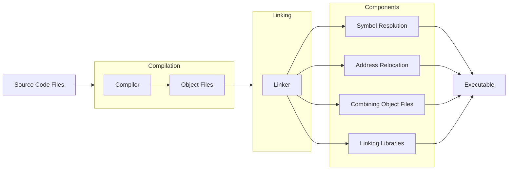

# Linkers

A **linker** is a crucial component in the process of creating an executable program from compiled code. The primary role of a linker is to combine multiple object files (produced by the compiler) into a single executable file, resolve symbol references, and handle address relocation. Let's break down the detailed functions and processes involved in linking:

## 1. Combining Object Files

When you compile a program with multiple source files, the compiler generates separate object files for each source file. Each object file contains machine code, but these files are not standalone executables. The linker takes these individual object files and combines them into a single executable file. This process involves merging code sections, data sections, and other relevant sections from each object file.

**Example**:

- You have `main.c` and `utils.c`.
- The compiler generates `main.o` and `utils.o`.
- The linker combines `main.o` and `utils.o` into `program.exe` (on Windows) or `program` (on Linux/Mac).

## 2. Symbol Resolution

In a program, functions and variables are often defined in one file and used in another. Each object file might contain undefined symbols (references to functions or variables not defined within that file). The linker’s job is to resolve these symbols by matching each use of a symbol with its definition.

**Example**:

- `main.c` calls a function `foo()` defined in `utils.c`.
- `main.o` contains an undefined reference to `foo`.
- `utils.o` contains the definition of `foo`.
- The linker resolves this reference by ensuring `main.o` knows where to find `foo` in `utils.o`.

## 3. Address Relocation

When object files are generated, they do not contain absolute memory addresses. Instead, they use relative addresses or placeholders. The linker adjusts these addresses so that all symbols point to their correct locations in the combined executable. This process is known as relocation.

**Example**:

- `main.o` and `utils.o` might have code that needs to be placed at specific addresses in memory.
- The linker calculates the final addresses for each symbol and updates the code to use these addresses.

## 4. Linking Libraries

Programs often rely on external libraries (like the C standard library). The linker includes the necessary parts of these libraries in the final executable. There are two types of linking: static and dynamic.

- **Static Linking**: The linker copies the code from the library directly into the executable. This results in a larger executable file but does not require the library to be present at runtime.

  - Example: Linking `libmath.a` statically includes all necessary math functions directly in `program.exe`.

- **Dynamic Linking**: The linker includes references to shared libraries (like `.dll` files on Windows or `.so` files on Linux). These libraries must be present at runtime.
  - Example: Linking `libmath.so` dynamically means `program` will rely on `libmath.so` being available when it runs.

## 5. Creating the Executable

After combining object files, resolving symbols, handling relocation, and linking libraries, the linker produces the final executable file. This file is now ready to be loaded into memory and executed by the operating system.

## Visualization

Here is a high-level overview of the linking process:

## Summary

- **Combining Object Files**: The linker merges multiple object files into a single executable.
- **Symbol Resolution**: It matches undefined symbols with their definitions across object files.
- **Address Relocation**: Adjusts memory addresses in the object files to create a coherent executable.
- **Linking Libraries**: Incorporates necessary libraries, either statically or dynamically.
- **Final Output**: Produces an executable file ready to be executed by the operating system.

By understanding the role of the linker, you can appreciate how different pieces of compiled code come together to form a complete, runnable program. The linker ensures that all parts of your program are correctly connected and positioned in memory, making the final executable functional.

## How a Linker Works in C

### Overview

In C, the linker combines multiple object files and libraries to create a final executable. The process involves several key steps:

1. **Combining Object Files**: The linker merges compiled object files (e.g., `main.o`, `utils.o`) into a single executable.
2. **Symbol Resolution**: The linker matches function and variable references (symbols) across object files.
3. **Address Relocation**: The linker adjusts memory addresses so that the compiled code can run correctly in memory.
4. **Linking Libraries**: The linker incorporates necessary libraries, either statically (e.g., `.a` files) or dynamically (e.g., `.so` files).

### Steps

1. **Combining Object Files**:

   - The compiler generates object files for each source file. For example, `gcc -c main.c -o main.o` produces `main.o`.
   - The linker combines these object files into a single executable: `gcc main.o utils.o -o program`.

2. **Symbol Resolution**:

   - Each object file may contain references to functions or variables not defined within it. The linker resolves these references by finding the corresponding definitions in other object files or libraries.

3. **Address Relocation**:

   - Object files contain relative addresses. The linker adjusts these addresses to ensure that functions and variables point to the correct locations in the final executable.

4. **Linking Libraries**:

   - The linker can include code from static libraries (`.a` files) directly into the executable.
   - For dynamic libraries (`.so` files), the linker adds references to the library. The actual library code is loaded at runtime.

## How a Linker Works in Rust

### Overview

In Rust, the linker performs similar tasks as in C but within the context of Rust's unique compilation model and package management system. Rust uses `rustc` (the Rust compiler) and `cargo` (the Rust package manager and build system).

### Steps

1. **Combining Object Files**:

   - Rust code is compiled into object files by `rustc`. For example, `rustc --crate-type=lib lib.rs` produces `lib.rlib`.
   - Cargo automates this process, managing dependencies and build configurations. Running `cargo build` compiles all source files into object files and combines them into the final executable.

2. **Symbol Resolution**:

   - Similar to C, Rust's linker resolves references to functions and variables across object files and libraries.

3. **Address Relocation**:

   - The linker adjusts memory addresses to ensure the final executable functions correctly.

4. **Linking Libraries**:
   - Rust supports various crate types (similar to libraries in C) that determine how code is linked and used.

## Crate Types in Rust

Rust supports several types of crates, each serving different purposes in how they are linked and used in programs:

1. **lib**: A standard Rust library crate.

   - **Usage**: Contains reusable code that can be included in other Rust projects.
   - **Example**: `libfoo.rlib`

2. **dylib**: A dynamically linked library crate.

   - **Usage**: Produces a shared library (`.so` on Linux, `.dylib` on macOS, `.dll` on Windows) that can be dynamically linked at runtime.
   - **Example**: `libfoo.so`
   - **Functions**: Allows for shared use of libraries at runtime, reducing the memory footprint.

3. **cdylib**: A C-compatible dynamically linked library crate.

   - **Usage**: Produces a shared library that can be used by other languages, especially C. It is suitable for creating FFI (Foreign Function Interface) libraries.
   - **Example**: `libfoo.so`
   - **Functions**: Enables Rust code to be called from C or other languages that support dynamic linking.

4. **staticlib**: A statically linked library crate.

   - **Usage**: Produces a static library (`.a` file) that can be statically linked into another program.
   - **Example**: `libfoo.a`
   - **Functions**: Useful for embedding Rust code into binaries for other languages without requiring dynamic linking.

5. **binary**: A binary executable crate.
   - **Usage**: Produces an executable binary.
   - **Example**: `foo` (an executable file)
   - **Functions**: The main entry point for Rust applications, resulting in a standalone program.

## Functions of Each Crate Type

- **lib**: Used for creating reusable libraries in Rust. These libraries are compiled into `.rlib` files that other Rust projects can include as dependencies.
- **dylib**: Used for creating shared libraries that can be dynamically linked at runtime. These are useful for reducing memory usage and enabling library updates without recompiling dependent programs.
- **cdylib**: Similar to `dylib`, but intended for interoperability with C and other languages. It is commonly used for creating Rust libraries that can be called from C programs.
- **staticlib**: Used for creating static libraries that are linked into the final executable at compile time. This results in a larger executable but does not require the library to be present at runtime.
- **binary**: Used for creating executable programs. These are the main outputs of Rust applications and can be run directly.
