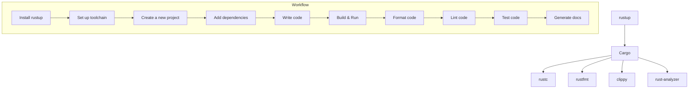

# Rust Toolchain

## 1. rustup
`rustup` is the official Rust toolchain installer and version manager. It makes it easy to install and manage different versions of Rust and their associated tools.

### Installation
To install rustup, run the following command in your terminal:
```sh
curl --proto '=https' --tlsv1.2 -sSf https://sh.rustup.rs | sh
```

### Usage
- **Install a specific toolchain version**: 
  ```sh
  rustup install stable
  rustup install nightly
  ```
- **Switch between toolchains**: 
  ```sh
  rustup default stable
  rustup default nightly
  ```
- **Update the installed toolchains**: 
  ```sh
  rustup update
  ```
- **List installed toolchains**: 
  ```sh
  rustup toolchain list
  ```

## 2. Cargo
`Cargo` is the Rust package manager and build system. It manages project dependencies, compiles your code, runs tests, and generates documentation.

### Creating a New Project
To create a new Rust project, use the following command:
```sh
cargo new my_project
```
This will create a new directory named `my_project` with the following structure:
```
my_project/
├── Cargo.toml
└── src/
    └── main.rs
```

### Building and Running
- **Build the project**:
  ```sh
  cargo build
  ```
- **Run the project**:
  ```sh
  cargo run
  ```
- **Build for release**:
  ```sh
  cargo build --release
  ```

### Managing Dependencies
Dependencies are specified in the `Cargo.toml` file. To add a dependency, edit `Cargo.toml`:
```toml
[dependencies]
serde = "1.0"
```
Then, run:
```sh
cargo build
```

### Testing
- **Run all tests**:
  ```sh
  cargo test
  ```

### Documentation
- **Generate documentation**:
  ```sh
  cargo doc --open
  ```

## 3. rustc
`rustc` is the Rust compiler. While `cargo` abstracts away many of the direct interactions with `rustc`, you can still compile Rust programs directly with `rustc`.

### Usage
Compile a Rust file:
```sh
rustc main.rs
```

## 4. Additional Tools

### rustfmt
`rustfmt` is a tool for formatting Rust code according to style guidelines.

### Installation
```sh
rustup component add rustfmt
```

### Usage
Format your code:
```sh
cargo fmt
```

### clippy
`clippy` is a linting tool that provides helpful suggestions to improve your Rust code.

### Installation
```sh
rustup component add clippy
```

### Usage
Run clippy:
```sh
cargo clippy
```

### rust-analyzer
`rust-analyzer` is a language server for Rust that provides features like autocompletion, go-to definition, and inline documentation.

### Installation
You can install `rust-analyzer` as a VSCode extension or download it from its [GitHub releases page](https://github.com/rust-analyzer/rust-analyzer/releases).

## 5. Example Workflow

Here's an example of a typical workflow when working with Rust:

1. **Install rustup**:
   ```sh
   curl --proto '=https' --tlsv1.2 -sSf https://sh.rustup.rs | sh
   ```
2. **Set up your toolchain**:
   ```sh
   rustup install stable
   rustup default stable
   rustup component add rustfmt
   rustup component add clippy
   ```
3. **Create a new project**:
   ```sh
   cargo new my_project
   cd my_project
   ```
4. **Add dependencies**:
   Edit `Cargo.toml` to include any dependencies your project needs.
5. **Write your code**:
   Implement your application logic in `src/main.rs` or other files in the `src` directory.
6. **Build and run your project**:
   ```sh
   cargo build
   cargo run
   ```
7. **Format your code**:
   ```sh
   cargo fmt
   ```
8. **Lint your code**:
   ```sh
   cargo clippy
   ```
9. **Test your code**:
   ```sh
   cargo test
   ```
10. **Generate documentation**:
    ```sh
    cargo doc --open
    ```

## Mermaid Diagram
Here's a mermaid diagram to visualize the Rust toolchain workflow:



# Conclusion
The Rust toolchain provides a comprehensive set of tools for developing, compiling, managing, and maintaining Rust projects. From installation with `rustup` to project management with `Cargo`, and code quality tools like `rustfmt` and `clippy`, the Rust toolchain ensures a smooth and efficient development experience.
