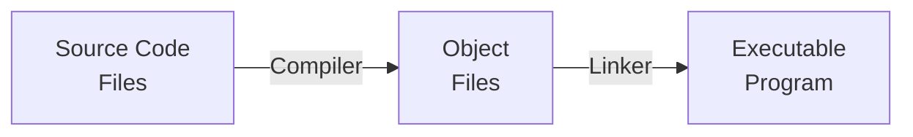

# Understanding Linkers and Crates in Rust

## What is a Linker?

Imagine you are building a puzzle. Each piece is like a piece of code you wrote. A linker is like a friend who helps put all these pieces together into a complete picture. In programming, a linker is a tool that takes different pieces of code (like functions and variables) and combines them into a single executable program that the computer can run.

## How Does a Linker Work in C?

In C, you write code in multiple files, and each file is compiled into an object file. These object files contain machine code but are not complete programs. The linker’s job is to:

1. **Combine Object Files**: It takes all the object files and combines them into a single executable file.
2. **Resolve Symbols**: It links function calls and variable references to their definitions, making sure all the pieces fit together correctly.
3. **Manage Libraries**: It includes code from libraries (collections of precompiled code) needed by your program.

Here’s a simple diagram to illustrate the process:

## How Does a Linker Work in Rust?

In Rust, the process is similar to C, but with some Rust-specific tools and terms. Here’s how it works:

1.  **Compile Rust Files**: Rust source files (`.rs` files) are compiled into object files.
2.  **Rustc**: The Rust compiler (`rustc`) generates these object files.
3.  **Cargo**: Cargo, the Rust package manager and build system, manages the building process, dependencies, and linking.
4.  **Linker**: The linker (which can be the system linker or one integrated with `rustc`) combines these object files into a single executable or library.

## Types of Crates the Rust Compiler Produces

In Rust, a crate is a compilation unit. Crates can be libraries or executables, and they come in different types:

1.  **lib**: A static library crate, which can be linked into other Rust programs.
2.  **dylib**: A dynamic library crate, which is dynamically linked at runtime (like `.dll` on Windows, `.so` on Linux).
3.  **cdylib**: A dynamic library crate meant for use with other languages, not just Rust (for creating FFI—Foreign Function Interface).
4.  **staticlib**: A static library crate, similar to `lib`, but meant to be used by other programming languages.
5.  **bin**: A binary executable crate, which is a complete executable program.

## Functions of These Crate Types

1.  **lib**: Used for creating reusable libraries that can be included in other Rust projects.
2.  **dylib**: Used for creating shared libraries that can be loaded at runtime, allowing for dynamic linking and plugin systems.
3.  **cdylib**: Used for creating shared libraries that other programming languages can use, making it easier to integrate Rust code with C, Python, etc.
4.  **staticlib**: Used for creating static libraries that other programming languages can link to at compile time.
5.  **bin**: Used for creating executable programs that can be run directly by the operating system.

## Summary

Linkers play a crucial role in combining different pieces of code into a complete program. In Rust, the compilation process involves creating object files that are linked together by a linker, managed by tools like `rustc` and Cargo. The Rust compiler produces different types of crates, each serving a specific purpose, from creating libraries to executable binaries, and enabling interoperability with other programming languages.
