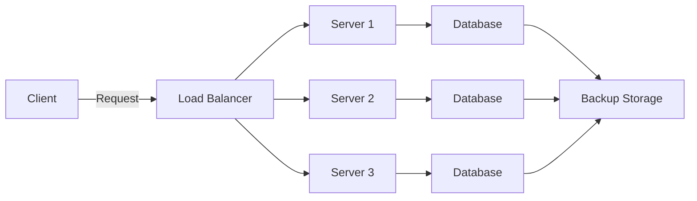

# 2. High Availability

Imagine you have a favorite toy that you always want to play with, and it should never break or be unavailable. High availability (HA) is like ensuring that your toy is always ready to use, no matter what.

High availability means making sure that a system or service is always up and running. It's like having a backup plan so that if something goes wrong, the system keeps working without interruption.

## Deep Dive and Important Points:

1. **Definition:**

   - High availability ensures that a system is continuously operational for a long time.
   - It minimizes downtime and ensures the system is accessible whenever needed.

2. **Key Components:**

   - **Redundancy:** Having extra parts or systems that can take over if one part fails. It's like having spare toys in case your favorite one breaks.
   - **Failover:** The process of switching to a backup system if the main one fails. It's like using a backup toy when your favorite one isn't available.
   - **Load Balancing:** Distributing the work evenly across multiple systems so that no single system gets overloaded. It's like sharing your toys with friends so no one toy gets worn out.

3. **Examples in Software:**

   - **Web Servers:** Using multiple servers to handle website traffic so that if one server goes down, others can take over.
   - **Databases:** Having multiple database copies so that if one fails, another can be used.

4. **Importance:**
   - **Reliability:** Ensures that services are reliable and users can access them anytime.
   - **Business Continuity:** Critical for businesses to keep operations running smoothly.
   - **User Satisfaction:** Users expect services to be available 24/7 without interruptions.

## Correct Industry Terms:

- **High Availability (HA):** A system design approach to ensure continuous operation.
- **Redundancy:** Extra components or systems to take over if one fails.
- **Failover:** Automatic switching to a backup system upon failure.
- **Load Balancing:** Distributing workloads across multiple systems.
- **Downtime:** The period when a system is not operational.

## High Availability Architecture

## Summary

High availability is like making sure your favorite toy is always ready to play with. In the tech world, it means designing systems to be continuously operational by using redundancy, failover, and load balancing. This ensures reliability, business continuity, and user satisfaction.
