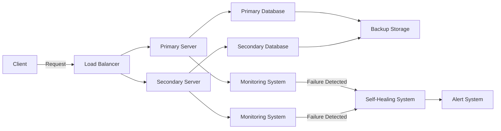

# 3. Fault Tolerance, Resilience, Reliability

## What are Fault Tolerance, Resilience, and Reliability?

Imagine you have a favorite toy that you really love playing with. Fault tolerance is like making sure your toy can still be played with even if it gets a little broken. Resilience is like your toy bouncing back to normal after getting damaged. Reliability is making sure your toy always works when you want to play with it.

## Simple Explanation:

- **Fault Tolerance:** Ensuring a system continues to operate even if some parts fail. It's like your toy still working even if one part breaks.
- **Resilience:** The ability of a system to recover quickly from problems. It's like your toy quickly getting fixed and ready to play with again.
- **Reliability:** Ensuring a system consistently performs well. It's like your toy always being ready to play with whenever you want.

## Deep Dive and Important Points:

1. **Fault Tolerance:**

   - **Definition:** Fault tolerance is the ability of a system to keep working even if some parts fail.
   - **Key Components:**
     - **Redundancy:** Extra parts or systems that can take over if one part fails.
     - **Graceful Degradation:** The system continues to work at a reduced level instead of completely failing.
   - **Example:** A web server setup where if one server fails, another server takes over without interrupting the service.

2. **Resilience:**

   - **Definition:** Resilience is the ability of a system to quickly recover from failures and continue operating.
   - **Key Components:**
     - **Self-Healing:** Systems that can automatically fix issues.
     - **Robustness:** The ability to withstand and recover from unexpected conditions.
   - **Example:** A database that can automatically recover corrupted data from backups.

3. **Reliability:**

   - **Definition:** Reliability is the ability of a system to perform consistently and correctly over time.
   - **Key Components:**
     - **Consistency:** Ensuring the system performs as expected.
     - **Uptime:** The amount of time the system is operational and available.
   - **Example:** A cloud service that guarantees 99.9% uptime, meaning it is almost always available for users.

4. **Importance:**

   - **Fault Tolerance:** Ensures continuous operation and minimizes service disruption.
   - **Resilience:** Enables quick recovery from failures, reducing downtime.
   - **Reliability:** Builds user trust by ensuring consistent and correct performance.

## Correct Industry Terms:

- **Fault Tolerance:** System's ability to continue operating despite failures.
- **Redundancy:** Extra components to take over if primary ones fail.
- **Graceful Degradation:** System continues to work at reduced capacity after a failure.
- **Resilience:** System's ability to recover from failures quickly.
- **Self-Healing:** Systems that automatically detect and fix issues.
- **Robustness:** Strength of a system to withstand failures.
- **Reliability:** Consistent performance and uptime of a system.

## Fault Tolerance, Resilience, Reliability Architecture

## Summary

Fault tolerance ensures a system keeps working even if parts fail. Resilience helps a system quickly recover from problems. Reliability ensures the system consistently performs well. Together, these concepts ensure systems are robust, reliable, and capable of continuous operation.
