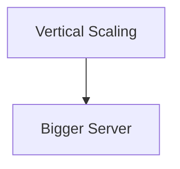
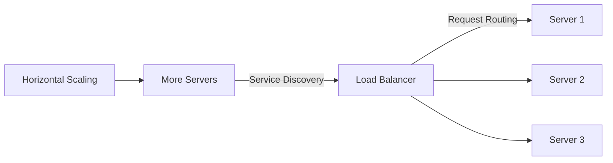
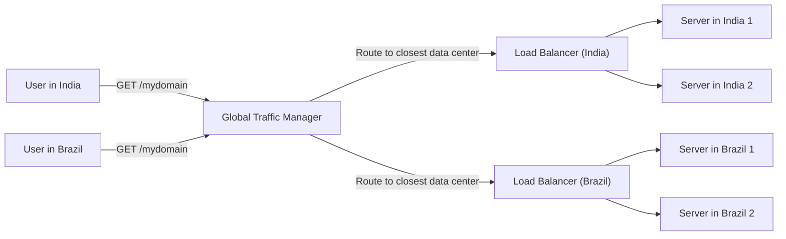
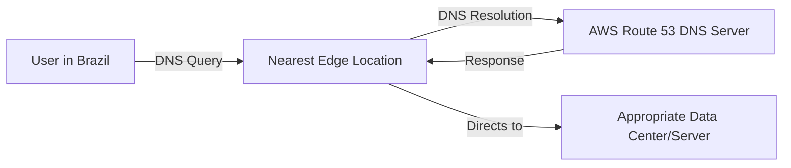
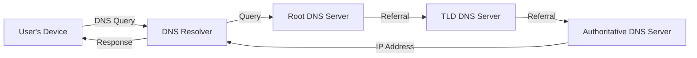
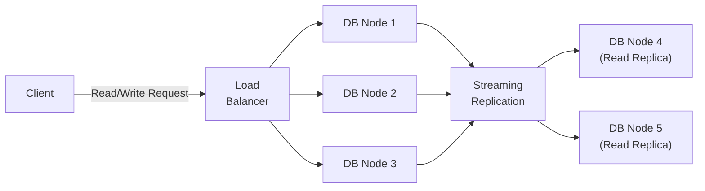

# 4. Scalability

## What is Scalability?

Imagine you have a toy collection that keeps growing. Scalability is like having a bigger toy box that can hold all your toys, no matter how many you have. It's about making sure your toy box can expand as you get more toys.

## Simple Explanation:

Scalability means that a system can grow and handle more work or users without breaking down. It's like having a toy box that can get bigger as you get more toys, so you always have enough space.

## Deep Dive and Important Points:

1. **Definition:**

   - Scalability is the ability of a system to handle increased load or to expand in capacity without compromising performance.
   - It ensures the system can grow and still work well.

2. **Types of Scalability:**

   - **Vertical Scalability (Scaling Up):** Adding more power to existing machines, like getting a bigger toy box.
   - **Horizontal Scalability (Scaling Out):** Adding more machines to share the load, like getting more toy boxes to distribute your toys.

3. **Key Components:**

   - **Elasticity:** The ability to automatically adjust resources based on the load. It's like your toy box automatically expanding or shrinking based on the number of toys.
   - **Load Balancing:** Distributing the workload evenly across multiple systems to ensure no single system gets overwhelmed.

4. **Examples in Software:**

   - **Web Applications:** Adding more servers to handle increased website traffic.
   - **Databases:** Using distributed databases that can grow by adding more storage nodes.

5. **Importance:**

   - **Performance:** Ensures the system can handle more users or data without slowing down.
   - **Flexibility:** Allows the system to grow and adapt to changing demands.
   - **Cost-Effectiveness:** Helps in managing resources efficiently by scaling up or down as needed.

## Correct Industry Terms:

- **Scalability:** The ability of a system to handle increased load or expand capacity.
- **Vertical Scalability (Scaling Up):** Increasing power of existing machines.
- **Horizontal Scalability (Scaling Out):** Adding more machines to share the load.
- **Elasticity:** Automatic adjustment of resources based on demand.
- **Load Balancing:** Even distribution of workload across systems.

## Scalability: Vertical vs Horizontal

## Examples of Global Traffic Managers

- **DNS-Based GTM**: Uses DNS to direct users to the nearest data center (e.g., AWS Route 53, Cloudflare DNS).
- **CDN Services**: Content Delivery Networks often include GTM functionality to route traffic based on geographic location (e.g., Akamai, Cloudflare CDN).
- **Dedicated GTM Solutions**: Specialized services or appliances that provide advanced traffic management features (e.g., F5 BIG-IP GTM, Citrix ADC).

By leveraging a Global Traffic Manager, organizations can ensure that user requests are handled efficiently, providing a better user experience and maintaining high availability.

## Distributed Database

- **Client Requests:**

  - Clients send read/write requests to the load balancer.

- **Load Balancer:**

  - Distributes incoming requests across multiple PostgreSQL nodes to balance the load.

- **PostgreSQL Nodes (Node 1, Node 2, Node 3):**

  - Handle the distributed read/write requests from the load balancer.
  - Act as primary nodes where data is written.

- **Streaming Replication:**

  - Continuous real-time synchronization of data changes from primary nodes to replica nodes.
  - Ensures data consistency across all nodes.

- **PostgreSQL Read Replicas (Node 4, Node 5):**
  - Receive data changes from primary nodes via streaming replication.
  - Primarily handle read requests to improve performance and reduce load on primary nodes.

## Summary

Scalability ensures a system can grow and handle more work or users efficiently. It can be achieved by scaling up (adding more power to existing machines) or scaling out (adding more machines). Key components include elasticity and load balancing, which help maintain performance and flexibility.
