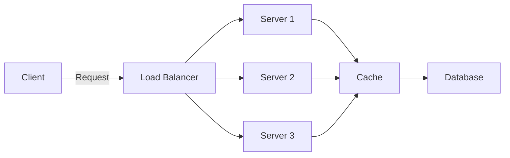
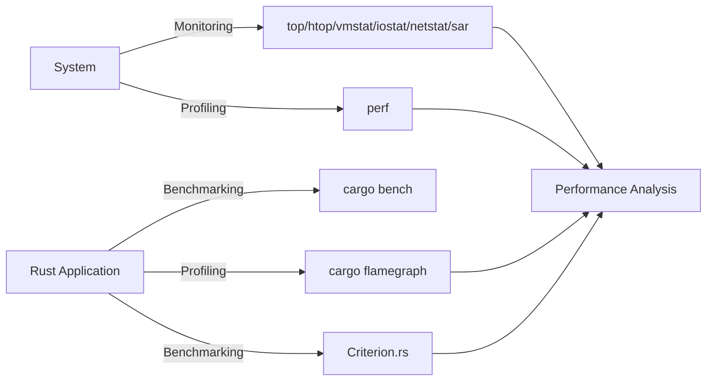

# 5. Performance

## What is Performance?

Imagine you have a toy race car that you want to make go as fast as possible. Performance in computing is like making sure your systems and applications run as fast and efficiently as they can.

## Simple Explanation:

Performance means how well and how quickly a system or application can complete tasks. It's like measuring how fast and smoothly your toy car can race around the track.

## Deep Dive and Important Points:

1. **Definition:**

   - Performance refers to how efficiently a system or application can complete its tasks.
   - It is measured by speed, responsiveness, and resource usage.

2. **Key Performance Metrics:**

   - **Latency:** The time it takes to respond to a request. Lower latency means faster response times.
   - **Throughput:** The number of tasks or transactions a system can handle in a given time period. Higher throughput means the system can handle more work.
   - **Resource Utilization:** How effectively a system uses its resources (CPU, memory, disk). Optimal resource utilization means better performance.

3. **Factors Affecting Performance:**

   - **Hardware:** The quality and power of the physical components (CPU, RAM, storage).
   - **Software:** The efficiency of the code and algorithms used.
   - **Network:** The speed and reliability of network connections.
   - **Configuration:** Proper tuning and settings of the system and applications.

4. **Improving Performance:**

   - **Optimization:** Improving the efficiency of code and algorithms.
   - **Caching:** Storing frequently accessed data in a quickly accessible location.
   - **Load Balancing:** Distributing workload evenly across multiple systems.
   - **Scaling:** Adding more resources or systems to handle increased load.

5. **Examples in Software:**

   - **Web Applications:** Reducing page load times by optimizing code and using content delivery networks (CDNs).
   - **Databases:** Using indexing and query optimization to speed up data retrieval.
   - **Networks:** Using faster network connections and optimizing data transfer protocols.

## Performance Optimization Architecture

## Tools for Mapping and Monitoring Performance Issues in Linux and Rust

### What are Performance Mapping and Monitoring Tools?

Imagine you have a big playground, and you want to make sure all the rides are working perfectly and everyone is having fun. Performance mapping and monitoring tools help you keep an eye on everything, ensuring the playground (your system) is running smoothly.

### Simple Explanation:

Performance mapping and monitoring tools help you check how well your system is working. They show you if something is slow or not working properly so you can fix it.

### Deep Dive and Important Points:

1. **Definition:**

   - **Mapping:** Identifying and understanding the performance characteristics of different parts of a system.
   - **Monitoring:** Continuously checking the system to ensure it is performing well and identifying any issues.

2. **Tools for Linux:**

   - **top:** Shows the processes using the most resources.
   - **htop:** An improved version of top with a user-friendly interface.
   - **vmstat:** Provides information about system processes, memory, paging, block IO, traps, and CPU activity.
   - **iostat:** Monitors system input/output device loading.
   - **netstat:** Displays network connections, routing tables, interface statistics, masquerade connections, and multicast memberships.
   - **sar:** Collects, reports, and saves system activity information.
   - **perf:** A powerful tool to profile and analyze system performance.

3. **Tools for Rust:**

   - **cargo bench:** A Rust command to run benchmarks.
   - **cargo flamegraph:** Generates a flamegraph of your program to visualize performance bottlenecks.
   - **perf (Linux):** Can be used with Rust for profiling by integrating with cargo.
   - **Criterion.rs:** A powerful statistical benchmarking library for Rust.

4. **Key Features:**

   - **Real-Time Monitoring:** Provides live updates on system performance.
   - **Historical Data:** Tracks performance over time to identify trends.
   - **Alerts:** Sends notifications when performance issues are detected.
   - **Visualization:** Graphs and charts that make it easy to understand performance data.

5. **Importance:**

   - **Proactive Issue Detection:** Identifies problems before they impact users.
   - **Resource Optimization:** Helps in tuning the system for better performance.
   - **Troubleshooting:** Aids in diagnosing and fixing performance issues.

### Performance Mapping and Monitoring Architecture

## Additional Performance Topics

### Idea Behind Batch Processing (Specifically, MapReduce)

Imagine you have a huge pile of LEGO bricks that you need to sort by color. Instead of sorting all by yourself, you ask your friends to help. Each friend takes a portion of the pile, sorts it, and then you combine the results. This is the idea behind batch processing and MapReduce.

#### Simple Explanation:

- **Batch Processing:** Handling large amounts of data by processing it in small chunks or batches.
- **MapReduce:** A technique to process and generate large datasets by splitting the task into smaller sub-tasks (Map) and then combining the results (Reduce).

#### Deep Dive:

1. **Map Phase:**

   - The data is divided into small chunks.
   - Each chunk is processed in parallel, producing intermediate results.

2. **Reduce Phase:**
   - The intermediate results are combined to produce the final output.

#### Example:

- **Map:** Sorting LEGO bricks by color in small batches.
- **Reduce:** Combining sorted batches into one big sorted pile.

### Increase Throughput by Scaling Out Message Queues

Imagine a single cashier in a store handling all customers. If you add more cashiers, customers are served faster. Similarly, scaling out message queues means adding more servers to handle messages, increasing throughput.

#### Simple Explanation:

- **Message Queues:** Systems that manage and process messages between services.
- **Scaling Out:** Adding more servers to handle more messages simultaneously.

#### Deep Dive:

1. **Single Queue:**

   - One server processes all messages.
   - Limited by server capacity.

2. **Scaled-Out Queues:**
   - Multiple servers process messages in parallel.
   - Increases capacity and speed.

#### Example:

- Adding more cashiers to a store to serve customers faster.

### Shards

Imagine your toy collection is so large that it doesn't fit in one box. You divide it into several smaller boxes, each holding a part of the collection. Each box is a shard.

#### Simple Explanation:

- **Sharding:** Splitting a database into smaller, more manageable pieces called shards.
- **Shard:** A small piece of the larger database, each storing a portion of the data.

#### Deep Dive:

1. **Why Shard:**

   - Improves performance and scalability.
   - Reduces the load on a single database server.

2. **How It Works:**
   - Data is divided based on a key (e.g., user ID).
   - Each shard operates independently.

#### Example:

- Dividing a large toy collection into smaller boxes for easier management.

### Idea Behind Scaling Data Store Reads

Imagine a library where everyone wants to read the same book. Instead of having one copy, you make multiple copies so everyone can read simultaneously. This is the idea behind scaling data store reads.

#### Simple Explanation:

- **Scaling Reads:** Adding more servers or replicas to handle more read requests.
- **Replication:** Making copies of data and distributing them across multiple servers.

#### Deep Dive:

1. **Why Scale Reads:**

   - To handle more read requests without slowing down.

2. **How It Works:**
   - Create replicas of the database.
   - Distribute read requests across these replicas.

#### Example:

- Making multiple copies of a popular book in a library so more people can read it at the same time.

### Industry Terms:

- **Performance:** Efficiency and speed of a system or application.
- **Latency:** Time taken to respond to a request.
- **Throughput:** Number of tasks handled in a given time.
- **Resource Utilization:** Efficiency of resource usage.
- **Optimization:** Improving efficiency of code and processes.
- **Caching:** Storing frequently accessed data for quick access.
- **Load Balancing:** Distributing workload evenly.
- **Scaling:** Increasing resources to handle more load.

- **Mapping:** Identifying performance characteristics.
- **Monitoring:** Continuously checking system performance.
- **Real-Time Monitoring:** Live updates on system performance.
- **Benchmarking:** Measuring performance using specific tests.
- **Profiling:** Analyzing the performance of a program.
- **Batch Processing:** Processing data in batches.
- **MapReduce:** A model for processing large datasets.
- **Message Queues:** Systems for managing messages between services.
- **Scaling Out:** Adding more servers to increase capacity.
- **Sharding:** Dividing a database into smaller parts.
- **Scaling Reads:** Adding replicas to handle more read requests.
- **Replication:** Creating copies of data.

## Summary

Performance ensures that systems and applications run efficiently and quickly. Key metrics for measuring performance include latency (response time), throughput (tasks handled over time), and resource utilization (efficient use of CPU, memory, disk). Improving performance involves techniques such as optimization, caching, load balancing, and scaling, which help maintain fast and reliable systems.

Performance mapping and monitoring tools play a crucial role in maintaining system efficiency. In Linux, essential tools include top, htop, vmstat, iostat, netstat, sar, and perf for system profiling. For Rust, tools like cargo bench, cargo flamegraph, and Criterion.rs are used for benchmarking and profiling. These tools help in proactive issue detection, resource optimization, and troubleshooting.

Effective performance management also involves handling increasing workloads. Batch processing with MapReduce splits tasks into smaller parts for parallel processing. Scaling out message queues and data store reads involves adding more servers or replicas to manage additional requests. Sharding divides a database into smaller, manageable pieces, improving performance and scalability.
