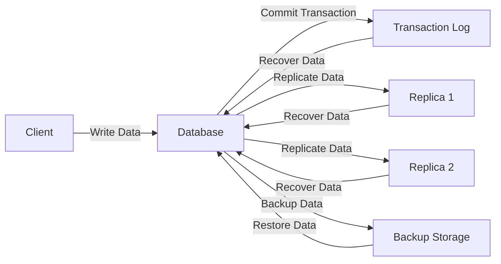

# 6. Durability

Imagine you have a diary where you write all your secrets. You want to make sure that even if you spill water on it or drop it, your secrets are safe. In computing, durability means making sure that your data is safe and lasts over time, even if something goes wrong.

Durability ensures that once data is saved, it remains safe and intact, even in the event of a system failure. It's like making sure your diary entries are protected and can't be lost or erased.

1. **Definition:**

   - Durability is one of the ACID properties (Atomicity, Consistency, Isolation, Durability) in database management.
   - It ensures that once a transaction is committed, it will remain saved even if the system crashes.

2. **Key Components:**

   - **Transactional Logging:** Keeping a log of all changes to the data so they can be recovered if needed.
   - **Replication:** Making copies of the data on multiple systems to protect against data loss.
   - **Backup and Restore:** Regularly backing up data and having a process to restore it in case of failure.

3. **How It Works:**

   - When a transaction is committed, the system ensures that all changes are saved to a permanent storage medium (like a hard drive).
   - Transaction logs are maintained to track changes and allow recovery.
   - Data replication ensures there are multiple copies of the data in different locations.

4. **Examples:**

   - **Database Systems:** Ensuring that once a transaction is committed, the data is permanently saved, even if the system crashes immediately after.
   - **File Systems:** When a file is saved, ensuring it remains intact and accessible even after a power failure.

5. **Importance:**

   - **Data Integrity:** Ensures that data remains accurate and uncorrupted.
   - **Reliability:** Builds trust that the data will always be there when needed.
   - **Business Continuity:** Critical for operations that rely on data being available at all times.

## Additional Concepts:

1. **Backup: Full, Differential, and Incremental**

   - **Full Backup:** A complete copy of all data. It is the most comprehensive backup method but also the most time-consuming and storage-intensive.
   - **Differential Backup:** Copies all changes made since the last full backup. It requires less storage than full backups but more than incremental backups.
   - **Incremental Backup:** Copies only the changes made since the last backup of any type (full or incremental). It is the most storage-efficient and fastest method but can be slower to restore since multiple backups may need to be applied.

2. **RAID (Redundant Array of Independent Disks):**

   - **RAID 0:** Data is split across multiple disks, offering improved performance but no redundancy. If one disk fails, all data is lost.
   - **RAID 1:** Data is mirrored across two or more disks, providing redundancy. If one disk fails, the data remains available on the other disk(s).
   - **RAID 5:** Data is striped across three or more disks with parity information distributed among the disks. It offers a good balance of performance, redundancy, and storage efficiency.
   - **RAID 6:** Similar to RAID 5 but with an additional parity block, allowing for up to two disk failures without data loss.
   - **RAID 10:** Combines RAID 0 and RAID 1, offering both improved performance and redundancy by mirroring and striping data across multiple disks.

3. **Availability vs. Durability:**

   - **Availability:** Ensures that a system or service is operational and accessible when needed. It focuses on minimizing downtime and ensuring continuous access to the system.
   - **Durability:** Ensures that once data is saved, it remains safe and intact over time. It focuses on data persistence and protection against data loss.

## Durability Architecture

## What are ACID Properties?

ACID is an acronym that stands for Atomicity, Consistency, Isolation, and Durability. These properties ensure that database transactions are processed reliably and ensure the integrity of the data.

### 1. Atomicity

Ensures that all parts of a transaction are completed successfully. If any part of the transaction fails, the entire transaction is rolled back, leaving the database in its original state.

### 2. Consistency

Ensures that a transaction brings the database from one valid state to another. The database must meet all predefined rules, such as constraints, cascades, and triggers, before and after the transaction.

### 3. Isolation

Ensures that the operations of one transaction are not visible to other transactions until the transaction is complete. This prevents transactions from interfering with each other and maintains data accuracy.

### 4. Durability

Ensures that once a transaction is committed, it remains permanent, even in the event of a system failure. This is achieved through transactional logging, replication, and backup strategies.

## Industry Terms:

- **Durability:** The ability to ensure that once a transaction is committed, it remains saved.
- **ACID Properties:** Set of properties that guarantee database transactions are processed reliably.
- **Transactional Logging:** Logging changes to ensure data can be recovered.
- **Replication:** Making multiple copies of data to prevent loss.
- **Backup and Restore:** Regularly saving data and having a process to recover it.

## Summary

Durability ensures that once data is saved, it remains safe and intact, even in the event of a system failure. It involves transactional logging, replication, and regular backups to protect data. This is crucial for maintaining data integrity, reliability, and business continuity. Additional concepts like backup types, RAID configurations, and understanding the difference between availability and durability are essential for comprehensive data protection.
