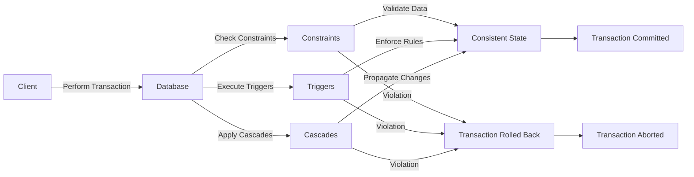

# 7. Consistency

Imagine you have a set of building blocks, and you want to make sure that each structure you build follows the same rules, so none of them collapse. In computing, consistency ensures that data remains accurate and follows predefined rules, so the system remains reliable.

Consistency means that data in a database is always valid and follows the rules set for it. It's like making sure all your building blocks fit together perfectly and don't cause the structure to fall apart.

1. **Definition:**

   - Consistency is one of the ACID properties (Atomicity, Consistency, Isolation, Durability) in database management.
   - It ensures that a transaction brings the database from one valid state to another, adhering to all defined rules and constraints.

2. **Key Components:**

   - **Constraints:** Rules that ensure data validity, such as primary keys, foreign keys, and unique constraints.
   - **Triggers:** Procedures that automatically enforce rules or constraints when certain conditions are met.
   - **Cascades:** Actions that automatically propagate changes from one table to related tables to maintain data integrity.

3. **Consistency Models:**

   - **Strong Consistency:** Guarantees that once data is written, all subsequent reads will see that data.
   - **Eventual Consistency:** Guarantees that, given enough time, all replicas will converge to the same value.
   - **Linearizability:** Ensures that operations appear instantaneous and in a consistent order.
   - **Monotonic Reads:** Guarantees that if a process reads a value, any subsequent reads will see the same or a more recent value.
   - **Read-Your-Writes (Read-After-Write):** Ensures that once a write is done, all subsequent reads will reflect that write.
   - **Consistent Prefix Reads:** Ensures that reads never see out-of-order writes.

4. **How It Works:**

   - When a transaction is performed, the database checks all constraints and rules to ensure the data remains valid.
   - If any part of the transaction violates these rules, the entire transaction is rolled back to maintain consistency.

5. **Examples:**

   - **Bank Transactions:** Ensuring that the total amount of money in all accounts remains consistent before and after a transaction.
   - **Inventory Systems:** Ensuring that product quantities are accurately updated after sales or restocks.

6. **Importance:**

   - **Data Integrity:** Ensures that the data is accurate and reliable.
   - **System Reliability:** Builds trust in the system by maintaining correct and predictable behavior.
   - **Error Prevention:** Prevents data corruption and logical errors by enforcing rules and constraints.

## Industry Terms:

- **Consistency:** Ensuring that data remains valid and follows all defined rules.
- **ACID Properties:** Set of properties that guarantee database transactions are processed reliably.
- **Constraints:** Rules that ensure data validity.
- **Triggers:** Procedures that enforce rules automatically.
- **Cascades:** Actions that propagate changes to maintain data integrity.
- **Consistency Models:** Different ways to achieve and understand data consistency.
- **Eventual Consistency:** A model where data will become consistent over time.
- **Linearizability:** Ensuring operations appear instantaneous and ordered.
- **Monotonic Reads:** Guaranteeing reads will not see older values.
- **Read-Your-Writes (Read-After-Write):** Ensuring subsequent reads reflect recent writes.
- **Consistent Prefix Reads:** Ensuring reads never see out-of-order writes.

## Consistency Architecture

## Summary

Consistency ensures that data in a database remains accurate and adheres to predefined rules. It involves checking constraints, executing triggers, and applying cascades during transactions. This property is crucial for maintaining data integrity and system reliability. Consistency models like strong consistency, eventual consistency, linearizability, monotonic reads, read-your-writes, and consistent prefix reads help define and achieve data consistency in various systems. Consistency, along with Atomicity, Isolation, and Durability, forms the ACID properties, which guarantee reliable database transactions.
