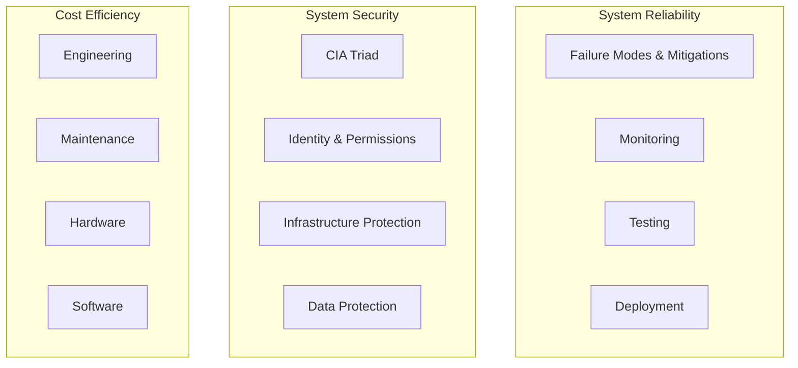

# 8. Maintainability, Security, Cost

Imagine you have a giant playground with various rides and games. To keep it fun and safe, you need to make sure everything works well (maintainability), is safe for everyone (security), and doesn't cost too much (cost). In computing, these aspects ensure that systems are reliable, secure, and cost-effective.

- **Maintainability:** Ensuring systems are easy to fix, monitor, and update.
- **Security:** Protecting systems and data from unauthorized access and threats.
- **Cost:** Managing expenses related to building, maintaining, and operating systems.

### Maintainability

1. **Failure Modes and Mitigations:**

   - **Failure Modes:** Identifying possible ways systems can fail.
   - **Mitigations:** Implementing strategies to prevent or minimize the impact of failures.

2. **Monitoring:**

   - Continuous tracking of system performance and health.
   - Tools: Prometheus, Grafana, Nagios.

3. **Testing:**

   - Regularly checking systems to ensure they work correctly.
   - Types: Unit tests, integration tests, system tests.

4. **Deployment:**

   - **Processes for Releasing New Software Versions**

     - **Planning:** Preparing for the release by understanding what changes will be made and how they will impact the system.
     - **Development:** Writing and testing code changes.
     - **Build:** Compiling the code and creating executable files.
     - **Testing:** Ensuring the new version works as expected without introducing bugs.
     - **Release:** Making the new version available to users.
     - **Monitoring:** Keeping an eye on the system after deployment to ensure it runs smoothly.

   - **Techniques:**

     - **Continuous Integration/Continuous Deployment (CI/CD):**

       - **Continuous Integration (CI):** Automatically integrating code changes from multiple contributors into a shared repository several times a day. Each integration is verified by an automated build and automated tests.
       - **Continuous Deployment (CD):** Automatically deploying every change that passes all stages of the production pipeline to the production environment. This ensures that the software can be released at any time.
       - **Benefits:** Faster release cycles, immediate feedback, and reduced manual intervention.
       - **Tools:** Jenkins, Travis CI, CircleCI, GitLab CI/CD, GitHub Actions.

     - **Blue-Green Deployment:**

       - **Blue Environment:** The current live environment where the application is running.
       - **Green Environment:** An identical environment where the new version of the application is deployed and tested.
       - **Process:**
         1. Deploy the new version to the green environment.
         2. Test the green environment to ensure everything works correctly.
         3. Switch the router to direct user traffic from the blue environment to the green environment.
         4. The blue environment becomes idle but is kept as a backup in case the deployment to the green environment fails.
       - **Benefits:** Minimal downtime and easy rollback in case of issues.

     - **Canary Deployment:**
       - **Concept:** Gradually rolling out the new version to a small subset of users before a full deployment.
       - **Process:**
         1. Deploy the new version to a small group of users (canary group).
         2. Monitor the new version for any issues or feedback from the canary group.
         3. Gradually increase the number of users receiving the new version if no issues are found.
         4. Fully deploy the new version to all users.
       - **Benefits:** Reduced risk by catching issues early, minimal impact on the majority of users.

### Security

1. **CIA Triad:**

   - **Confidentiality:** Ensuring that data is accessible only to authorized users.
   - **Integrity:** Ensuring that data is accurate and unaltered.
   - **Availability:** Ensuring that data and systems are available when needed.

2. **Identity and Permissions Management:**

   - **Authentication:** Verifying the identity of users.
   - **Authorization:** Controlling user access to resources based on permissions.

3. **Infrastructure Protection:**

   - Protecting physical and virtual infrastructure from threats.
   - Methods: Firewalls, intrusion detection systems (IDS), virtual private networks (VPNs).

4. **Data Protection:**
   - Ensuring data is secure at rest and in transit.
   - Techniques: Encryption, backups, access controls.

### Cost

1. **Engineering:**

   - Costs related to the development and improvement of systems.
   - Includes salaries, tools, and resources.

2. **Maintenance:**

   - Ongoing costs to keep systems running smoothly.
   - Includes updates, bug fixes, and support.

3. **Hardware:**

   - Costs for physical equipment like servers, storage devices, and networking gear.
   - Considerations: Purchasing, hosting, power, cooling.

4. **Software:**
   - Costs for software licenses, subscriptions, and development tools.
   - Considerations: Open-source vs. proprietary, software as a service (SaaS).

## Industry Terms:

- **Maintainability:** The ease with which a system can be maintained.
- **Failure Modes and Mitigations:** Identifying and addressing potential system failures.
- **Monitoring:** Continuous tracking of system performance.
- **Testing:** Regular checks to ensure system functionality.
- **Deployment:** Processes for releasing software updates.
- **CIA Triad:** Confidentiality, Integrity, Availability.
- **Authentication:** Verifying user identity.
- **Authorization:** Controlling access to resources.
- **Infrastructure Protection:** Securing physical and virtual infrastructure.
- **Data Protection:** Ensuring data security.
- **Engineering Costs:** Expenses related to system development.
- **Maintenance Costs:** Ongoing expenses to keep systems operational.
- **Hardware Costs:** Expenses for physical equipment.
- **Software Costs:** Expenses for software licenses and tools.

## Maintainability, Security, and Cost Architecture

## Summary

Maintainability ensures that systems are easy to fix, monitor, and update, covering aspects like failure modes, monitoring, testing, and deployment. Security protects systems and data through the CIA triad, identity and permissions management, infrastructure protection, and data protection. Cost management includes expenses for engineering, maintenance, hardware, and software, ensuring that systems remain cost-effective. Together, these aspects ensure reliable, secure, and cost-efficient systems.
