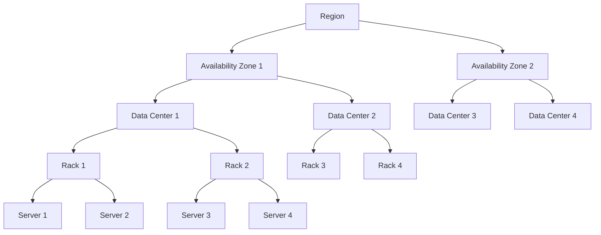

# 1. Regions, Availability Zones, Data Centers, Racks, Servers

## Introduction

Hardware plays a crucial role in achieving certain system qualities such as high availability, fault tolerance, performance, and scalability. Understanding the hierarchy of regions, availability zones, data centers, racks, and servers helps in designing robust and efficient systems.

## Hierarchy Overview

1.  **Regions**
2.  **Availability Zones**
3.  **Data Centers**
4.  **Racks**
5.  **Servers**

## 1. Regions

- A region is a geographically distinct area that contains multiple availability zones. Each region operates independently and is isolated from other regions.

### System Qualities Achieved:

- **Disaster Recovery:** By deploying systems across multiple regions, you can protect against large-scale disasters.
- **Geographical Redundancy:** Ensures that services remain available even if an entire region goes offline.
- **Performance:** Placing data and services closer to users in different regions reduces latency.

## 2. Availability Zones

- An availability zone is a distinct location within a region, engineered to be isolated from failures in other availability zones. Each availability zone typically contains multiple data centers.

### System Qualities Achieved:

- **High Availability:** Spreading applications across multiple availability zones ensures they remain operational even if one zone fails.
- **Fault Tolerance:** Independent power, cooling, and networking infrastructure in each availability zone mitigate single points of failure.

## 3. Data Centers

- A data center is a facility that houses servers and other computing resources. It is equipped with redundant power supplies, cooling systems, and networking infrastructure.

### System Qualities Achieved:

- **Reliability:** Redundant systems and robust infrastructure ensure continuous operation.
- **Scalability:** Large numbers of servers in data centers allow for easy scaling of applications and services.

## 4. Racks

- A rack is a framework designed to house multiple servers and other computing devices. Racks are organized within data centers.

### System Qualities Achieved:

- **Efficient Space Utilization:** Maximizes the use of physical space in data centers.
- **Organized Management:** Simplifies the management and maintenance of hardware by organizing it into standardized units.

## 5. Servers

- Servers are powerful computers that provide various services and resources to other computers and users in a network. They can be physical (bare-metal) or virtual (virtual machines).

### System Qualities Achieved:

- **Performance:** High-performance servers ensure fast processing and handling of data.
- **Scalability:** Servers can be added or upgraded to meet increasing demands.
- **Redundancy:** Multiple servers can be used to ensure that services remain available if one server fails.

## How Hardware Helps Achieve System Qualities

1.  **High Availability and Fault Tolerance:**

    - Deploying across multiple availability zones and regions ensures that systems remain operational even during failures.
    - Redundant power and cooling systems in data centers and racks enhance reliability.

2.  **Scalability and Performance:**

    - The ability to add more servers and racks allows systems to scale out as demand increases.
    - High-performance servers ensure efficient processing of tasks, improving overall system performance.

3.  **Disaster Recovery and Data Redundancy:**

    - Geographic distribution of regions and availability zones ensures data and services can be recovered quickly in case of a disaster.
    - Data replication across multiple data centers and servers protects against data loss.

## Summary

Regions, availability zones, data centers, racks, and servers are the building blocks of modern computing infrastructure. They help achieve key system qualities such as high availability, fault tolerance, scalability, and performance. By strategically deploying hardware across these hierarchical levels, organizations can ensure robust, reliable, and efficient systems.
