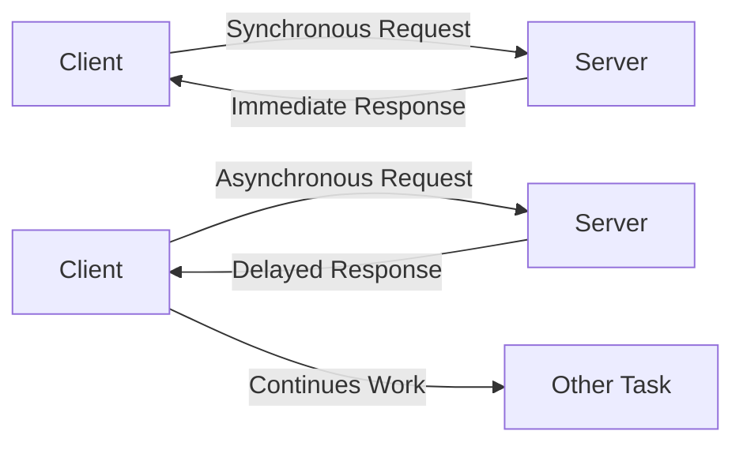
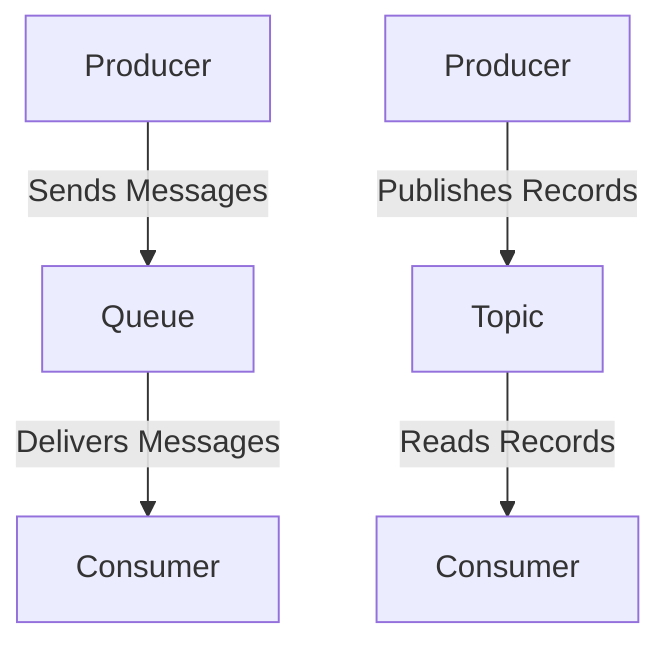

# 1. Synchronous vs Asynchronous Communication

## What are Synchronous vs Asynchronous Communication?

Imagine you and your friend are playing a game where you pass notes to each other. Synchronous communication is like waiting for your friend to read your note and write back before you do anything else. Asynchronous communication is like passing the note and continuing with your game while waiting for your friend's response.

## Simple Explanation:

**Synchronous Communication:**

- Think of a phone call. You talk, and the other person listens and responds immediately.
- It's like a back-and-forth conversation where both people are engaged at the same time.

**Asynchronous Communication:**

- Think of sending a letter. You send it, and the other person reads and replies whenever they can.
- You don't have to wait for the reply before doing other things.

---

## Deep Dive and Important Points:

### Synchronous Request-Response Models:

1. **Definition:**

   - Both parties are connected and interact in real-time.
   - Each request waits for a response before moving on to the next task.

2. **Examples in Software:**

   - **HTTP Requests:** When you visit a website, your browser sends a request to the server and waits for the response before displaying the page.
   - **Database Queries:** When a program asks the database for information, it waits until the database sends the data back.

3. **Characteristics:**

   - **Immediate Response:** The system waits for a response before continuing.
   - **Blocking:** The current process is paused until the response is received.

### Asynchronous Request-Response Models:

1. **Definition:**

   - Requests and responses happen independently.
   - The requester can continue doing other tasks while waiting for the response.

2. **Examples in Software:**

   - **Email:** You send an email and continue with other work while waiting for a reply.
   - **JavaScript Promises:** A web page can fetch data from a server without stopping the user from interacting with the page.

3. **Characteristics:**

   - **Non-blocking:** The system can handle other tasks while waiting for a response.
   - **Concurrent Processing:** Multiple requests can be handled at the same time.

### Asynchronous Messaging:

1. **Definition:**

   - A communication method where messages are sent without requiring an immediate response.

2. **Examples:**

   - **Message Queues:** Systems like RabbitMQ or Kafka store messages that can be processed later.
   - **Event-Driven Architecture:** Events trigger actions in the system without waiting for an immediate response.

3. **Importance:**

   - **Scalability:** Allows systems to handle many requests simultaneously.
   - **Reliability:** Ensures messages are delivered even if parts of the system are temporarily unavailable.

---

## Summary

**Synchronous communication** is like having a live conversation where you wait for responses before continuing, which ensures immediate feedback but can be slower due to waiting. **Asynchronous communication** allows you to send a message and continue with other tasks, enabling faster and more efficient processing without waiting, crucial for building scalable and reliable systems.

---

## Mermaid Diagram for Synchronous vs Asynchronous Communication

# RabbitMQ and Kafka

## What are RabbitMQ and Kafka?

Imagine you have a post office and a message board in your neighborhood. RabbitMQ is like a post office where you send and receive letters, while Kafka is like a big message board where everyone can post and read messages whenever they want.

## Simple Explanation:

**RabbitMQ:**

- RabbitMQ is like a post office.
- You send messages (letters) to RabbitMQ, and it delivers them to the right place.
- It makes sure your messages are delivered safely and in order.

**Kafka:**

- Kafka is like a big message board.
- You post messages (notes) on the board.
- Everyone who is interested can read the messages whenever they want.
- It can handle a lot of messages very quickly.

---

## Deep Dive and Important Points:

### RabbitMQ:

1. **Definition:** RabbitMQ is a message broker. It takes messages from a sender and delivers them to a receiver.

2. **How it Works:**

   - **Producer:** The sender that creates and sends messages.
   - **Queue:** A holding area for messages before they are delivered.
   - **Consumer:** The receiver that gets the messages from the queue.
   - **Exchange:** Determines how messages are routed to the queues.

3. **Characteristics:**

   - **Reliability:** Ensures messages are delivered safely.
   - **Routing:** Can route messages based on rules.
   - **Acknowledgments:** Confirms that messages have been received.

4. **Use Cases:**

   - **Task Queues:** Distributing tasks to multiple workers.
   - **Data Integration:** Connecting different parts of a system.

### Kafka:

1. **Definition:** Kafka is a distributed streaming platform. It allows you to publish and subscribe to streams of records, store them, and process them.

1. **How it Works:**

   - **Producer:** The sender that creates and sends messages.
   - **Topic:** A category or feed name to which records are published.
   - **Consumer:** The receiver that reads messages from a topic.
   - **Broker:** A server that stores and serves records.

1. **Characteristics:**

   - **Scalability:** Can handle a large volume of messages.
   - **Durability:** Messages are stored on disk and replicated.
   - **Real-time Processing:** Can process streams of data in real time.

1. **Use Cases:**
   - **Event Sourcing:** Logging changes to the system.
   - **Stream Processing:** Analyzing data in real time.

## Summary

**RabbitMQ** is like a post office that ensures messages are delivered safely and in order, suitable for tasks like distributing work. **Kafka** is like a big message board that handles large volumes of messages quickly and allows real-time processing, suitable for event logging and stream processing.

---

### Mermaid Diagram for RabbitMQ and Kafka

