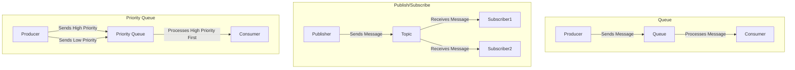
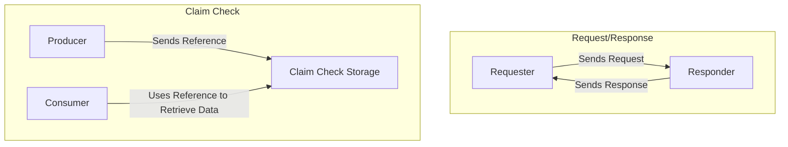

# 2. Asynchronous Messaging Patterns

Imagine you're at a carnival with lots of games and activities. Asynchronous messaging patterns are like different ways to manage and organize how people play games and participate in activities without everyone having to wait in line.

### Message Queuing Model:

- Think of it like a line at a food truck.
- You place your order and wait for it to be ready.
- Your order (message) is queued up and processed one by one.

### Publish/Subscribe Model:

- Imagine a town crier announcing news.
- Everyone who is interested (subscribers) listens.
- The town crier (publisher) doesn't need to know who is listening.

### Competing Consumers Pattern:

- Picture multiple people at a checkout line.
- Each cashier (consumer) serves the next person (message) in line.
- This helps process messages faster.

### Request/Response Messaging Pattern:

- It's like sending a letter and waiting for a reply.
- You send a message and expect an answer back.

### Priority Queue Pattern:

- Think of an emergency room where patients are treated based on urgency.
- Messages with higher priority are processed first.

### Claim Check Pattern:

- Imagine leaving your coat at a coat check.
- You get a ticket (claim check) and use it to retrieve your coat later.
- Large data is stored separately, and you use a reference to access it.

## Deep Dive and Important Points:

### Message Queuing Model:

1. **Definition:** Messages are stored in a queue until they are processed.

2. **How it Works:**

   - **Producer:** Sends messages to the queue.
   - **Queue:** Stores messages in the order they arrive.
   - **Consumer:** Processes messages from the queue.

3. **Characteristics:**

   - **Orderly Processing:** Messages are handled in the order they arrive.
   - **Decoupling:** Producers and consumers operate independently.

4. **Use Cases:**
   - **Task Scheduling:** Distributing tasks to workers.
   - **Load Balancing:** Ensuring smooth processing without overloading.

### Publish/Subscribe Model:

1. **Definition:**
   - Messages are sent to multiple subscribers who are interested in receiving them.
2. **How it Works:**

   - **Publisher:** Sends messages to a topic.
   - **Subscribers:** Receive messages from the topic they are subscribed to.

3. **Characteristics:**

   - **Broadcasting:** Messages are broadcast to multiple receivers.
   - **Loose Coupling:** Publishers don't need to know about subscribers.

4. **Use Cases:**
   - **News Distribution:** Sending updates to multiple users.
   - **Event Notifications:** Informing systems about events.

### Competing Consumers Pattern:

1. **Definition:**
   - Multiple consumers process messages from the same queue to balance the load.
2. **How it Works:**

   - **Queue:** Stores messages.
   - **Consumers:** Compete to process messages from the queue.

3. **Characteristics:**

   - **Load Distribution:** Multiple consumers help in faster processing.
   - **Scalability:** Easily add more consumers to handle increased load.

4. **Use Cases:**
   - **Order Processing:** Handling customer orders.
   - **Background Jobs:** Running tasks in the background.

### Request/Response Messaging Pattern:

1. **Definition:**
   - A pattern where a request message is sent and a response message is expected.
2. **How it Works:**

   - **Requester:** Sends a request message.
   - **Responder:** Sends back a response message.

3. **Characteristics:**

   - **Two-Way Communication:** Requires both request and response.
   - **Synchronization:** Often used for immediate feedback.

4. **Use Cases:**
   - **API Calls:** Requesting data from a server.
   - **Customer Support:** Handling inquiries.

### Priority Queue Pattern:

1. **Definition:**
   - Messages are processed based on their priority.
2. **How it Works:**

   - **Producer:** Assigns priority to messages.
   - **Queue:** Processes higher priority messages first.

3. **Characteristics:**

   - **Urgency Handling:** Important messages are processed sooner.
   - **Order Management:** Maintains order within priority levels.

4. **Use Cases:**
   - **Emergency Alerts:** Handling urgent notifications.
   - **Time-Sensitive Tasks:** Prioritizing critical tasks.

### Claim Check Pattern:

1. **Definition:**
   - A pattern where large data is stored separately and accessed using a reference.
2. **How it Works:**

   - **Producer:** Sends a small message with a reference to the large data.
   - **Consumer:** Uses the reference to retrieve the large data.

3. **Characteristics:**

   - **Efficiency:** Reduces the size of messages.
   - **Data Management:** Keeps large data out of the main message flow.

4. **Use Cases:**
   - **File Transfers:** Handling large files.
   - **Media Content:** Managing large media files.

## Summary

Asynchronous messaging patterns help manage communication in systems by organizing how messages are sent and received. **Message queuing** ensures orderly processing, **publish/subscribe** broadcasts messages to multiple receivers, **competing consumers** balance the load, **request/response** handles two-way communication, **priority queues** process urgent messages first, and **claim check** manages large data efficiently.

### Diagram for Asynchronous Messaging Patterns

###

