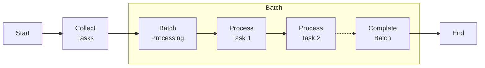
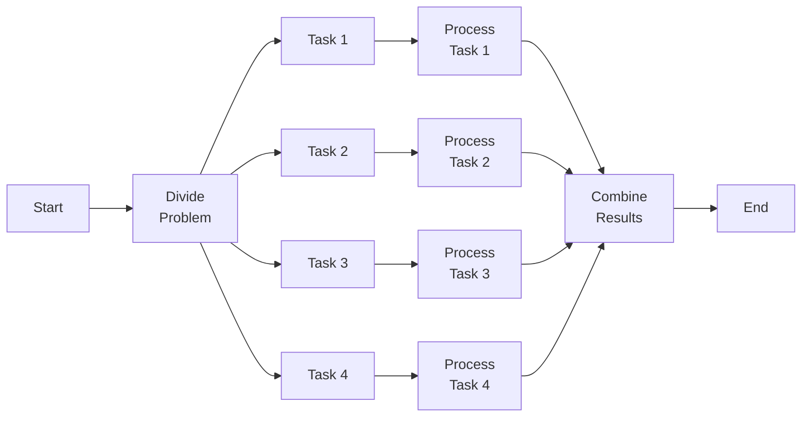

# 5. Big Compute Architecture

Imagine you need to solve a very large puzzle, and it's too big for one person to complete quickly. Big compute architecture is like having a big team where each person works on a small piece of the puzzle at the same time, making it faster to complete the whole puzzle.

Big compute architecture involves using many computers (or processors) working together to solve large problems more efficiently. It's used for tasks that need a lot of computing power, like scientific simulations, data analysis, and large-scale processing.

### Batch Computing Model:

**Batch computing model** is like doing your homework in batches. Instead of doing one problem at a time, you do a bunch of problems all at once and then check them together.

- **Batch Processing:** Collect a set of tasks (a batch) and process them all at once.
- **No Immediate Feedback:** You don't see results right away; you get them after the whole batch is processed.
- **Examples:** Running a payroll system, processing bank transactions, or performing large-scale data analysis.

### Embarrassingly Parallel Problems:

**Embarrassingly parallel problems** are tasks that can be divided into many separate parts, and each part can be solved independently without needing to communicate with other parts. It's like giving each person in a big group a separate piece of the puzzle to work on their own.

- **Independent Tasks:** Each task can be completed without depending on others.
- **Easy to Parallelize:** These problems are easy to split up and solve using multiple processors.
- **Examples:** Image processing (applying a filter to each pixel), simulations where each part runs separately, or processing different data files independently.

## Deep Dive and Important Points:

1. **Big Compute Architecture:**

   - **Definition:** Using multiple computers or processors to perform large-scale computations.
   - **Purpose:** Solves complex problems faster and more efficiently by distributing the workload.

2. **Batch Computing Model:**

   - **Definition:** Collecting and processing a group of tasks together as a single batch. Tasks are collected and processed as a group, but they are processed one after another within the batch.

   - **Advantages:**

     - Efficient use of resources.
     - Suitable for repetitive and scheduled tasks.

   - **Disadvantages:**

     - No real-time processing.
     - Delays in getting results.

1. **Embarrassingly Parallel Problems:**

   - **Definition:** Problems that can be easily separated into independent tasks with no need for communication between them.
   - **Advantages:**
     - Simple to implement.
     - Scales well with additional processors.
   - **Disadvantages:**
     - Not all problems are embarrassingly parallel.
     - Limited by the number of independent tasks available.

## Summary

Big compute architecture is like having a large team to solve huge problems faster by dividing the work. The batch computing model processes tasks in groups, which is efficient but not real-time. Embarrassingly parallel problems are ideal for this architecture because they can be split into many independent tasks, making them easy to solve using multiple processors. This approach is essential for handling complex and large-scale computations efficiently.
